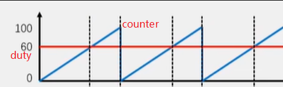
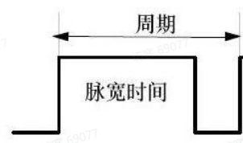
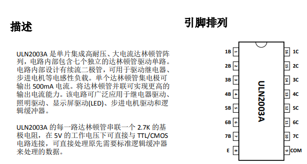

## STC89C52 系列总结 

### 基础


1. 引脚（P7~P1->高位~低位）

   - P0：输入输出端口， 用作16位地址总线中的低8位地址总线，8位数据总线
   - P1：输入输出端口
   - P2：输入输出端口， 用作16位地址总线中的高8位地址总线
   - P3：输入输出端口，多功能端口。
     - P3.0（RXD）：串行数据接收端。外部的串行数据可由此脚进入单片机。  
     - P3.1（TXD）：串行数据发送端。单片机内部的串行数据可由此脚输出，发送给外部电 路或设备。  
     - P3.2（INT0）：外部中断信号0输入端。  
     - P3.3（INT1）：外部中断信号1输入端。 
     -  P3.4（T0）：定时器/计数器T0的外部信号输入端。  
     - P3.5（T1）：定时器/计数器T1的外部信号输入端。 
     -  P3.6（WR ）：写片外RAM的控制信号输出端。 
     -  P3.7（RD）：读片外RAM的控制信号输出端。

2. 中断
   - 89C52含有中断：T0、INT0、T1、INT1、串口 ``interrupt 取值范围0~4`

   - `interrupt 0`：外部中断0（INT0）的中断服务程序。

     `interrupt 1`：定时器0溢出中断的中断服务程序。
   
     `interrupt 2`：外部中断1（INT1）的中断服务程序。
   
     `interrupt 3`：定时器1溢出中断的中断服务程序。
   
     `interrupt 4`：串口中断的中断服务程序。
   
   - **`using 1`** 表示 **中断服务程序使用寄存器组1** 来保存和恢复寄存器的状态,使用不同的寄存器组可以保证中断服务程序中的寄存器操作不会干扰到主程序中的数据,范围`0~3`。
   
   - **寄存器组0（`using 0`）**：使用R0-R7作为中断服务程序的工作寄存器。
   
     **寄存器组1（`using 1`）**：使用R0-R7作为中断服务程序的工作寄存器。这样做可以保留寄存器组0的内容，并在中断返回后恢复。
   
     **寄存器组2（`using 2`）**：使用R0-R7。
   
     **寄存器组3（`using 3`）**：使用R0-R7
   
   - 中断相关寄存器
   
     ```C
     //中断允许寄存器IE
     EA - - PS ET1 EX1 ET0 EX0
     EA:总中断控制位
     PS:串行中断控制位
     ET1 ET0：T1/T0中断允许位
     EX1 EX0: INT1/INT0中断允许位
     
     //工作方式控制寄存器TMOD
     GATE C/T M1 M0 GATE C/T M1 M0
     Gate: 启动模式设置
     C/T：计数、定时设置（0--定时器、1--计数器）
     M1 M0：工作方式设定（0x01--16位 0x00--13位 0x02--8位 0x03--T0独立8位）
     
     //定时器/计数器控制TCON
     TF1 TR1 TF0 TR0 IE1 IT1 IE0 IT0
     TF1 TR1: T1溢出标志位和启动控制位
     TF0 TR0: T0溢出标志位和启动控制位
     IE1 IT1: INT1中断标志位和触发方式设定，一般下降沿为 1 
     IE0 IT0: INT0中断标志位和触发方式
     
     //中断优先级控制IP
     - - - PS PT1 PX1 PT0 PX0
     PS串口 T1 INT1 T0 INT0
     
     //串口通信控制SCON
     SM0 SM1 SM2 REN TB8 RB8 TI RI
     SM0 SM1:工作方式设定(8位同步移位--f/12、10位异步收发--可变、11位异步收发--f/64,f/32、11位异步收发--可变)
     SM2:主从机通信（1--允许多机通信）
     REN:允许/禁止数据接收控制位
     TI RI: 发送/接收中断标志位（需要手动清0）
     ```
   
3. RAM ROM Falsh

### 外设

1. LED

   - LED灯：通过高低电平来控制

   - 数码管：分为共``阴/阳（cathode / anode）``极数码管, 对应的键值不一样

     - **74HC573：**可以同时锁存8位二进制数据，常用于数据总线、寄存器、I/O扩展等场景


     ```C
     // 74H573 8位数码管驱动
     #include "89C52.h"
     #include "MyDelay.h"
     
     sbit LE1 = P2 ^ 3; // 段选锁存使能
     sbit LE2 = P2 ^ 4; // 位选锁存使能
     
     // 数码管段选编码表（0-9）
     uint8_t code seg_code[] = {0x3F, 0x06, 0x5B, 0x4F, 0x66, 0x6D, 0x7D, 0x07, 0x7F, 0x6F};
     
     // 数码管位选编码表（选择哪一位数码管）
     uint8_t code bit_code[] = {0xFE, 0xFD, 0xFB, 0xF7, 0xEF, 0xDF, 0xBF, 0x7F};
     
     // 向锁存器写入数据
     void Latch_Write(uint8_t dat, bit latch)
     {
         P0 = dat; // 将数据写入 P0 口
         if (latch == 0) {
             LE1 = 1; // 锁存段选数据
             LE1 = 0;
         } else {
             LE2 = 1; // 锁存位选数据
             LE2 = 0;
         }
     }
     
     // 初始化数码管
     void Dig_Init()
     {
         Latch_Write(0xFF, 0); // 关闭所有段选
         Latch_Write(0x00, 1); // 关闭所有位选
     }
     
     // 在指定位置显示数字
     void Dig_Display(uint8_t pos, uint8_t num)
     {
         Latch_Write(seg_code[num], 0); // 写入段选数据
         Latch_Write(bit_code[pos], 1); // 写入位选数据
         DelayMs(5);                    // 延时，控制显示亮度
         Latch_Write(0x00, 1);          // 关闭位选，消除鬼影
     }
     
     ```

   - LED点阵（8x8）74HC595：

     - 74HC595工作原理：8 位串行数据从74HC595芯片的14脚（DS/SER）由低位到高位输入,同时从11脚（SHCP/SCK）输入移位脉冲，12脚（STCP/RCK）输入一个 锁存脉冲（一个脉冲上升沿），可实现串行转并行数据，9脚可继续连接74HC595的DS端（先最低端数据输入）
     - `特别注意在使用多个74HC595时,需注意时序图，要同时输出码值，可在每次输出间隔添加空输出以去除重影，并且将输出码值的595 STCP脚单独控制`
     - 点阵的动画显示：使用取模工具得到不同的码值（前后添加空值，以设置动画连贯），再通过595输入点阵，设置码值偏移量++（码值数-8）可以生成动画，偏移量+8可以显示逐帧动画
     - 应用于电子显示屏

   - 呼吸灯

     

     - 需要使用PWM（脉冲宽度调制）技术，即调整高低电平在整个周期的占比即可实现

       
     
       ```C
       // 亮暗是不停交换的
       for(time = 0;time < 300;time ++){ //从暗逐渐变亮的过程
           led = 0;
           Delayus(time);
           led = 1;
           Delayus(300 - time);
       }
       for(time = 0;time < 300;time ++){ //从亮逐渐变暗的过程
           led = 1;
           Delayus(time);
           led = 0;
           Delayus(300 - time);
       }
       ```
     
       ```C
       // 中断方式实现
       unsigned char pwm_duty=0; // 占空比
       bit pwm_direction = 0; // 亮暗方向控制
       
       void Timer0_Init() {
           TMOD = 0x02; // 定时器0，模式2（8位自动重装）
           TH0 = 0x00;  // 定时器初值
           TL0 = 0x00;
           ET0 = 1;     // 使能定时器0中断
           EA = 1;      // 使能总中断
           TR0 = 1;     // 启动定时器0
       }
       
       void Timer0_ISR() interrupt 1 {
           static unsigned char pwm_counter = 0;
           pwm_counter++;
           pwm_counter%=100; // 限制在100内
           if (pwm_counter < pwm_duty) 
               LED = 1; // 高电平
            else 
               LED = 0; // 低电平
       }  
       
       void main(void)
       {
           if（pwm_direction==0）{
               pwm_duty++; // 改变duty即改变占空比，可以设置不同亮度
               if(pwm_duty == 255)
                   pwm_direction = 1;
           }else
           {
               pwm_duty--;
               if(pwm_duty == 0)
                   pwm_direction = 0;
           }    	
       }
       
       ```
     
       

2. 按键`

   1. 按键检测和消抖控制：按键由于机械结构特性需要延时消抖或者物理消抖

      

   2. 外部中断按键控制LED：中断定时检测按键按下状态，

   3. 矩阵键盘：分为行列式扫描和翻转式扫描（需要保存行列的值 然后进行或运算）可得到具体的按键码值，对应码值设置键值

      - 行列式扫描：

        - 将行线设置为输出，列线设置为输入。
        - 逐行拉低行线，检测列线的状态。
        - 如果某列线为低电平，则说明该行该列的按键被按下。

        ```
        // 第一行0xf7,第二行0xfb,第三行0xfd,第四行0xf7, while()用于等待按键弹起
        uint8_t key_matrix_ranks(void){
            uint8_t keyM;
            KEYP1 = 0xf7; 
            if(KEYP1!=0xf7){
                delayMs(20);
                if(KEYP1!=0xf7)
                {
                    switch (KEYP1)
                    {
                        case 0x77:keyM = 0;break;
                        case 0xb7:keyM = 4;break;
                        case 0xd7:keyM = 8;break;
                        case 0xe7:keyM = 12;break;
                    }
                }
            }
            while (KEYP1 !=0xf7)
            {
                return keyM;
            }
            
            // 二
            KEYP1 = 0xfb; 
            if(KEYP1!=0xfb){
                delayMs(20);
                if(KEYP1!=0xfb)
                {
                    switch (KEYP1)
                    {
                        case 0x7b:keyM = 1;break;
                        case 0xbb:keyM = 5;break;
                        case 0xdb:keyM = 9;break;
                        case 0xeb:keyM = 13;break;
                    }
                }
            }
            while (KEYP1 !=0xfb)
            {
                return keyM;
            }
            // 三
            KEYP1 = 0xfd; 
            if(KEYP1!=0xfd){
                delayMs(20);
                if(KEYP1!=0xfd)
                {
                    switch (KEYP1)
                    {
                        case 0x7d:keyM = 2;break;
                        case 0xbd:keyM = 6;break;
                        case 0xdd:keyM = 10;break;
                        case 0xed:keyM = 14;break;
                    }
                }
            }
            while (KEYP1 !=0xfd)
            {
                return keyM;
            }
            // 四
            KEYP1 = 0xfe; 
            if(KEYP1!=0xfe){
                delayMs(20);
                if(KEYP1!=0xfe)
                {
                    switch (KEYP1)
                    {
                        case 0x7e:keyM = 3;break;
                        case 0xbe:keyM = 7;break;
                        case 0xde:keyM = 11;break;
                        case 0xee:keyM = 15;break;
                    }
                }
            }
            while (KEYP1 !=0xfe)
            {
                return keyM;
            }
        }
        ```

      - 翻转式扫描

        - 将行线设置为输出，列线设置为输入，逐行拉低行线，检测列线的状态。

        - 将列线设置为输出，行线设置为输入，逐列拉低列线，检测行线的状态。

        - 通过两次扫描的结果，确定按键的位置。

          ```C
          uint8_t key_matrix_detection(void)
          {
              uint8_t keyM,row,column;
              KEYP1 = 0xf0;
              if(KEYP1 != 0xf0)
              {
                  delayMs(20);
                  KEYP1 = 0xf0;
                  if(KEYP1 != 0xf0)
                  {
                      row = KEYP1;
                      KEYP1 = 0x0f;
                      column = KEYP1;
                      // 通过或将高四位和第四位组合在一起，就是完整键码，然后在标准比对得到键值
                      keyM = row | column; 
                  }
              }else
                  keyM = 0xff;
              return keyM;
          }
          ```

          

4. 串口通信

     - 基本概念：

       - 通信分为并行（多位）通信和串行（逐位）通信；

       - 串行通信又可分为异步（信以帧为单 位进行数据传输，约定速率）通信和同步（）通信

       - 串行通信根据数据的传送方向可分为三种方式：单工（单方向）方式、半双（不可同时间双向）工方式和全双（双向）工方式

       - SCON

         | SM1  | SM0  | 串口工作模式                |                                                              |
         | ---- | ---- | --------------------------- | ------------------------------------------------------------ |
         | 0    | 0    | 方式0（同步移位寄存器）     | /                                                            |
         | 0    | 1    | 方式1（8位数据，1位停止位） | SCON = 0x50;  // 设置SM0=0, SM1=1，配置为模式1（8位数据，1位停止位） |
         | 1    | 0    | 方式2（9位数据，1位停止位） | SCON = 0x52;  // 设置SM0=1, SM1=0，配置为模式2（9位数据，1位停止位） |
         | 1    | 1    | 方式3（9位数据，1位停止位） | SCON = 0x53;  // 设置SM0=1, SM1=1，配置为模式3（9位数据，1位停止位，支持多机通讯） |

4. 外设模组

     - DS1302 日期时间设置

       

       - **低功耗**：DS1302 在备用模式下功耗极低，适合电池供电的应用。

       - **实时时钟**：提供秒、分、时、日、月、年和星期的时间信息。

       - **31 x 8 位暂存 RAM**：可用于存储额外的数据。

       - **串行接口**：通过简单的三线接口（CE、I/O、SCLK）与微控制器通信。

       - **宽电压范围**：工作电压范围为 2.0V 至 5.5V。

       - **涓流充电**：内置涓流充电电路，可用于给备用电池充电。

       - **编写时将写指令和读数据分开写可以避免时序问题**

       - **BCD 码转十进制数**：

         - 将 BCD 码的每一位转换为对应的十进制数字，并根据权重求和。`0x25(16进制保存的BCD码值)=00100101=0x25/16*10+0x25%16=25，0x3567=0011 0101 0110 0111=0x3567/16*10^3+0x3567/16*10^2+0x3567/16*10+0x3567%16=3 5 6 7`
         
       - **十进制数转 BCD 码**：

         - 将十进制数的每一位转换为 4 位二进制数，并根据权重求和。`25(OCT)=00100101(BCD)=25/10*16+25%10=0x25(DEC)  2354=2*16^3+3*16^2=5*16^1+4=0x2354 `

         ```C
         sbit DS1302_CE   = P3 ^ 5; // CE 引脚
         sbit DS1302_SCLK = P3 ^ 6; // SCLK 引脚
         sbit DS1302_IO   = P3 ^ 4; // I/O 引脚
         
         char DS1302_DateTime[] = {25,02,18,14,20,25};
         // 单字节写入         
         void DS1302_WriteByte(unsigned char dat)
         {
             unsigned char i;
             for (i = 0; i < 8; i++) {
                 DS1302_IO = dat & 0x01; // 发送最低位
                 dat >>= 1;              // 右移一位
                 DS1302_SCLK = 1;        // 上升沿写入数据
                 _nop_();
                 DS1302_SCLK = 0; // 下降沿
                 _nop_();
             }
         }
         
         // 单字节读取
         unsigned char DS1302_ReadByte()
         {
             unsigned char i, dat = 0;
             for (i = 0; i < 8; i++) {
                 dat >>= 1;                  // 右移一位
                 if (DS1302_IO) dat |= 0x80; // 读取数据位
                 DS1302_SCLK = 1;            // 上升沿
                 _nop_();
                 DS1302_SCLK = 0; // 下降沿
                 _nop_();
             }
             return dat;
         }
         
         /**
          * @brief  向DS1302写入数据
          * @param  addr 控制指令
          * @param  dat 写入的数据
          * @retval Null
          * */
         void DS1302_Write(unsigned char addr, unsigned char dat)
         {
             DS1302_CE = 1;          // 使能 DS1302
             DS1302_WriteByte(addr); // 发送地址
             DS1302_WriteByte(dat);  // 发送数据
             DS1302_CE = 0;          // 关闭 DS1302
         }
         
         /**
          * @brief  从 DS1302 读取数据
          * @param  addr 读取指令（和写入指令一样）
          * @retval dat 读取的数据
          * */
         unsigned char DS1302_Read(unsigned char addr)
         {
             unsigned char dat;
             DS1302_CE = 1;                 // 使能 DS1302
             DS1302_WriteByte(addr | 0x01); // 发送读命令,设置读取和设置命令一样
             dat       = DS1302_ReadByte(); // 读取数据
             DS1302_CE = 0;                 // 关闭 DS1302
             return dat;
         }
         
         /**
          * @brief  DS1302初始化
          * @param  Null
          * @retval Null
          * */
         void DS1302_Init()
         {
             DS1302_CE   = 0;          // 关闭 DS1302
             DS1302_SCLK = 0;          // 初始化 SCLK
             DS1302_Write(0x8E, 0x00); // 关闭写保护
             DS1302_Write(0x80, 0x00); // 启动时钟
         }
         
         /**
          * @brief  日期时间设置
          * @param  Null
          * @retval Null
          * */
         void DS1302_SetDateTime()
         {
             DS1302_Write(0x8E, 0x00);                                                   // 关闭写保护
             DS1302_Write(0x80, DS1302_DateTime[5] / 10 * 16 + DS1302_DateTime[5] % 10); // 设置秒
             DS1302_Write(0x82, DS1302_DateTime[4] / 10 * 16 + DS1302_DateTime[4] % 10); // 设置分
             DS1302_Write(0x84, DS1302_DateTime[3] / 10 * 16 + DS1302_DateTime[3] % 10); // 设置时
             DS1302_Write(0x86, DS1302_DateTime[2] / 10 * 16 + DS1302_DateTime[2] % 10); // 设置日
             DS1302_Write(0x88, DS1302_DateTime[1] / 10 * 16 + DS1302_DateTime[1] % 10); // 设置月
             DS1302_Write(0x8C, DS1302_DateTime[0] / 10 * 16 + DS1302_DateTime[0] % 10); // 设置年
             DS1302_Write(0x8E, 0x80);                                                   // 打开写保护
         }
         
         /**
          * @brief  日期时间读取
          * @param  Null
          * @retval Null
          * */
         void DS1302_GetDateTime(void)
         {
             uint8_t temp;
             temp               = DS1302_Read(0x80);
             DS1302_DateTime[5] = temp / 16 * 10 + temp % 16;
             temp               = DS1302_Read(0x82);
             DS1302_DateTime[4] = temp / 16 * 10 + temp % 16;
             temp               = DS1302_Read(0x84);
             DS1302_DateTime[3] = temp / 16 * 10 + temp % 16;
             temp               = DS1302_Read(0x86);
             DS1302_DateTime[2] = temp / 16 * 10 + temp % 16;
             temp               = DS1302_Read(0x88);
             DS1302_DateTime[1] = temp / 16 * 10 + temp % 16;
             temp               = DS1302_Read(0x8C);
             DS1302_DateTime[0] = temp / 16 * 10 + temp % 16;
         }
         ```

     - 电机控制

       - ULN2003A：该芯片是一个 **达林顿晶体管阵列**，通常用于驱动高电流负载（如继电器、步进电机等），而不是直接驱动直流电机。ULN2003A 的输出是开漏输出，适合驱动感性负载，但对于直流电机调速，通常需要 H 桥电路（如 L298N 或 L293D）来实现正反转和调速。

         

       - 直流电机：使用 **ULN2003A** 来控制直流电机调速是可行的（**通过逐渐增加和减小占空比，实现电机转速的渐变效果**）

       - 步进电机：为旋转式、直线式和平面式，旋转式步进电动机又分为永磁式和反应式

         - 三相六极步进电机（Z 为转子的齿数；N 为一个通电循环周期的拍数。）：单三拍（A-B-C，步进角=360°/ZN ）、双三拍（AB-BC-CA）和单双六拍（A→AB→B→BC→C→CA→A）
         - 五线四相步进电机（电源线和4相线）：单四拍方式（A-B-C-D）、双四拍方式(AB-BC-CD-DA)和单双八拍方式(A-AB-B-BC-C-CD-D-DA)

     - 蜂鸣器

       - 蜂鸣器是一种将电信号转换为声音信号的器件，常用来产生设备的按键音、报警音等提示信号。

       - 有源蜂鸣器：内部自带振荡源，将正负极接上直流电压即可持续发声，频率固定。

       - 无源蜂鸣器：内部不带振荡源，需要控制器提供振荡脉冲才可发声，调整提供振荡脉冲的频率，可发出不同频率的声音。
       
         ```C
         // 无源蜂鸣器：需要生成一定频率的方波信号来驱动。常见的驱动频率范围为 1kHz-5kHz
         // 通过定时器生成5KHZ的方波，即1/5000=0.2ms=200us(12M),所以方波信号的初值为100us, 调用时只需设置延时时间，即蜂鸣器工作时间
         void Timer0_Init() {
             TMOD = 0x02; // 定时器0，模式2（8位自动重装）
             TH0 = 0x9C;  // 定时器初值，生成 1kHz 方波
             TL0 = 0x9C;
             ET0 = 1;     // 使能定时器0中断
             EA = 1;      // 使能总中断
             TR0 = 1;     // 启动定时器0
         }
         
         // 定时器0中断服务函数（生成方波信号）
         void Timer0_ISR() interrupt 1 {
             Buzzer = ~Buzzer; // 翻转蜂鸣器引脚状态
         }
         ```
         
       
     - 红外（有可见和不可见940nm）

       - 主要使用红外光进行通信，主要由红外LED调制发送，由专用的红外接收头进行解调，使用单工异步通信

       - 红外通讯协议

         - NEC协议：16个地址码，8位命令码，8位命令反码，所以需要准确的延时控制

         - **逻辑0**：通常是一个短脉冲（0.56ms） + 短脉冲（0.56ms）

           **逻辑1**：通常是一个短脉冲（0.56ms） + 长脉冲（1.68ms）

           ```C
           // 使用定时器来准确控制延时，在红外发送和接收都要使用
           #define FREQ 12000000  // 系统时钟频率，12 MHz
           // 定时器初始化，设置定时器0，使用16位定时器模式
           void TimerInit(void)
           {
               TMOD |= 0x01;  // 设置定时器0为模式1（16位定时器模式）
               TH0 = 0;       // 定时器初值高8位
               TL0 = 0;       // 定时器初值低8位
               TR0 = 1;       // 启动定时器0
           }
           //开始定时器
           void TimerStart(void)
           {
               TF0=0; // 清除溢出标志
               TR0=1; // 启动定时器
           }
           // 获取时间
           uint8_t Timer0_GetCounter(void)
           {
           	return (TH0<<8)|TL0;
           }
           
           // 停止定时器
           void TimerStop(void)
           {
               TR0 = 0;  // 停止定时器
               TH0 = 0;  // 清除定时器高位
               TL0 = 0;  // 清除定时器低位
           }
           
           // 设置定时器的初始值，延时n微秒，主要在发送时精准延时
           void TimerDelayMs(unsigned int delayTimeUs)
           {
               unsigned int count;
               unsigned int reloadValue;
               
               // 计算每毫秒需要的计数器初值 FREQ/1000/65536 表示在16位计数器下的每Us初始计数值
               count = delayTimeUs * (FREQ / 1000000) / 65536; 
               reloadValue = 65536 - count;  // 计算定时器初值
               TH0 = (reloadValue >> 8);   // 设置定时器高8位
               TL0 = (reloadValue & 0xFF); // 设置定时器低8位
               
               // 启动定时器并等待延时
               TimerStart();
               while (!TF0);  // 等待定时器溢出（TF0标志位为1）
               TimerStop();   // 停止定时器
               TF0 = 0;       // 清除溢出标志
           }
           ```

           ```C
           // IR发送函数，基于NEC协议 IR_PIN是引脚
           // 逻辑1
           void SendNECPulseHigh(void)
           {
               IR_PIN = 1;  // 设置为高电平
               TimerDelayMs(562);  // 延时562.5微秒
               IR_PIN = 0;  // 设置为低电平
               TimerDelayMs(1687);  // 延时1.6875毫秒
           }
           // 逻辑0
           void SendNECPulseLow(void)
           {
               IR_PIN = 1;  // 设置为高电平
               TimerDelayMs(562);  // 延时562.5微秒
               IR_PIN = 0;  // 设置为低电平
               TimerDelayMs(562);  // 延时562.5微秒
           }
           
           // 发送完整的数据（32位），根据NEC协议
           void SendNECData(unsigned long data)
           {
               // 发送起始码：9ms高电平 + 4.5ms低电平
               IR_PIN = 1;
               TimerDelayMs(9000);  // 延时9毫秒
               IR_PIN = 0;
               TimerDelayMs(4500);  // 延时4.5毫秒
           
               // 发送32位数据
               for (int i = 0; i < 32; i++)
               {
                   if (data & (1 << (31 - i))) {
                       // 发送逻辑1
                       SendNECPulseHigh();
                   } else {
                       // 发送逻辑0
                       SendNECPulseLow();
                   }
               }
           }
           ```

           ```C
           // 红外接收函数
           
           unsigned long lastTime = 0;           // 上次中断时间
           unsigned long currentTime;            // 当前时间
           unsigned long pulseWidth;             // 脉冲宽度
           unsigned char receivedDataBuffer[32]; // 存储接收到的32位数据
           unsigned char bitCount = 0;           // 记录接收到的数据位数
           unsigned char dataReceivedFlag = 0;   // 标记数据是否已接收完成
           
           // 外部中断初始化
           void ExternalInterrupt0_Init(void)
           {
               IT0 = 1;  // 设置 INT0 为下降沿触发中断
               EX0 = 1;  // 使能外部中断0
               EA = 1;   // 开启全局中断
           }
           
           // 外部中断0的中断服务函数
           void ExternalInterrupt0_ISR(void) interrupt 0
           {
               currentTime = Timer0_GetCounter();  // 获取当前定时器的 ticks（时间戳）
               
               // 计算脉冲宽度（单位：微秒）
               pulseWidth = currentTime - lastTime;
               lastTime = currentTime;
           
               // 判断脉冲宽度，区分逻辑0和逻辑1
               if (pulseWidth > 1000) {
                   if (bitCount < 32) {
                       receivedDataBuffer[bitCount++] = 1;  // 存储逻辑1
                   }
               } else {
                   if (bitCount < 32) {
                       receivedDataBuffer[bitCount++] = 0;  // 存储逻辑0
                   }
               }
           
               // 判断是否接收到完整的32位数据
               if (bitCount == 32) {
                   dataReceivedFlag = 1;  // 标记数据接收完成
                   TimerStop(); // 数据接收完成，停止计数器
               }
           }
           
           // 接收到的数据处理，获取命令位
           unsigned char GetCommandFromData(unsigned long receivedData)
           {
               unsigned char command;
               // 提取命令位（第9到第16位）
               command = (receivedData >> 16) & 0xFF;  // 高字节就是命令位
               return command;
           }
           
           // 主函数
           void main(void)
           {
               // 初始化定时器和外部中断
               Timer0_Init();
               ExternalInterrupt0_Init();
           
               // 主循环
               while (1) {
                   if (dataReceivedFlag) {
                       // 数据接收完成后处理
                       dataReceivedFlag = 0;  // 清除接收标志
                       dat = GetCommandFromData();      // 解析并处理接收到的数据
                   }
               }
           }
           ```

     
  
