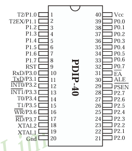
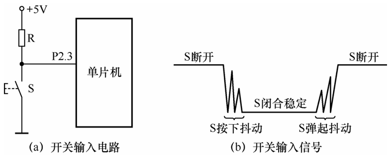
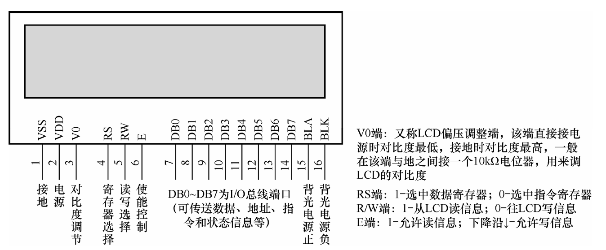
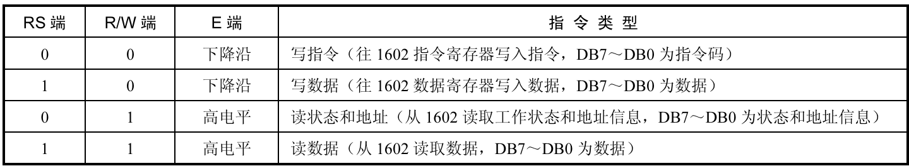
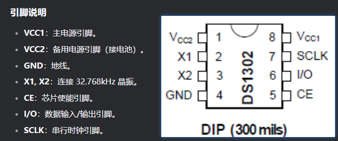

## STC89C52 系列总结 

### 基础



1. 引脚（P7~P1->高位~低位）

   - P0：输入输出端口， 用作16位地址总线中的低8位地址总线，8位数据总线
   - P1：输入输出端口
   - P2：输入输出端口， 用作16位地址总线中的高8位地址总线
   - P3：输入输出端口，多功能端口。
     - P3.0（RXD）：串行数据接收端。外部的串行数据可由此脚进入单片机。  
     - P3.1（TXD）：串行数据发送端。单片机内部的串行数据可由此脚输出，发送给外部电 路或设备。  
     - P3.2（INT0）：外部中断信号0输入端。  
     - P3.3（INT1）：外部中断信号1输入端。 
     -  P3.4（T0）：定时器/计数器T0的外部信号输入端。  
     - P3.5（T1）：定时器/计数器T1的外部信号输入端。 
     -  P3.6（WR ）：写片外RAM的控制信号输出端。 
     -  P3.7（RD）：读片外RAM的控制信号输出端。

2. 中断
   - 89C52含有中断：T0、INT0、T1、INT1、串口 ``interrupt 取值范围0~4`

   - `interrupt 0`：外部中断0（INT0）的中断服务程序。

     `interrupt 1`：定时器0溢出中断的中断服务程序。
   
     `interrupt 2`：外部中断1（INT1）的中断服务程序。
   
     `interrupt 3`：定时器1溢出中断的中断服务程序。
   
     `interrupt 4`：串口中断的中断服务程序。
   
   - **`using 1`** 表示 **中断服务程序使用寄存器组1** 来保存和恢复寄存器的状态,使用不同的寄存器组可以保证中断服务程序中的寄存器操作不会干扰到主程序中的数据,范围`0~3`。
   
   - **寄存器组0（`using 0`）**：使用R0-R7作为中断服务程序的工作寄存器。
   
     **寄存器组1（`using 1`）**：使用R0-R7作为中断服务程序的工作寄存器。这样做可以保留寄存器组0的内容，并在中断返回后恢复。
   
     **寄存器组2（`using 2`）**：使用R0-R7。
   
     **寄存器组3（`using 3`）**：使用R0-R7
   
   - 中断相关寄存器
   
     ```C
     //中断允许寄存器IE
     EA - - PS ET1 EX1 ET0 EX0
     EA:总中断控制位
     PS:串行中断控制位
     ET1 ET0：T1/T0中断允许位
     EX1 EX0: INT1/INT0中断允许位
     
     //工作方式控制寄存器TMOD
     GATE C/T M1 M0 GATE C/T M1 M0
     Gate: 启动模式设置
     C/T：计数、定时设置（0--定时器、1--计数器）
     M1 M0：工作方式设定（16位 13位 8位 T0独立8位）
     
     //定时器/计数器控制TCON
     TF1 TR1 TF0 TR0 IE1 IT1 IE0 IT0
     TF1 TR1: T1溢出标志位和启动控制位
     TF0 TR0: T0溢出标志位和启动控制位
     IE1 IT1: INT1中断标志位和触发方式设定，一般下降沿为 1 
     IE0 IT0: INT0中断标志位和触发方式
     
     //中断优先级控制IP
     - - - PS PT1 PX1 PT0 PX0
     PS串口 T1 INT1 T0 INT0
     
     //串口通信控制SCON
     SM0 SM1 SM2 REN TB8 RB8 TI RI
     SM0 SM1:工作方式设定(8位同步移位--f/12、10位异步收发--可变、11位异步收发--f/64,f/32、11位异步收发--可变)
     SM2:主从机通信（1--允许多机通信）
     REN:允许/禁止数据接收控制位
     TI RI: 发送/接收中断标志位（需要手动清0）
     ```
   
3. RAM ROM Falsh


### 外设

1. LED

   - LED灯：通过高低电平来控制

   - 数码管：分为共``阴/阳（cathode / anode）``极数码管, 对应的键值不一样

     ```C
     unsigned char code cathode = {0x3f,0x06,0x5b,0x4f,0x66,0x6d,0x7d,0x07,
     0x7f,0x6f,0x77,0x7c,0x39,0x5e,0x79,0x71}
     
     unsigned char code anode = {0xc0,0xf9,0xa4,0xb0,0x99,0x92,0x82,
     0xf8,0x80,0x90,0x88,0x83,0xc6,0xa1,0x86,0x8e}
     ```

     ```C
     // 八位数码管显示搭配 74HC573 锁存器使用，分段锁存 位锁存
     /* 
     **P0：数据输出
     ** TDATA:缓存待显示数
     **duanSuo: 段锁存
     **weiSuo: 位锁存
     */
     #define WDM   P0
     unsigned char TDATA[8];
     sbit DuanSuo = P2 ^ 3;
     sbit WeiSuo  = P2 ^ 4;
     void Display(uint8_t ShiWei, uint8_t WeiShu)
     {
         // shiwei weishu ：初始位置，结束位置
         static unsigned char i;
         WDM    = WMtable[i + ShiWei];
         WeiSuo = 1;
         WeiSuo = 0;
     
         WDM     = TDATA[i];
         DuanSuo = 1;
         DuanSuo = 0;
     
         i++;
         if (i == WeiShu)
             i = 0;
     }
     ```

     

   - LED点阵（8x8）74HC595：

     - 74HC595工作原理：8 位串行数据从74HC595芯片的14脚（DS/SER）由低位到高位输入,同时从11脚（SHCP/SCK）输入移位脉冲，12脚（STCP/RCK）输入一个 锁存脉冲（一个脉冲上升沿），可实现串行转并行数据，9脚可继续连接74HC595的DS端（先最低端数据输入）
     - `特别注意在使用多个74HC595时,需注意时序图，要同时输出码值，可在每次输出间隔添加空输出以去除重影，并且将输出码值的595 STCP脚单独控制`
     - 点阵的动画显示：使用取模工具得到不同的码值（前后添加空值，以设置动画连贯），再通过595输入点阵，设置码值偏移量++（码值数-8）可以生成动画，偏移量+8可以显示逐帧动画
     - 应用于电子显示屏

2. 按键`

   1. 按键检测和消抖控制：按键由于机械结构特性需要延时消抖或者物理消抖

      

   2. 外部中断按键控制LED：中断定时检测按键按下状态，

   3. 矩阵键盘：分为行列式扫描和翻转式扫描（需要保存行列的值 然后进行或运算）可得到具体的按键码值，对应码值设置键值

3. LCD1602

   

   - 1602 有11 条指令，可分为写指令、写数据、读状态和地址、读数据4种类型，这4种 指令的操作类型由1602的RS端、R/W端和E端决定
   - 
   - 常用指令：
     - **清屏**：通过发送`0x01`指令清除屏幕内
     - **显示光标**：通过发送`0x0E`或`0x0F`启用光标，`0x0C`则关闭光标
     - **光标定位**：通过发送`0x80`命令来设置光标的位置。
     - **显示移动**：通过发送`0x18`（屏幕左移）和`0x1C`（屏幕右移）来移动显示内容。
     - **自定义字符**：通过`0x40`指令和后续8个字节数据来定义自定义字符，之后可以通过数据模式显示。
     - 设置显示模式：选择显示模式，通常设置为`0x38`来使用2行、5x7点阵模式。``0x40` 切换到4位数据传输模式, `0x08`关闭LCD显示（光标仍然存在）。

4. 串口通信

     - 基本概念：

       - 通信分为并行（多位）通信和串行（逐位）通信；

       - 串行通信又可分为异步（信以帧为单 位进行数据传输，约定速率）通信和同步（）通信

       - 串行通信根据数据的传送方向可分为三种方式：单工（单方向）方式、半双（不可同时间双向）工方式和全双（双向）工方式

       - SCON

         | SM1  | SM0  | 串口工作模式                |                                                              |
         | ---- | ---- | --------------------------- | ------------------------------------------------------------ |
         | 0    | 0    | 方式0（同步移位寄存器）     | /                                                            |
         | 0    | 1    | 方式1（8位数据，1位停止位） | SCON = 0x50;  // 设置SM0=0, SM1=1，配置为模式1（8位数据，1位停止位） |
         | 1    | 0    | 方式2（9位数据，1位停止位） | SCON = 0x52;  // 设置SM0=1, SM1=0，配置为模式2（9位数据，1位停止位） |
         | 1    | 1    | 方式3（9位数据，1位停止位） | SCON = 0x53;  // 设置SM0=1, SM1=1，配置为模式3（9位数据，1位停止位，支持多机通讯） |

     - 

5. 外设模组

     - DS1302 日期时间设置

       

       - **低功耗**：DS1302 在备用模式下功耗极低，适合电池供电的应用。
       - **实时时钟**：提供秒、分、时、日、月、年和星期的时间信息。
       - **31 x 8 位暂存 RAM**：可用于存储额外的数据。
       - **串行接口**：通过简单的三线接口（CE、I/O、SCLK）与微控制器通信。
       - **宽电压范围**：工作电压范围为 2.0V 至 5.5V。
       - **涓流充电**：内置涓流充电电路，可用于给备用电池充电。

     - 电机控制

     - 蜂鸣器

     - 红外

     - 温度

     - 数模转换（AD/DA）

     - 超声波距离

     - 外部存储

6. IIC通信
     
