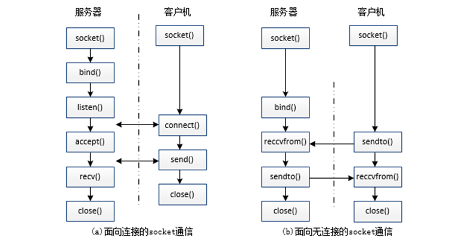
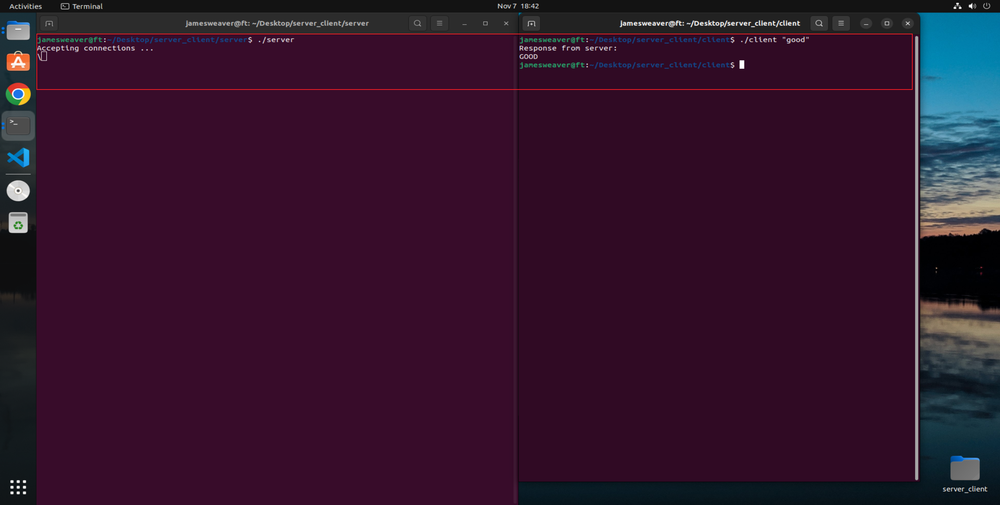

# C_Socket

## Socket基本概念

Socket(套接字)是一种 **通信端点（Communication Endpoint）**，程序用于访问网络以通过网络与其他进程/节点进行通信的核心组件之一。 你可以把它理解成网络中的“文件描述符”，通过它可以：发送数据，接收数据，实现不同设备/主机间的通信，套接字编程广泛应用于即时通讯应用程序、二进制流和文档协作、在线流媒体平台等，Socket 类型如下：

- ***\*TCP 套接字（流套接字）：\****提供可靠的、基于连接的通信（即[TCP协议](https://www.geeksforgeeks.org/computer-networks/what-is-transmission-control-protocol-tcp/)).
- ***\*UDP 套接字（数据报套接字）：\****提供无连接通信，速度更快但不可靠（即[UDP 协议](https://www.geeksforgeeks.org/computer-networks/user-datagram-protocol-udp/)).

## TCP和UDP的区别

| 对比项       | **TCP**                           | **UDP**                        |
| ------------ | --------------------------------- | ------------------------------ |
| **是否连接** | 面向连接（需三次握手）            | 无连接（直接发送）             |
| **是否可靠** | 可靠，保证数据顺序与完整性        | 不可靠，可能丢包、乱序         |
| **传输方式** | 字节流（Stream）                  | 数据报（Datagram）             |
| **速度**     | 较慢（需确认与重传）              | 快速（无握手与确认）           |
| **首部开销** | 20~60 字节                        | 仅 8 字节                      |
| **流量控制** | 有                                | 无                             |
| **拥塞控制** | 有                                | 无                             |
| **是否保序** | 保证数据顺序                      | 不保证顺序                     |
| **适合场景** | 文件传输、Web、MQTT、HTTP、Telnet | 视频流、语音、广播、传感器上报 |
| **典型端口** | 80(HTTP), 443(HTTPS), 22(SSH)     | 53(DNS), 69(TFTP), 161(SNMP)   |

## Client-Server

Client-Server指Socket中使用的架构，客户端和服务器相互交互以交换信息或服务。此体系结构允许客户端发送服务请求，并允许服务器处理和发送对这些服务请求的响应；状态图如下：



## Socket 常用函数

- 通用函数

  ```C
  // domain: 通信协议簇，AF_INET:IPV4的远程通信；AF_UNIX: 本地进程的通信
  // type: 取值分别为SOCK_STREAM(TCP)、SOCK_DGRAM(UDP)、SOCK_RAW(ICMP通信协议 原始套接字，需要自定义数据报格式)
  // protocol: 默认为0即可
  int socket(int domain, int type, int protocol); // 创建套接字，打开网络通信，调用失败返回errno,可以使用strerror输出错误信息
  ```

  

- 服务端专用函数

  ```C
  // 1️⃣ 服务器所监听的网络地址和端口号通常固定不变，客户端程序得知服务器程序的地址和端口号后，可主动向服务器请求连接，因此服务器需调用bind()函数绑定客户端中的进程，以便后续可监听到客户端的请求
  /* sockfd：指代socket文件的文件描述符
  **addr：指代需要与服务器进行通信进程的地址，为sockaddr 结构体的指针
  **addrlen：表示参数addr的长度，实质上addr参数可接受多种协议的结构体
  */
  int bind(int sockfd, const struct sockaddr *addr,socklen_t addrlen); // 绑定客户端进程号
  // sockaddr 结构体
  struct sockaddr {
    sa_family_t sa_family;
    char     sa_data[14];
  }
  
  // 定义socklen_t 结构体
  struct sockaddr_in servaddr;          //结构体定义
  bzero(&servaddr, sizeof(servaddr));      //结构体清零
  servaddr.sin_family = AF_INET;         //设置地址类型为AF_INET
  servaddr.sin_addr.s_addr = htonl(INADDR_ANY); //设置网络地址为INADDR_ANY
  servaddr.sin_port = htons(85);         //设置端口号为85
  
  
  // 2️⃣ sockfd表示socket文件描述符；参数backlog用于设置请求队列的最大长度,即连接的客户端数量
  int listen(int sockfd, int backlog); // 监听客户端进程状态
  
  /* 3️⃣ 
  **sockfd表示socket文件描述符;
  **addr是一个传出参数，表示客户端的地址
  **addrlen是一个传入传出参数，传入时为函数调用者提供的缓冲区addr的长度，传出时为客户端地址结构体的实际长度    
  */
  int accept(int sockfd, struct sockaddr *addr, socklen_t *addrlen); // accept()函数在listen()函数之后使用，其功能为阻塞等待客户端的连接请求
  ```

  

- 客户端专用函数

  ```C
  // addr 为服务端地址
  int connect(int sockfd, const struct sockaddr *addr,socklen_t addrlen); // 向服务端发起请求
  
  /*
  **sockfd：表示接收端的socket文件描述符
  **buf：为指向要发送数据的缓冲区指针
  **len：表示缓冲区buf中数据的长度；参数flags表示调用的执行方式（阻塞/非阻塞）
  */
  ssize_t send(int sockfd, const void *buf, size_t len, int flags);  // 向处于连接状态的套接字中发送数据
  
  ssize_t recv(int sockfd, void *buf, size_t len, int flags); // 已连接的套接字中接受信息，参数同send
  
  int close(int fd); // 释放系统分配资源
  ```

- 网络字节序：参见大小端模式，为了解决数据解析问题，所以需要对字节进行转换，linux中有`srpa/inet.h`：

  ```C
  uint32_t htonl(uint32_t hostlong);
  uint16_t htons(uint16_t hostshort);
  uint32_t ntohl(uint32_t netlong);
  uint16_t ntohs(uint16_t netshort);
  ```

- IP地址转换

  ```C
  // af的值必须是AF_INET或AF_INET6
  // src 表示IP地址
  // dst 表示接收转换后值的内存地址，其分为IPV4的地址：in_addr, IPV6地址：in6_addr
  int inet_pton(int af, const char *src, void *dst);
  const char *inet_ntop(int af, const void *src, char *dst, socklen_t size); // size 区分IPV4（16字节）和IPV6（46字节）
  ```

  

## Socket的使用

`server.c`

```C
#include <stdio.h>
#include <stdlib.h>
#include <string.h>
#include <unistd.h>
#include <sys/socket.h>
#include <netinet/in.h>
#include <arpa/inet.h>

#pragma comment(lib, "ws2_32.lib") // 链接 Winsock 库

#define MAXLINE 80     // 最大连接数
#define SERV_PORT 6666 // 服务器端口号
int main(void)
{
    struct sockaddr_in servaddr, cliaddr; // 定义服务器与客户端地址结构体
    socklen_t cliaddr_len;                // 客户端地址长度
    int listenfd, connfd;
    char buf[MAXLINE];
    char str[INET_ADDRSTRLEN];
    int i, n;

    listenfd = socket(AF_INET, SOCK_STREAM, 0); // 创建服务器端套接字文件
    // 初始化服务器端口地址
    bzero(&servaddr, sizeof(servaddr));                             // 将服务器端口地址清零
    servaddr.sin_family = AF_INET;                                  // 设置地址族为IPv4
    servaddr.sin_addr.s_addr = htonl(INADDR_ANY);                   // 监听所有网卡地址
    servaddr.sin_port = htons(SERV_PORT);                           // 设置服务器端口号
    bind(listenfd, (struct sockaddr *)&servaddr, sizeof(servaddr)); // 将套接字文件与服务器端口地址绑定
    listen(listenfd, 20); // 监听，并设置最大连接数未20
    printf("Accepting connections ...\n");
    
    // 接收客户端数据，并处理请求
    while (1)
    {
        cliaddr_len = sizeof(cliaddr);
        connfd = accept(listenfd, (struct sockaddr *)&cliaddr, &cliaddr_len);
        n = recv(connfd, buf, MAXLINE, 0);
        printf("received from %s at PORT %d\n",
               inet_ntop(AF_INET, &cliaddr.sin_addr, str, sizeof(str)),
               ntohs(cliaddr.sin_port));
        for (i = 0; i < n; i++)
            buf[i] = toupper(buf[i]); // 接收的字符串转为大写
        send(connfd, buf, n, 0);      // 将处理后的数据发送回客户端
        // 关闭连接
        close(connfd);
    }
    return 0;
}
```


`client.c`

```C
#include <stdio.h>
#include <stdlib.h>
#include <string.h>
#include <unistd.h>
#include <sys/socket.h>
#include <netinet/in.h>

#define MAXLINE 80
#define SERV_PORT 6666
int main(int argc, char *argv[])
{
    struct sockaddr_in servaddr; // 定义服务器地址结构体
    char buf[MAXLINE];
    int sockfd, n;
    char *str;
    if (argc != 2)
    {
        fputs("usage: ./client message\n", stderr);
        exit(1);
    }
    str = argv[1];
    
    sockfd = socket(AF_INET, SOCK_STREAM, 0);// 创建客户端套接字文件
    
    bzero(&servaddr, sizeof(servaddr));// 初始化服务器端口地址
    servaddr.sin_family = AF_INET; // 设置地址族为IPv4
    inet_pton(AF_INET, "127.0.0.1", &servaddr.sin_addr); // 设置服务器IP地址
    servaddr.sin_port = htons(SERV_PORT); // 设置服务器端口号
    connect(sockfd, (struct sockaddr *)&servaddr, sizeof(servaddr)); // 请求链接
    send(sockfd, str, strlen(str), 0);// 发送数据
    n = recv(sockfd, buf, MAXLINE, 0);// 接收客户端返回的数据
    printf("Response from server:\n");
    write(STDOUT_FILENO, buf, n);// 将客户端返回的数据打印到终端
    close(sockfd);// 关闭连接
    return 0;
}
```

在linux下分别编译两个文件，然后分别在终端执行

