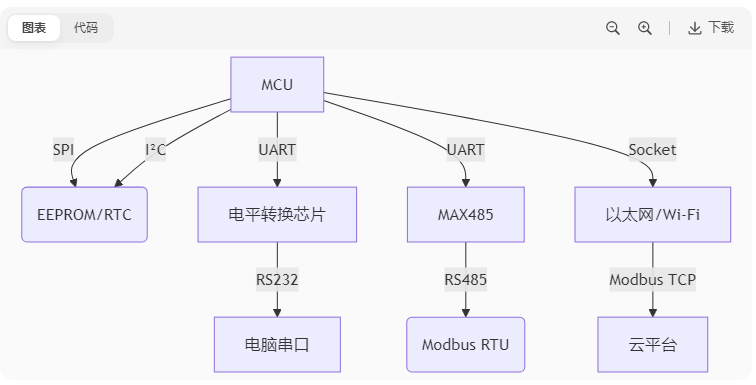

# STM32F103C8T6

## STM32引脚图


## 系统架构

**系统结构：四个驱动单元（DC Code总线Dbus, 系统总线Sbus，DMA1, DMA2）四个被动单元（SRAM,内部闪存存储器，FSMC, AHB到APB桥--连接APB设备）**

**互联网结构：五个驱动单元（D-bus, Sbus,DMA1, DMA2, 以太网DMA），三个被动单元（SRAM,内部闪存存储器，AHB到APB桥--连接APB设备）**


## GPIO

1. ### 由上图可知：GPIO通过APB2总线连接，采用32位编码，高16位未使用，其基本结构为

   

2. ### GPIO的8种端口模式

   **对应 “ gpio.h ” 文件中：**

   ```C
   typedef enum
   { 
     GPIO_Mode_AIN = 0x00, // 模拟输入，GPIO无效，引脚直接接入内部ADC
     GPIO_Mode_IN_FLOATING = 0x04,// 浮空输入，可读取引脚电平，若引脚悬空，则电平不确定
     GPIO_Mode_IPD = 0x28, // 下拉输入，可读取引脚电平，内部连接下拉电阻，悬空时默认低电平
     GPIO_Mode_IPU = 0x48, // 上拉输入，可读取引脚电平，内部连接上拉电阻，悬空时默认高电平
     GPIO_Mode_Out_OD = 0x14, // 开漏输出，高电平无驱动，低电平有输出驱动能力
     GPIO_Mode_Out_PP = 0x10, // 推挽输出，高低电平均有驱动能力
     GPIO_Mode_AF_OD = 0x1C, // 复用开漏输出，可输出引脚电平，高电平为高阻态，低电平接VSS
     GPIO_Mode_AF_PP = 0x18 // 复用推挽输出，可输出引脚电平，高电平接VDD,低电平接VSS
   }GPIOMode_TypeDef;
   ```

3. LED

    - 需要了解GPIO的输入和输出

    - 常用函数

      ```C
      // 时钟使能
      void RCC_APB2PeriphClockCmd(uint32_t RCC_APB2Periph, FunctionalState NewState); // APB2内部时钟
      void RCC_APB1PeriphClockCmd(uint32_t RCC_APB1Periph, FunctionalState NewState); // APB1时钟
      void RCC_AHBPeriphClockCmd(uint32_t RCC_AHBPeriph, FunctionalState NewState); // AHB时钟使能
      
      // GPIO初始化
      GPIO_InitTypeDef gpio_initstruct; // 结构体
      gpio_initstruct.GPIO_Pin   = GPIO_Pin_1; // 引脚
      gpio_initstruct.GPIO_Mode  = GPIO_Mode_Out_PP; // 输出模式
      gpio_initstruct.GPIO_Speed = GPIO_Speed_50MHz; // 速度
      void GPIO_Init(GPIO_TypeDef* GPIOx, GPIO_InitTypeDef* GPIO_InitStruct) // 初始化GPIO
      
      // 引脚设置
      void GPIO_SetBits(GPIO_TypeDef* GPIOx, uint16_t GPIO_Pin); // 高电平
      void GPIO_ResetBits(GPIO_TypeDef* GPIOx, uint16_t GPIO_Pin); // 低电平
      void GPIO_WriteBit(GPIO_TypeDef* GPIOx, uint16_t GPIO_Pin, BitAction BitVal); // BitVal 值： bit_Set高或者bit_ReSet低， 
      void GPIO_Write(GPIO_TypeDef* GPIOx, uint16_t PortVal); // 控制多个端口
      ```

4. 点灯

   ```C
   // 需要三步：
   // 1.开启端口时钟
   RCC_APB2PeriphClockCmd(RCC_APB2Periph_GPIOA, ENABLE); // 启用或禁用高速APB（APB 2）外围设备时钟。
   
   // 2.初始化GPIO
   GPIO_InitTypeDef gpio_initstruct; // 结构体初始化
   gpio_initstruct.GPIO_Pin   = GPIO_Pin_1;
   gpio_initstruct.GPIO_Mode  = GPIO_Mode_Out_PP; // 推挽输出
   gpio_initstruct.GPIO_Speed = GPIO_Speed_50MHz;
   while(1)
   {
       // 3.设置端口值
       GPIO_SetBits(GPIOA, GPIO_Pin_1); // 置高电平
       Delay_ms(200);
       GPIO_ResetBits(GPIOA, GPIO_Pin_1);// 置低电平
   }
   ```

5. GPIO端口检测
    ```C
    uint8_t GPIO_ReadInputDataBit(GPIO_TypeDef* GPIOx, uint16_t GPIO_Pin); // 端口输入检测
    uint16_t GPIO_ReadInputData(GPIO_TypeDef* GPIOx); // 多端口输入检测
    uint8_t GPIO_ReadOutputDataBit(GPIO_TypeDef* GPIOx, uint16_t GPIO_Pin); // 端口输出检测
    uint16_t GPIO_ReadOutputData(GPIO_TypeDef* GPIOx); // 多端口输出检测
    ```

6.  Interrupt **参考"中断.md"**

7. Serial Communication

    - **基本概念**

      - 全双工：双线同时收发数据（USART，如TX和RX，电话）

      - 半双工：单线分时收发数据（IIC、对讲机）

      - 同步：需要共享时钟信号来同步数据（SPI-SCK,IIC-SCL, 同步串口）

      - 异步：无时钟信号，依赖波特率和帧格式（RS232,RS-485）

        | 接口  | 全双工 | 同步/异步 | 硬件流控 | 最高波特率         | 典型应用            |
        | :---- | :----- | :-------- | :------- | :----------------- | :------------------ |
        | USART | 是     | 同步/异步 | 支持     | 4.5 Mbps (USART1)  | 通用串口通信        |
        | UART  | 是     | 异步      | 可选     | 2.25 Mbps          | 简单异步通信        |
        | SPI   | 是     | 同步      | 不支持   | 18 Mbps            | 高速外设（如Flash） |
        | I2C   | 半双工 | 同步      | 不支持   | 400 kHz (标准模式) | 低速传感器          |

      

    - **标准串口（USRAT / UART）参考"USART.md"**；

      - **UART**：仅支持异步通信（如RS232、RS485）,（TTL标准电平）通常需搭配电平转换芯片才能对接RS232或RS485设备

        | **特性**       | **UART**                   | **RS232**                    | **RS485**                         |
        | :------------- | :------------------------- | :--------------------------- | :-------------------------------- |
        | **本质**       | 异步串行通信协议（逻辑层） | 电气标准（物理层）           | 电气标准（物理层）                |
        | **通信类型**   | 异步、全双工               | 异步、全双工（实际常半双工） | 异步、半双工/全双工               |
        | **信号线**     | TX（发送）、RX（接收）     | TX、RX、GND（DB9接口常用）   | A（+）、B（-）、GND（差分对）     |
        | **电平标准**   | TTL电平（0V/3.3V/5V）      | ±3V~±15V（负逻辑）           | 差分信号（±1.5V~±5V）             |
        | **传输距离**   | <1米（直接TTL）            | ≤15米（9600bps时）           | ≤1200米（速率降低时）             |
        | **拓扑结构**   | 点对点                     | 点对点                       | 多点总线（1主多从，32~256节点）   |
        | **抗干扰能力** | 极弱                       | 中等（高电压摆幅）           | 极强（差分信号抑制共模干扰）      |
        | **典型应用**   | MCU间短距离通信、蓝牙模块  | 电脑串口、工业设备配置接口   | 工业自动化（Modbus RTU）、PLC网络 |
    
      - **USART**：支持同步（如SPI、I2C）和异步模式，更灵活
    
        | **特性**       | **USART**                                               | **SPI**                     | **I²C**                       | **CAN**                     |
        | :------------- | :------------------------------------------------------ | :-------------------------- | :---------------------------- | :-------------------------- |
        | **全称**       | Universal Synchronous/Asynchronous Receiver/Transmitter | Serial Peripheral Interface | Inter-Integrated Circuit      | Controller Area Network     |
        | **通信类型**   | 同步/异步可选                                           | 同步、全双工                | 同步、半双工                  | 异步、半双工                |
        | **信号线**     | TX, RX（异步） +CLK（同步）                             | SCK, MOSI, MISO, SS         | SCL, SDA                      | CAN_H, CAN_L                |
        | **拓扑结构**   | 点对点                                                  | 单主多从（硬件片选）        | 多主多从（总线）              | 多主对等（总线）            |
        | **时钟信号**   | 同步模式需外部时钟                                      | 必需（主设备提供）          | 必需（开漏时钟）              | 无（异步，位填充同步）      |
        | **速度**       | 异步：≤1Mbps 同步：更高                                 | 可达100MHz+                 | 标准模式：100kHz 高速：3.4MHz | 1Mbps（CAN FD达5Mbps）      |
        | **寻址方式**   | 无（点对点）                                            | 硬件片选（SS引脚）          | 7位/10位设备地址              | 11/29位报文ID（无设备地址） |
        | **错误检测**   | 可选奇偶校验                                            | 无                          | 无                            | CRC校验+自动重传            |
        | **抗干扰能力** | 弱（单端信号）                                          | 弱（单端信号）              | 弱（单端信号）                | 极强（差分信号+汽车级EMC）  |
        | **典型应用**   | 调试串口、蓝牙模块                                      | Flash、显示屏               | 传感器、EEPROM                | 汽车电子、工业控制          |
    
      - 其他
    
        | **特性**     | **MQTT**（双绞线）     | **HTTP**（双绞线）   | **Modbus**（双绞线/RS232/RS485） | **Socket**(双绞线)          |
        | :----------- | :--------------------- | :------------------- | :------------------------------- | :-------------------------- |
        | **协议类型** | 发布/订阅消息协议      | 请求/响应应用协议    | 主从式工业协议                   | 网络编程接口（API）         |
        | **OSI层级**  | 应用层（基于TCP）      | 应用层（基于TCP）    | 应用层（基于RS485/TCP）          | 传输层/网络层（TCP/UDP/IP） |
        | **通信模型** | 事件驱动（异步）       | 同步请求-响应        | 主设备轮询从设备                 | 支持全双工/半双工           |
        | **数据格式** | 二进制（主题+Payload） | 文本（Header+Body）  | 二进制/ASCII（功能码+数据）      | 原始字节流（需自定义格式）  |
        | **连接方式** | 长连接（心跳保活）     | 短连接（默认无状态） | 短连接（RS485）/长连接（TCP）    | 可长可短（开发者控制）      |
        | **典型延迟** | 低（毫秒级）           | 高（百毫秒级）       | 中等（轮询延迟）                 | 取决于底层协议              |
        | **适用场景** | 物联网设备群控         | Web服务交互          | 工业设备数据采集                 | 自定义网络通信              |
