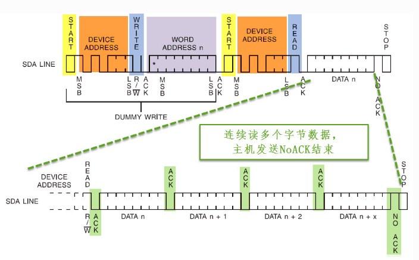

# IIC

1. IIC基本概念

   - IIC原理：I²C（Inter-Integrated Circuit，集成电路总线）是一种 **同步、半双工、串行通信协议**，由 **Philips**（现 NXP）开发，广泛用于 **传感器、EEPROM、RTC（实时时钟）、LCD 驱动** 等低速外设的通信。STM32 等微控制器通常内置硬件 I²C 控制器，支持主从模式。

   - 通信结构：I²C 采用 **主从架构**，仅需 **2 根信号线**：

     | 信号线                  | 作用                               |
     | :---------------------- | :--------------------------------- |
     | **SCL（Serial Clock）** | 主机提供的同步时钟（单向）         |
     | **SDA（Serial Data）**  | 双向数据线（开漏输出，需上拉电阻） |

   - 

   - I²C 数据帧格式：I²C 通信由 **起始条件、地址帧、数据帧、停止条件** 组成：

     - **起始条件（Start Condition）:** SCL 为高电平时，SDA 由高→低跳变。

     - **停止条件（Stop Condition）: **SCL 为高电平时，SDA 由低→高跳变。

     - **地址帧（Address Frame）: **7 位从机地址 + 1 位读写方向（0=写，1=读）。
     
     - **数据帧（Data Frame）:** 每 8 位数据后跟随 1 位 **ACK（应答）**（低电平有效）。
     
       ```C
       typedef struct {
           uint32_t I2C_ClockSpeed; /*!< 设置SCL时钟频率，此值要低于40 0000*/
           uint16_t I2C_Mode;      /*!< 指定工作模式，可选I2C模式及SMBUS模式 */
           uint16_t I2C_DutyCycle; /*指定时钟占空比，可选low/high = 2:1及16:9模式*/
           uint16_t I2C_OwnAddress1;     /*!< 指定自身的I2C设备地址 */
           uint16_t I2C_Ack;                 /*!< 使能或关闭响应(一般都要使能) */
           uint16_t I2C_AcknowledgedAddress; /*!< 指定地址的长度，可为7位及10位 */
       } I2C_InitTypeDef;
       ```
     
       

2. IIC配置

   ```C
   #define IIC_Write_SCL(x)		GPIO_WriteBit(GPIOB, GPIO_Pin_11, (BitAction)(x))
   #define IIC_Write_SDA(x)		GPIO_WriteBit(GPIOB, GPIO_Pin_12, (BitAction)(x))
   // IIC 配置
   void IIC_GPIO_Init(void){
       GPIO_InitTypeDef GPIO_InitStructure;
    	GPIO_InitStructure.GPIO_Mode = GPIO_Mode_Out_OD;
   	GPIO_InitStructure.GPIO_Speed = GPIO_Speed_50MHz;
   	GPIO_InitStructure.GPIO_Pin = GPIO_Pin_11;
    	GPIO_Init(GPIOB, &GPIO_InitStructure);
   	GPIO_InitStructure.GPIO_Pin = GPIO_Pin_12;
    	GPIO_Init(GPIOB, &GPIO_InitStructure);
   }
   
   void IIC_Start(void){
    	// 起始条件
       IIC_Write_SCL(1);
       IIC_Write_SDA(1);
       IIC_Write_SDA(0);
       IIC_Write_SCL(0);
   }
   
   void IIC_Stop(void){
       IIC_Write_SDA(0); // 确保当前的SDA为0
       IIC_Write_SCL(1);
       IIC_Write_SDA(1); // SDA产生上升沿    
   }
   
   void IIC_Send_Byte(uint8_t Byte){
       uint8_t i;
       IIC_Start();
   	for(i=0;i<8;i++){
           IIC_Write_SDA(!!(Byte & (0x80>>i)));
           IIC_Write_SCL(1);
           IIC_Write_SCL(0);
       }
   	IIC_Write_SCL(1);
       IIC_Write_SCL(0);
   }
   ```

3. EEPROM

   - EEPROM 写入时序（起始信号>器件地址+写>内存地址>data>停止信号）

   

   ​	

   ```C
   /**
   * @brief  写入单个字节到EEPROM
   * @param  deviceAddr: 设备地址
   * @param  memAddr: 内存地址
   * @param  data: 要写入的数据
   * @retval Null
   * */
   void IIC_WriteBytes(uint8_t deviceAddr, uint16_t memAddr, uint8_t data)
   {
       // 每完成一步，均需要等待信号完成
       // 等待I2C1空闲
       while (I2C_GetFlagStatus(I2C1, I2C_FLAG_BUSY));
       while (!I2C_GetFlagStatus(I2C1, I2C_FLAG_TXE));
   
       // 发送起始信号
       I2C_GenerateSTART(I2C1, ENABLE);
       while (!I2C_CheckEvent(I2C1, I2C_EVENT_MASTER_MODE_SELECT)); // 等待START信号生成完成
   
       // 发送设备地址
       I2C_Send7bitAddress(I2C1, deviceAddr, I2C_Direction_Transmitter); // 发送设备地址和写操作
       while (!I2C_CheckEvent(I2C1, I2C_EVENT_MASTER_TRANSMITTER_MODE_SELECTED));    // 等待地址发送完成
   
       // 发送内存地址（高字节）
       I2C_SendData(I2C1, (uint8_t)(memAddr >> 8));
       while (!I2C_CheckEvent(I2C1, I2C_EVENT_MASTER_BYTE_TRANSMITTED)); // 等待数据发送完成
       // 发送内存地址（低字节）
       I2C_SendData(I2C1, (uint8_t)(memAddr & 0xFF));
       while (!I2C_CheckEvent(I2C1, I2C_EVENT_MASTER_BYTE_TRANSMITTED)); // 等待数据发送完成
   
       // 发送数据
       I2C_SendData(I2C1, data);
       while (!I2C_CheckEvent(I2C1, I2C_EVENT_MASTER_BYTE_TRANSMITTED)); // 等待数据发送完成   
       // 产生停止信号
       I2C_GenerateSTOP(I2C1, ENABLE);
       Delay_ms(5); // 等待写入完成，EEPROM需要时间来完成写操作
   }
   
   /**
    * @brief  写入多个字节到EEPROM
    * @param  deviceAddr: 设备地址
    * @param  memAddr: 内存地址
    * @param  buffer: 数据缓冲区指针
    * @param  length: 要写入的字节数
    * @retval Null
    * */
   void EEPROM_IIC_WriteBytes(uint8_t deviceAddr, uint16_t memAddr, char *buffer, uint8_t length)
   {
       // TODO: 可以直接for循环调用EEPROM_IIC_Writebytes函数来实现写入多个字节
       // 等待I2C1空闲
       while (I2C_GetFlagStatus(I2C1, I2C_FLAG_BUSY));
       while (!I2C_GetFlagStatus(I2C1, I2C_FLAG_TXE));
   
       EEPROM_IIC_Start(I2C1);                                           // 产生起始信号
       EEPROM_IIC_SendAddr(I2C1, deviceAddr, I2C_Direction_Transmitter); // 发送设备地址
       EEPROM_IIC_SendData(I2C1, (uint8_t)(memAddr >> 8));               // 发送内存地址之高八位地址
       EEPROM_IIC_SendData(I2C1, (uint8_t)(memAddr && 0xFF));            // 发送内存地址之低八位地址
   
       // 发送数据，需要处理最后一个字节的ACK/NACK
       for (uint8_t i = 0; i < length; i++) {
           if (i == length - 1) {
               buffer[i] = EEPROM_IIC_ReceiveData(I2C1, 0); // NACK
           } else {
               buffer[i] = EEPROM_IIC_ReceiveData(I2C1, 1); // ACK
           }
       }
       EEPROM_IIC_Stop(I2C1); // 产生停止信号
   }
   ```

   ​	

   

   - EEPROM的读取顺序（起始信号>器件地址+写>内存地址>重复起始信号>器件地址+读>data>停止信号）

      
      
      ```C
      /**
      * @brief  从EEPROM读取一个字节
      * @param  deviceAddr: 设备地址
      * @param  memAddr: 内存地址
      * @retval data: 读取到的数据
      * */
      uint8_t EEPROM_IIC_ReadByte(uint8_t deviceAddr, uint16_t memAddr)
      {
          uint8_t data;
          // 等待I2C1空闲
          while (I2C_GetFlagStatus(I2C1, I2C_FLAG_BUSY));
          while (!I2C_GetFlagStatus(I2C1, I2C_FLAG_TXE));
      
          EEPROM_IIC_Start(I2C1);// 发送起始信号
          EEPROM_IIC_SendAddr(I2C1, deviceAddr, I2C_Direction_Transmitter);// 发送设备地址和写操作
          EEPROM_IIC_SendData(I2C1, (uint8_t)(memAddr >> 8));// 发送内存地址（高字节）   
          EEPROM_IIC_SendData(I2C1, (uint8_t)(memAddr & 0xFF));// 发送内存地址（低字节）  
          EEPROM_IIC_Start(I2C1);// 发送重复起始信号
          EEPROM_IIC_SendAddr(I2C1, deviceAddr, I2C_Direction_Receiver);// 发送设备地址和读操作
          
          // 接收数据
          data = EEPROM_IIC_ReceiveData(I2C1, 0); // NACK
          EEPROM_IIC_Stop(I2C1);// 产生停止信号
          return data; // 返回接收到的数据
      }
      
      /**
       * @brief  从EEPROM读取多个字节
       * @param  deviceAddr: 设备地址
       * @param  memAddr: 内存地址
       * @param  buffer: 数据缓冲区指针
       * @param  length: 要读取的字节数
       * @retval Null
       */
      void EEPROM_IIC_ReadBytes(uint8_t deviceAddr, uint16_t memAddr, char *buffer, uint8_t length)
      {
          // 等待I2C1空闲
          while (I2C_GetFlagStatus(I2C1, I2C_FLAG_BUSY));
          while (!I2C_GetFlagStatus(I2C1, I2C_FLAG_TXE));
      
          EEPROM_IIC_Start(I2C1); // 产生起始信号
          EEPROM_IIC_SendAddr(I2C1, deviceAddr, I2C_Direction_Transmitter); // 发送设备地址和写操作
          EEPROM_IIC_SendData(I2C1, (uint8_t)(memAddr >> 8)); // 发送内存地址（高字节）
          EEPROM_IIC_SendData(I2C1, (uint8_t)(memAddr & 0xFF)); // 发送内存地址（低字节）
          EEPROM_IIC_Start(I2C1); // 发送重复起始信号    
          EEPROM_IIC_SendAddr(I2C1, deviceAddr, I2C_Direction_Receiver); // 发送设备地址和读操作 
          // 接收数据
          for (uint8_t i = 0; i < length; i++) {  
              if (i == length - 1) {
                  buffer[i] = EEPROM_IIC_ReceiveData(I2C1, 0); // NACK
              } else {
                  buffer[i] = EEPROM_IIC_ReceiveData(I2C1, 1); // ACK
              }
          }
          EEPROM_IIC_Stop(I2C1); // 产生停止信号
      }
      ```

4. OLED 

   - 原理：
   - 设计：
