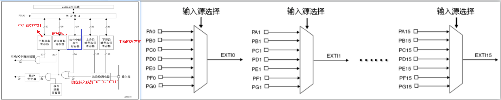

# STM32F103C8T6

## STM32引脚图


## 系统架构

**系统结构：四个驱动单元（DC Code总线Dbus, 系统总线Sbus，DMA1, DMA2）四个被动单元（SRAM,内部闪存存储器，FSMC, AHB到APB桥--连接APB设备）**

**互联网结构：五个驱动单元（D-bus, Sbus,DMA1, DMA2, 以太网DMA），三个被动单元（SRAM,内部闪存存储器，AHB到APB桥--连接APB设备）**


## GPIO

1. ### 由上图可知：GPIO通过APB2总线连接，采用32位编码，高16位未使用，其基本结构为

   

2. ### GPIO的8种端口模式

   **对应 “ gpio.h ” 文件中：**

   ```C
   typedef enum
   { 
     GPIO_Mode_AIN = 0x00, // 模拟输入，GPIO无效，引脚直接接入内部ADC
     GPIO_Mode_IN_FLOATING = 0x04,// 浮空输入，可读取引脚电平，若引脚悬空，则电平不确定
     GPIO_Mode_IPD = 0x28, // 下拉输入，可读取引脚电平，内部连接下拉电阻，悬空时默认低电平
     GPIO_Mode_IPU = 0x48, // 上拉输入，可读取引脚电平，内部连接上拉电阻，悬空时默认高电平
     GPIO_Mode_Out_OD = 0x14, // 开漏输出，高电平无驱动，低电平有输出驱动能力
     GPIO_Mode_Out_PP = 0x10, // 推挽输出，高低电平均有驱动能力
     GPIO_Mode_AF_OD = 0x1C, // 复用开漏输出，可输出引脚电平，高电平为高阻态，低电平接VSS
     GPIO_Mode_AF_PP = 0x18 // 复用推挽输出，可输出引脚电平，高电平接VDD,低电平接VSS
   }GPIOMode_TypeDef;
   ```

3. LED

    - 需要了解GPIO的输入和输出

    - 常用函数

      ```C
      // 时钟使能
      void RCC_APB2PeriphClockCmd(uint32_t RCC_APB2Periph, FunctionalState NewState); // APB2内部时钟
      void RCC_APB1PeriphClockCmd(uint32_t RCC_APB1Periph, FunctionalState NewState); // APB1时钟
      void RCC_AHBPeriphClockCmd(uint32_t RCC_AHBPeriph, FunctionalState NewState); // AHB时钟使能
      
      // GPIO初始化
      GPIO_InitTypeDef gpio_initstruct; // 结构体
      gpio_initstruct.GPIO_Pin   = GPIO_Pin_1; // 引脚
      gpio_initstruct.GPIO_Mode  = GPIO_Mode_Out_PP; // 输出模式
      gpio_initstruct.GPIO_Speed = GPIO_Speed_50MHz; // 速度
      void GPIO_Init(GPIO_TypeDef* GPIOx, GPIO_InitTypeDef* GPIO_InitStruct) // 初始化GPIO
      
      // 引脚设置
      void GPIO_SetBits(GPIO_TypeDef* GPIOx, uint16_t GPIO_Pin); // 高电平
      void GPIO_ResetBits(GPIO_TypeDef* GPIOx, uint16_t GPIO_Pin); // 低电平
      void GPIO_WriteBit(GPIO_TypeDef* GPIOx, uint16_t GPIO_Pin, BitAction BitVal); // BitVal 值： bit_Set高或者bit_ReSet低， 
      void GPIO_Write(GPIO_TypeDef* GPIOx, uint16_t PortVal); // 控制多个端口
      ```

4. 点灯

   ```C
   // 需要三步：
   // 1.开启端口时钟
   RCC_APB2PeriphClockCmd(RCC_APB2Periph_GPIOA, ENABLE); // 启用或禁用高速APB（APB 2）外围设备时钟。
   
   // 2.初始化GPIO
   GPIO_InitTypeDef gpio_initstruct; // 结构体初始化
   gpio_initstruct.GPIO_Pin   = GPIO_Pin_1;
   gpio_initstruct.GPIO_Mode  = GPIO_Mode_Out_PP; // 推挽输出
   gpio_initstruct.GPIO_Speed = GPIO_Speed_50MHz;
   while(1)
   {
       // 3.设置端口值
       GPIO_SetBits(GPIOA, GPIO_Pin_1); // 置高电平
       Delay_ms(200);
       GPIO_ResetBits(GPIOA, GPIO_Pin_1);// 置低电平
   }
   ```

5. GPIO端口检测
    ```C
    uint8_t GPIO_ReadInputDataBit(GPIO_TypeDef* GPIOx, uint16_t GPIO_Pin); // 端口输入检测
    uint16_t GPIO_ReadInputData(GPIO_TypeDef* GPIOx); // 多端口输入检测
    uint8_t GPIO_ReadOutputDataBit(GPIO_TypeDef* GPIOx, uint16_t GPIO_Pin); // 端口输出检测
    uint16_t GPIO_ReadOutputData(GPIO_TypeDef* GPIOx); // 多端口输出检测
    ```

6. EXTI外部中断流程和相关函数

    

    - 基本概念：STM32支持19个外部中断，0~15为IO端口输入中断，16-PVD电压监测, 17-RTC闹钟,18-USB唤醒，19-以太网端口（互联网性）； 

    - 0~15个IO端口分配至EXTI0~EXTI15，为了对应线和中断所以需要做映射：`void GPIO_EXTILineConfig(uint8_t GPIO_PortSource, uint8_t GPIO_PinSource)`

    - 映射后设置中断的初始化，分别包含标志位（EXTI_Line）、模式选择（EXTI_Mode）、触发方式(上升沿、下降沿、双边沿)、中断有效控制，`void EXTI_Init(EXTI_InitTypeDef* EXTI_InitStruct);`

      ```C
      // EXTI完整配置
      EXTI_InitTypeDef EXTI_InitStructure = {0};
      
      // 编码器A相(PA0)配置：双边沿触发
      EXTI_InitStructure.EXTI_Line = EXTI_Line0; // 标志位
      EXTI_InitStructure.EXTI_Mode = EXTI_Mode_Interrupt; // 模式选择
      EXTI_InitStructure.EXTI_Trigger = EXTI_Trigger_Rising_Falling; // 触发方式--双边沿
      EXTI_InitStructure.EXTI_LineCmd = ENABLE; // 中断使能
      EXTI_Init(&EXTI_InitStructure); // 应用配置
      ```

    - 中断可能同时触发，所以需要设置优先级（NVIC）,外部中断通道选择、抢占优先级、子优先级、中断使能`NVIC_InitTypeDef NVIC_InitStructure`

      ```C
      // NVIC配置
      NVIC_InitTypeDef NVIC_InitStructure = {0};
      // EXTI0中断(编码器A相)
      NVIC_InitStructure.NVIC_IRQChannel = EXTI0_IRQn; // 通道匹配
      NVIC_InitStructure.NVIC_IRQChannelPreemptionPriority = 0x0F; // 抢占优先级
      NVIC_InitStructure.NVIC_IRQChannelSubPriority = 0x0F; // 子优先级
      NVIC_InitStructure.NVIC_IRQChannelCmd = ENABLE; // 使能
      NVIC_Init(&NVIC_InitStructure); // 应用配置
      ```
      
      
      
    - 中断子程序：外部中断函数只有6个，中断线0-4每个中断线对应一个中断函数，中断线5-9共用中断函数EXTI9_5_IRQHandler，中 断线10-15共用中断函数EXTI15_10_IRQHandler。

    - 其他常用函数：中断发生监控`ITStatus EXTI_GetITStatus(uint32_t EXTI_Line)； ` 中断标志位清除(使用中断时，均要加在最后关闭中断)：`void EXTI_ClearITPendingBit(uint32_t EXTI_Line)； `

      ```C
      /*总结
      1.使能APB2时钟（GPIO和AFIO）
      2.GPIO初始化
      3.映射GPIO至AFIO
      4.中断初始化
      5.NVIC优先级配置
      6.编写中断子程序
      */
      ```
      

7. EC11编码器

    - 名称：增量式机械编码器；主要用于旋转方向，角度控制，按键

    - 引脚：

        - A相（CLK）：输出脉冲信号1。
        - B相（DT）：输出脉冲信号2，相位与A相差90°。
        - C相（SW）：按键信号（按下时接地）加RC滤波，硬件防抖。

    - 原理：使用正交编码，A/B两相输出波形相差90° 

        ```C
        // 顺时针：A上升沿 B低电平 A下降沿 B高电平
        // 逆时针：A上升沿，B高电平 A下降沿 B低电平
        // 使用双边沿检查
        // EXTI0中断（A相跳变）
        uint16_t CW_Count
        void EXTI0_IRQHandler(void) {
            if (EXTI_GetITStatus(EXTI_Line0) != RESET) {
                static uint8_t lastA = 0, lastB = 0;
                uint8_t currentA = GPIO_ReadInputDataBit(EC11_PORT, EC11_A_PIN);
                uint8_t currentB = GPIO_ReadInputDataBit(EC11_PORT, EC11_B_PIN);
                
                // 状态机判断方向（需结合A、B相变化）
                if (lastA == 0 && currentA == 1) {  // A上升沿
                    currentB == 0 ? CW_Count++: CCW_Count++;  // B=0:CW, B=1:CCW
                }
                else if (lastA == 1 && currentA == 0) {  // A下降沿
                    currentB == 1 ? CW_Count++:CCW_Count++;  // B=1:CW, B=0:CCW
                }
                
                lastA = currentA;
                lastB = currentB;
                EXTI_ClearITPendingBit(EXTI_Line0);  // 清除中断标志
            }
        }
        ```

    - 常见问题：由于机械结构原因可能多次响应

8. 定时器

    1. 定时器分类
    2. 时基单元工作流程
        - 进入预分频器（PSC）,对内部的72MHz的时钟进行分频，实际的分频值 = 预分频值 + 1
        - 计数器计数，分为向上计数，向下计数，中央对齐计数
        - 自动重装初始值

    | 编号       | 类型       | 总线 | 功能                                                         |
    | ---------- | ---------- | ---- | ------------------------------------------------------------ |
    | TIM1、8    | 高级定时器 | APB2 | 拥有通用定时器全部功能，并额外具有重复计数器、死区生成、互补输出、刹车输入等功能 |
    | TIM2,3,4,5 | 通用定时器 | APB1 | 拥有基本定时器全部功能，并额外具有内外时钟源选择、输入捕获、输出比较、编码器接口、主从触发模式等功能 |
    | TIM6,7     | 基本定时器 | APB1 | 拥有定时中断、主模式触发DAC的功能                            |


8. 外设
   - EC11 编码器
   - 原理：