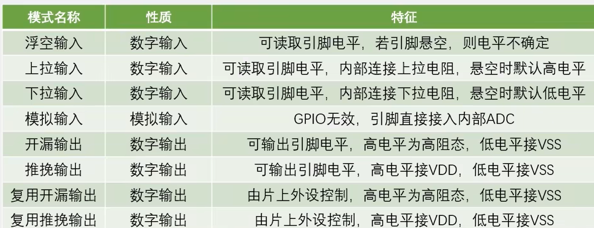

# STM32F103C8T6


### 系统架构

**系统结构：四个驱动单元（DC Code总线Dbus, 系统总线Sbus，DMA1, DMA2）四个被动单元（SRAM,内部闪存存储器，FSMC, AHB到APB桥--连接APB设备）**

**互联网结构：五个驱动单元（D-bus, Sbus,DMA1, DMA2, 以太网DMA），三个被动单元（SRAM,内部闪存存储器，AHB到APB桥--连接APB设备）**

### GPIO

1. 由上图可知：GPIO通过APB2总线连接，采用32位编码，高16位未使用，其基本结构为

   

2. GPIO的8种端口模式

   

   

   **对应GPIO.H文件中：**

   ```C
   typedef enum
   { 
     GPIO_Mode_AIN = 0x00, // 模拟输入
     GPIO_Mode_IN_FLOATING = 0x04,// 浮空输入
     GPIO_Mode_IPD = 0x28, // 下拉输入
     GPIO_Mode_IPU = 0x48, // 上拉输入
     GPIO_Mode_Out_OD = 0x14, // 开漏输出，高电平无驱动，低电平有输出驱动能力
     GPIO_Mode_Out_PP = 0x10, // 推挽输出，高低电平均有驱动能力
     GPIO_Mode_AF_OD = 0x1C, // 复用开漏输出
     GPIO_Mode_AF_PP = 0x18 // 复用推挽输出
   }GPIOMode_TypeDef;
   ```

3. 常用函数

   ```
   RCC_APB2PeriphClockCmd(); // 启用或禁用低速APB（APB 2）外围设备时钟
   RCC_AHBPeriphClockCmd(); // 仅在睡眠模式期间才能禁用静态存储器和FLITF时钟
   RCC_APB1PeriphClockCmd(); // 启用或禁用低速APB（APB 1）外围设备时钟
   
   GPIO_Init(); // 初始化GPIO
   GPIO_SetBits(); // 高电平
   GPIO_ReSetBits(); // 低电平
   GPIO_WriteBit(); // bit_Set高或者bit_ReSet低， 
   GPIO_Write(); // 控制多个端口
   ```

   

4. 点灯

   ```C
   // 需要三步：
   // 1.开启端口时钟
   RCC_APB2PeriphClockCmd(RCC_APB2Periph_GPIOA, ENABLE); // 启用或禁用高速APB（APB 2）外围设备时钟。
   
   // 初始化GPIO 配置50MHZ GPIO为推挽模式
   GPIO_InitTypeDef gpio_initstruct; // 结构体初始化
   gpio_initstruct.GPIO_Pin   = GPIO_Pin_1;
   gpio_initstruct.GPIO_Mode  = GPIO_Mode_Out_PP;
   gpio_initstruct.GPIO_Speed = GPIO_Speed_50MHz;
   while(1)
   {
       // 设置端口值
       GPIO_SetBits(GPIOA, GPIO_Pin_1); // 置高电平
       Delay_ms(200);
       GPIO_ResetBits(GPIOA, GPIO_Pin_1);// 置低电平
   }
   ```

   