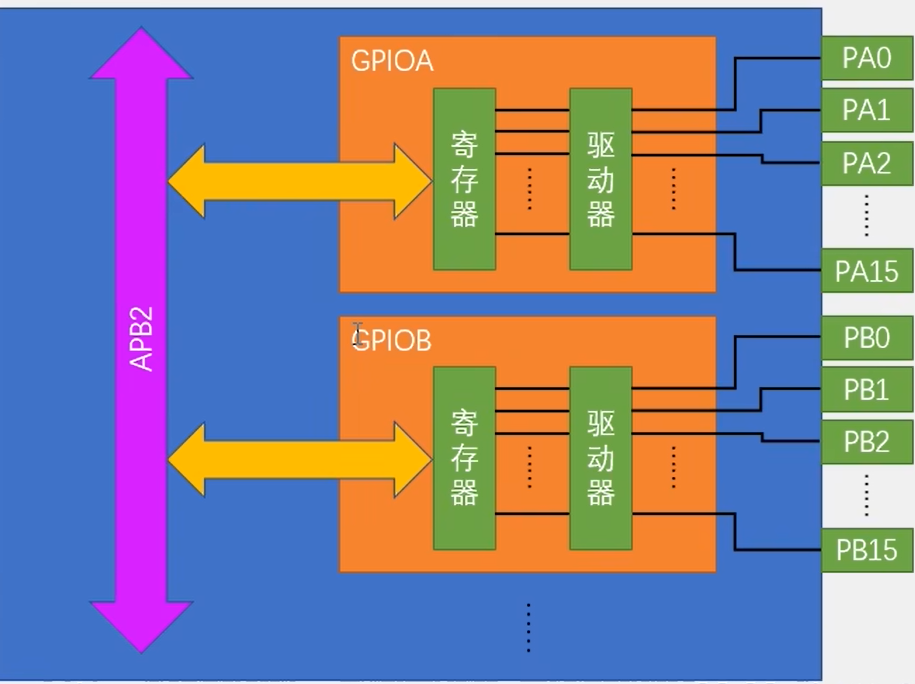

# STM32F103C8T6

## STM32引脚图


## 系统架构

**系统结构：四个驱动单元（DC Code总线Dbus, 系统总线Sbus，DMA1, DMA2）四个被动单元（SRAM,内部闪存存储器，FSMC, AHB到APB桥--连接APB设备）**

**互联网结构：五个驱动单元（D-bus, Sbus,DMA1, DMA2, 以太网DMA），三个被动单元（SRAM,内部闪存存储器，AHB到APB桥--连接APB设备）**


## GPIO

1. ### 由上图可知：GPIO通过APB2总线连接，采用32位编码，高16位未使用，其基本结构为

   

2. ### GPIO的8种端口模式

   **对应 “ gpio.h ” 文件中：**

   ```C
   typedef enum
   { 
     GPIO_Mode_AIN = 0x00, // 模拟输入，GPIO无效，引脚直接接入内部ADC
     GPIO_Mode_IN_FLOATING = 0x04,// 浮空输入，可读取引脚电平，若引脚悬空，则电平不确定
     GPIO_Mode_IPD = 0x28, // 下拉输入，可读取引脚电平，内部连接下拉电阻，悬空时默认低电平
     GPIO_Mode_IPU = 0x48, // 上拉输入，可读取引脚电平，内部连接上拉电阻，悬空时默认高电平
     GPIO_Mode_Out_OD = 0x14, // 开漏输出，高电平无驱动，低电平有输出驱动能力
     GPIO_Mode_Out_PP = 0x10, // 推挽输出，高低电平均有驱动能力
     GPIO_Mode_AF_OD = 0x1C, // 复用开漏输出，可输出引脚电平，高电平为高阻态，低电平接VSS
     GPIO_Mode_AF_PP = 0x18 // 复用推挽输出，可输出引脚电平，高电平接VDD,低电平接VSS
   }GPIOMode_TypeDef;
   ```

3. LED

    - 需要了解GPIO的输入和输出

    - 常用函数

      ```C
      // 时钟使能
      void RCC_APB2PeriphClockCmd(uint32_t RCC_APB2Periph, FunctionalState NewState); // APB2内部时钟
      void RCC_APB1PeriphClockCmd(uint32_t RCC_APB1Periph, FunctionalState NewState); // APB1时钟
      void RCC_AHBPeriphClockCmd(uint32_t RCC_AHBPeriph, FunctionalState NewState); // AHB时钟使能
      
      // GPIO初始化
      GPIO_InitTypeDef gpio_initstruct; // 结构体
      gpio_initstruct.GPIO_Pin   = GPIO_Pin_1; // 引脚
      gpio_initstruct.GPIO_Mode  = GPIO_Mode_Out_PP; // 输出模式
      gpio_initstruct.GPIO_Speed = GPIO_Speed_50MHz; // 速度
      void GPIO_Init(GPIO_TypeDef* GPIOx, GPIO_InitTypeDef* GPIO_InitStruct) // 初始化GPIO
      
      // 引脚设置
      void GPIO_SetBits(GPIO_TypeDef* GPIOx, uint16_t GPIO_Pin); // 高电平
      void GPIO_ResetBits(GPIO_TypeDef* GPIOx, uint16_t GPIO_Pin); // 低电平
      void GPIO_WriteBit(GPIO_TypeDef* GPIOx, uint16_t GPIO_Pin, BitAction BitVal); // BitVal 值： bit_Set高或者bit_ReSet低， 
      void GPIO_Write(GPIO_TypeDef* GPIOx, uint16_t PortVal); // 控制多个端口
      ```

4. 点灯

   ```C
   // 需要三步：
   // 1.开启端口时钟
   RCC_APB2PeriphClockCmd(RCC_APB2Periph_GPIOA, ENABLE); // 启用或禁用高速APB（APB 2）外围设备时钟。
   
   // 2.初始化GPIO
   GPIO_InitTypeDef gpio_initstruct; // 结构体初始化
   gpio_initstruct.GPIO_Pin   = GPIO_Pin_1;
   gpio_initstruct.GPIO_Mode  = GPIO_Mode_Out_PP; // 推挽输出
   gpio_initstruct.GPIO_Speed = GPIO_Speed_50MHz;
   while(1)
   {
       // 3.设置端口值
       GPIO_SetBits(GPIOA, GPIO_Pin_1); // 置高电平
       Delay_ms(200);
       GPIO_ResetBits(GPIOA, GPIO_Pin_1);// 置低电平
   }
   ```

5. GPIO端口检测
    ```C
    uint8_t GPIO_ReadInputDataBit(GPIO_TypeDef* GPIOx, uint16_t GPIO_Pin); // 端口输入检测
    uint16_t GPIO_ReadInputData(GPIO_TypeDef* GPIOx); // 多端口输入检测
    uint8_t GPIO_ReadOutputDataBit(GPIO_TypeDef* GPIOx, uint16_t GPIO_Pin); // 端口输出检测
    uint16_t GPIO_ReadOutputData(GPIO_TypeDef* GPIOx); // 多端口输出检测
    ```

6. 

8. 

    


8. 外设
   - EC11 编码器
   - 原理：