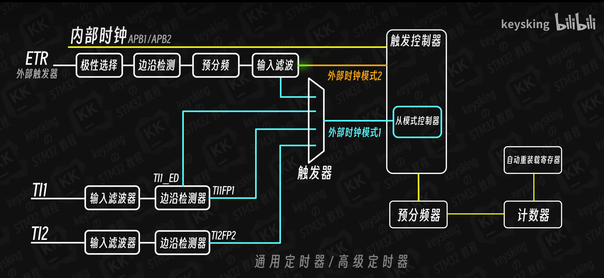
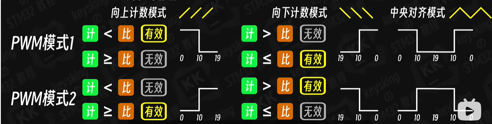

# STM32F103C8T6 中断

## 外部中断EXTI

1. 中断基本概念

   - STM32 中断非常强大，每个外设都可以产生中断，
   - 中断的分类：分为内核中断和外设中断，其中外设中断由外设（GPIO、TIM USART）触发，可配置优先级(`NVIC`)

2. EXTI外部中断流程和相关函数

   - 基本概念：STM32支持19个外部中断，0~15为IO端口输入中断，16-PVD电压监测, 17-RTC闹钟,18-USB唤醒，19-以太网端口（互联网性）； 

   - **配置GPIO与中断线映射：**0~15个IO端口分配至EXTI0~EXTI15，为了对应线和中断所以需要做映射：`void GPIO_EXTILineConfig(uint8_t GPIO_PortSource, uint8_t GPIO_PinSource)`， **此外AFIO映射并非所有所有引脚都支持该功能，需要查阅手册**

     

   - **映射后设置中断的初始化：**分别包含标志位（EXTI_Line）、模式选择（EXTI_Mode）、触发方式(上升沿、下降沿、双边沿)、中断有效控制，`void EXTI_Init(EXTI_InitTypeDef* EXTI_InitStruct);`

     ```C
     // EXTI完整配置
     EXTI_InitTypeDef EXTI_InitStructure = {0};
     
     // 编码器A相(PA0)配置：双边沿触发
     EXTI_InitStructure.EXTI_Trigger = EXTI_Trigger_Rising_Falling; // 触发方式--双边沿
     EXTI_InitStructure.EXTI_Mode = EXTI_Mode_Interrupt; // 模式选择
     EXTI_InitStructure.EXTI_Line = EXTI_Line0; // 标志位
     EXTI_InitStructure.EXTI_LineCmd = ENABLE; // 中断使能
     EXTI_Init(&EXTI_InitStructure); // 应用配置
     ```

     

   - **NVIC （嵌套向量中断控制器级）配置：**中断可能同时触发，所以需要设置优先级,外部中断通道选择、抢占优先级、子优先级、中断使能`NVIC_InitTypeDef NVIC_InitStructure`

     ```C
     // NVIC配置
     
     NVIC_PriorityGroupConfig(NVIC_PriorityGroup_2); // NVIC分组，意在将抢占优先级和子优先级进行分配；取值为0~4；0 表示0个抢占优先级 4个子优先级，依次类推
     NVIC_InitTypeDef NVIC_InitStructure = {0};
     // EXTI0中断(编码器A相)
     NVIC_InitStructure.NVIC_IRQChannel = EXTI0_IRQn; // 通道匹配
     NVIC_InitStructure.NVIC_IRQChannelPreemptionPriority = 0x0F; // 抢占优先级
     NVIC_InitStructure.NVIC_IRQChannelSubPriority = 0x0F; // 子优先级
     NVIC_InitStructure.NVIC_IRQChannelCmd = ENABLE; // 使能
     NVIC_Init(&NVIC_InitStructure); // 应用配置
     ```

     

   - **中断子程序：**外部中断函数只有6个，中断线0-4每个中断线对应一个中断函数`EXTIx_IRQHandler`，中断线5-9共用中断函数`EXTI9_5_IRQHandler`，中断线10-15共用中断函数`EXTI15_10_IRQHandler`

   - **中断退出(必须添加)：**清除中断标志即可，`void EXTI_ClearITPendingBit(uint32_t EXTI_Line)；`否则程序一直在中断中。

   - 其他常用函数：中断发生监控`ITStatus EXTI_GetITStatus(uint32_t EXTI_Line)； ` 

     ```C
     /*总结
     1.使能APB2时钟（GPIO和AFIO）EXTI是在APB2总线的
     2.GPIO初始化
     3.映射GPIO至AFIO
     4.中断初始化（EXTI）
     5.NVIC优先级配置
     6.编写中断子程序
     */
     ```

3. EC11编码器

   - 名称：增量式机械编码器；主要用于旋转方向，角度控制，按键

   - 引脚：

     - A相（CLK）：输出脉冲信号1。
     - B相（DT）：输出脉冲信号2，相位与A相差90°。
     - C相（SW）：按键信号（按下时接地）加RC滤波，硬件防抖。

   - 原理：使用正交编码，A/B两相输出波形相差90° 

     ```C
     // 顺时针：A上升沿 B低电平 A下降沿 B高电平
     // 逆时针：A上升沿，B高电平 A下降沿 B低电平
     // 使用双边沿检查
     // EXTI0中断（A相跳变）
     uint16_t CW_Count
     void EXTI0_IRQHandler(void) {
         if (EXTI_GetITStatus(EXTI_Line0) != RESET) {
             static uint8_t lastA = 0, lastB = 0;
             uint8_t currentA = GPIO_ReadInputDataBit(EC11_PORT, EC11_A_PIN);
             uint8_t currentB = GPIO_ReadInputDataBit(EC11_PORT, EC11_B_PIN);
             
             // 状态机判断方向（需结合A、B相变化）
             if (lastA == 0 && currentA == 1) {  // A上升沿
                 currentB == 0 ? CW_Count++: CCW_Count++;  // B=0:CW, B=1:CCW
             }
             else if (lastA == 1 && currentA == 0) {  // A下降沿
                 currentB == 1 ? CW_Count++:CCW_Count++;  // B=1:CW, B=0:CCW
             }
             
             lastA = currentA;
             lastB = currentB;
             EXTI_ClearITPendingBit(EXTI_Line0);  // 清除中断标志
         }
     }
     ```

   - 常见问题：由于机械结构原因可能多次响应

## 定时器中断分类

| 编号       | 类型       | 总线 | 功能                                                         |
| ---------- | ---------- | ---- | ------------------------------------------------------------ |
| TIM1、8    | 高级定时器 | APB2 | 16位的可 以向上/下计数，拥有通用定时器全部功能，并额外具有重复计数器、死区生成、互补输出、刹车输入等功能 |
| TIM2,3,4,5 | 通用定时器 | APB1 | 16位的可以向上/下计数，拥有基本定时器全部功能，并额外具有内外时钟源选择、输入捕获、输出比较、编码器接口、主从触发模式等功能 |
| TIM6,7     | 基本定时器 | APB1 | 16位的只能向上计数，拥有定时中断、主模式触发DAC的功能        |



### RCC内部时钟基本定时器

基本定时器时基单元工作流程 

- 第一步：经过筛选后的信号（72MHz）会进入**分频PSC（`TIM_Prescaler`）**，对72MHz的RCC内部时钟进行分频,APB1默认分频系数为2，实际的分频值 = 预分频值 + 1；所以此处预设值为1

- 第二步：计数器从0开始进入计时，即对应**计数模式（`TIM_CounterMode`）而**计数器计数分为向上计数，向下计数，中央对齐计数；

- 第三步：计数器开始计数，当计数器的值达到设定值后产生中断溢出即重新计数，这个设定值就是自动重装初始值(`ARR`，即`TIM_Period`)，配合PSC可以决定中断周期，最大为65535，

  

- 中断频率计算：`中断频率 = 输入时钟频率 / [(PSC + 1) * (ARR + 1)]`，假如需要1KHz的频率，那么`[(PSC + 1) * (ARR + 1)] = 72MHz/1KHz = 72000`, 再**有1KHz为低频信号，低功耗，所以一般PSC大，ARR小，反之亦然，**所以设置PSC=7199、ARR为9

- 中断周期：中断周期 = 1/中断频率；

- 中断时间：T = 中断周期 x 中断次数;

  | 场景                           | 推荐组合          | 原因                   |
  | ------------------------------ | ----------------- | ---------------------- |
  | **PWM 呼吸灯、LED亮度等**      | ✅ 小 PSC + 大 ARR | 提高占空比精度（平滑） |
  | **马达控制**                   | ✅ 小 PSC + 大 ARR | 高精度 PWM 控制        |
  | **定时中断（只要求某个频率）** | ✅ 大 PSC + 小 ARR | 简单节省资源           |
  | **粗略定时（1s, 10s等）**      | ✅ 大 PSC + 小 ARR | 可读性高，占用小       |
  | **需要很高定时精度（微秒级）** | ✅ 小 PSC + 大 ARR | 提供高时间分辨率       |
  | **资源紧张、对精度要求低**     | ✅ 大 PSC + 小 ARR | 省资源                 |

  | 控制项    | 控制作用             | 对占空比的影响         |
  | --------- | -------------------- | ---------------------- |
  | **ARR**   | PWM周期长度 / 档位数 | 越大，占空比越精细     |
  | **PSC**   | 计数步长（计时粒度） | 影响频率和响应时间     |
  | **CCR值** | 当前的占空比         | 比例 = CCR / (ARR + 1) |

### 通用定时器和高级定时器

- 时钟源：内部时钟CK_INT、外部时钟1 TIx、外部时钟2：外部中断触发ETR、内部触发输入 ITRx
- 高级控制定时器 (TIM1 和 TIM8) 和通用定时器在基本定时器的基础上引入了外部引脚，可以实 现输入捕获和输出比较功能
- 高级控制定时器比通用定时器增加了可编程死区互补输出、重复计 数器、带刹车 (断路) 功能，这些功能都是针对工业电机控制方面。
- 外部时钟1_TIx：
  - 时钟信号（TI1/2/3/4）配置：1.配置TI映射，2.设置滤波 3.触发方式选择 4.触发源选择 5.外部时钟触发模式选择
- 外部时钟2_TIMx_ETR：
    - TIMx_ETR配置：1.映射 2. 触发方式选择 3. 预分频（小于16MHz）4.设置滤波 5.外部时钟触发模式选择
- 内部时钟_ITRx：
    - 内部触发：内部触发输入是使用一个定时器作为另一个定时器的预分频器

###   内部时钟的定时中断（输出中断-TIM4）

  ```C
  // TIM定时器的定时中断
  
  #include "stm32f10x.h"
  volatile uint16_t Timer_Count_Number=0;
  
  void Timer_Init(void)
  {
      // 时钟使能
      RCC_APB1PeriphClockCmd(RCC_APB1Periph_TIM4, ENABLE);
  
      TIM_TimeBaseInitTypeDef TIM_TimeBaseStructure;
      /* 使用定时器的 输入捕获、编码器模式 或 外部时钟 这些需要对外部信号做滤波的功能，就会用到 ClockDivision; 
      TIM_CKD_DIV1为不产生滤波
      TIM_CKD_DIV2数字滤波采样时钟 = 定时器时钟 / 2
      */
      TIM_TimeBaseStructure.TIM_ClockDivision = TIM_CKD_DIV1;       // 滤波器设置
      // 要设置1Hz = 72MHz/[(PSC+1)*(ARR+1)
      TIM_TimeBaseStructure.TIM_Prescaler         = 7200 - 1;  // PSC
      TIM_TimeBaseStructure.TIM_Period            = 10000 - 1; // ARR
      TIM_TimeBaseStructure.TIM_CounterMode   = TIM_CounterMode_Up; // 向上计数模式
      // TIM_TimeBaseStructure.TIM_RepetitionCounter = 0;         // 重复计数器设置,高级定时器才需要
      TIM_TimeBaseInit(TIM4, &TIM_TimeBaseStructure);
  
      NVIC_PriorityGroupConfig(NVIC_PriorityGroup_2); // NVIC分组
  
      NVIC_InitTypeDef NVIC_InitStructure;
      // md.s 中没有TIM6 TIM7; 需要切换为MD_VL or HD等；此处可改为TIM4使用
      NVIC_InitStructure.NVIC_IRQChannel                   = TIM4_IRQn; 
      NVIC_InitStructure.NVIC_IRQChannelPreemptionPriority = 0; 	   // 抢占优先级
      NVIC_InitStructure.NVIC_IRQChannelSubPriority        = 0;      // 子优先级
      NVIC_InitStructure.NVIC_IRQChannelCmd                = ENABLE; // 使能
      NVIC_Init(&NVIC_InitStructure);
      
      // TIM_IT_Update: 更新中断 TIM_IT_Trigger: 触发中断；捕获中断
      TIM_ITConfig(TIM4, TIM_IT_Update, ENABLE); // 中断类型（中断输出更新事件）使能
      TIM_Cmd(TIM4,ENABLE); // 定时器开关
  }
  
  
  // Handler函数
  void TIM4_IRQHandler()
  {
      if (TIM_GetITStatus(TIM4, TIM_IT_Update) != RESET) {
          Timer_Count_Number++;
          TIM_ClearITPendingBit(TIM4, TIM_IT_Update); // 清除中断
      }
  }
  ```

##  ETR详解

| 特性           | TIM_ETRConfig          | TIM_ETRClockMode1Config   | TIM_ETRClockMode2Config     |
| :------------- | :--------------------- | :------------------------ | :-------------------------- |
| **功能**       | 仅配置ETR引脚参数      | 配置ETR引脚+设置时钟模式1 | 配置ETR引脚+设置时钟模式2   |
| **时钟源改变** | 否                     | 是（改为外部时钟模式1）   | 是（改为外部时钟模式2）     |
| **自动配置**   | 仅引脚参数             | 引脚+SMS+TS               | 引脚+ECE                    |
| **典型应用**   | 需要手动配置其他参数时 | 直接使用ETR作为时钟源     | 需要ETR同时作为时钟和触发源 |

1. 

### `TIM_ETRClockMode2Config`外部时钟2-更新事件中断（TIM1-ETR 中断计数）

- 寻迹模块数字量输入检测
- 检测时会出现抖动所以需要设置`TIM_ICPrescaler ` （取值为1,2,4,8分别表示边沿捕获的有效次数）& `TIM_ICFilter`（取值为0~15，值越小越灵敏）
- 此外由于**TIM1是高级定时器**，所以需要添加 `TIM_TimeBaseStructure.TIM_RepetitionCounter = 0;` 否则中断的溢出次数可能会出现`ARR多次溢出才能触发一次中断` 

```C
#include "stm32f10x.h"
#include "./drive/inc/MyDelay.h"

int32_t Overflow_value = 0; // 溢出计数器

void TIM1_ETR_ExternalClock2_Overflow_Config()
{
    RCC_APB2PeriphClockCmd(RCC_APB2Periph_GPIOA, ENABLE);
    RCC_APB2PeriphClockCmd(RCC_APB2Periph_TIM1, ENABLE);

    GPIO_InitTypeDef GPIO_InitStructure;
    GPIO_InitStructure.GPIO_Pin  = GPIO_Pin_12;
    GPIO_InitStructure.GPIO_Mode = GPIO_Mode_IN_FLOATING;
    GPIO_Init(GPIOA, &GPIO_InitStructure);


    // 定时器基础配置
    TIM_TimeBaseInitTypeDef TIM_TimeBaseStructure;
    TIM_TimeBaseStructure.TIM_Period        = 10; // ARR 
    TIM_TimeBaseStructure.TIM_Prescaler     = 0; // PSC
    TIM_TimeBaseStructure.TIM_ClockDivision = TIM_CKD_DIV1; // 滤波的分频， 主要用于输入捕获和编码器接口
    TIM_TimeBaseStructure.TIM_CounterMode   = TIM_CounterMode_Up;
    TIM_TimeBaseStructure.TIM_RepetitionCounter = 0;  
    TIM_TimeBaseInit(TIM1, &TIM_TimeBaseStructure);

    // 配置 ETR 为外部时钟2触发源，边沿触发
    TIM_ETRClockMode2Config(
        TIM1,
        TIM_ExtTRGPSC_OFF,              // 不分频
        // TIM_ExtTRGPSC_DIV8,
        TIM_ExtTRGPolarity_NonInverted, // 上升沿触发（可改为 Inverted）
        0x0F                            // 滤波器（最大值，抗抖动）
    );

    // 6. 配置NVIC
    NVIC_InitTypeDef NVIC_InitStructure;
    NVIC_InitStructure.NVIC_IRQChannel                   = TIM1_UP_IRQn;
    NVIC_InitStructure.NVIC_IRQChannelPreemptionPriority = 0;
    NVIC_InitStructure.NVIC_IRQChannelSubPriority        = 0;
    NVIC_InitStructure.NVIC_IRQChannelCmd                = ENABLE;
    NVIC_Init(&NVIC_InitStructure);


    TIM_ClearFlag(TIM1,TIM_FLAG_Update | TIM_IT_Update); // 恢复上电进入的中断
    TIM_ITConfig(TIM1,TIM_IT_Update,ENABLE);
    
    // 7. 启动定时器
    TIM_Cmd(TIM1, ENABLE);
}

void TIM1_UP_IRQHandler(void)
{
    if (TIM_GetITStatus(TIM1, TIM_IT_Update) != RESET) {
        Overflow_value++;                            // 溢出计数器加1
        TIM_ClearITPendingBit(TIM1, TIM_IT_Update); // 清除中断标志
    }

}

int64_t Get_Overflow_value(void)
{
    return Overflow_value * 10 + TIM_GetCounter(TIM1);
}
```


### 外部时钟1 - ETR

**仅需将外部时钟2的ETR配置更换为`TIM_ETRMode1Clock()` 参数保持一样，虽然一样，但是本质已经变化**

1. **信号路径不同**：
   - 模式1：ETR→滤波器→边沿检测→TIMF_ED→CK_PSC
   - 模式2：ETR→分频器→ETRF→TRGI→内部触发→CK_PSC
2. **触发能力**：
   - 模式1下ETR只能作为时钟源
   - 模式2下ETR可以同时作为时钟源和触发源
3. **寄存器配置**：
   - 模式1通过SMS[2:0]=111配置
   - 模式2通过ECE=1配置

### `TIM_ETRConfig`手动配置从模式（触发模式）

除去外部时钟模式还有其他模式，**这些模式需要通过更新中断`TIM_IT_update`或者监听从模式标志位`TIM_Flag_Trigger`** ，主要通过两个函数确定他们分别为

- `void TIM_SelectInputTrigger(TIM_TypeDef* TIMx, uint16_t TIM_InputTriggerSource)` 第二个参数表示输入的时钟信号，分别为：

  - @arg TIM_TS_ITR0: Internal Trigger 0
    *     @arg TIM_TS_ITR1: Internal Trigger 1
    *     @arg TIM_TS_ITR2: Internal Trigger 2
    *     @arg TIM_TS_ITR3: Internal Trigger 3
    *     @arg TIM_TS_TI1F_ED: TI1 Edge Detector
    *     @arg TIM_TS_TI1FP1: Filtered Timer Input 1
    *     @arg TIM_TS_TI2FP2: Filtered Timer Input 2
    *     @arg TIM_TS_ETRF: External Trigger input

- `void TIM_SelectSlaveMode(TIM_TypeDef* TIMx, uint16_t TIM_SlaveMode)` 第二个参数表示模式的选择，分别为：

  -  @arg TIM_SlaveMode_Reset（复位模式）:上升沿重新触发

     @arg TIM_SlaveMode_Gated（门模式）: 高电平触发计数，低电平暂停计数

     @arg TIM_SlaveMode_Trigger（触发模式模式）:  上升沿开始计数

     @arg TIM_SlaveMode_External1（外部时钟1模式）: 上升沿计数 （类比 `TIM_ETRMode1Clock()`）

```C
#include "stm32f10x.h"
#include "./drive/inc/MyDelay.h"

void TIM1_ETR_ExternalClock1_Overflow_Config()
{
    RCC_APB2PeriphClockCmd(RCC_APB2Periph_GPIOA | RCC_APB2Periph_TIM1, ENABLE);

    GPIO_InitTypeDef GPIO_InitStructure;
    GPIO_InitStructure.GPIO_Pin  = GPIO_Pin_12;
    GPIO_InitStructure.GPIO_Mode = GPIO_Mode_IN_FLOATING;
    GPIO_Init(GPIOA, &GPIO_InitStructure);


    // 定时器基础配置
    TIM_TimeBaseInitTypeDef TIM_TimeBaseStructure;
    TIM_TimeBaseStructure.TIM_Period            = 65534;        // ARR
    TIM_TimeBaseStructure.TIM_Prescaler         = 0;            // PSC
    TIM_TimeBaseStructure.TIM_ClockDivision     = TIM_CKD_DIV1; // 滤波的分频， 主要用于输入捕获和编码器接口
    TIM_TimeBaseStructure.TIM_CounterMode       = TIM_CounterMode_Up;
    TIM_TimeBaseStructure.TIM_RepetitionCounter = 0;
    TIM_TimeBaseInit(TIM1, &TIM_TimeBaseStructure);

    TIM_ETRConfig(TIM1, TIM_ExtTRGPSC_OFF, TIM_ExtTRGPolarity_NonInverted, 0x0F);// 选择输入型号和模式
    
    TIM_SelectInputTrigger(TIM1, TIM_TS_ETRF);      // 选择TIM1-ETR信号为触发信号
    
    TIM_SelectSlaveMode(TIM1, TIM_SlaveMode_Gated); // 触发模式为重置，效果为“ 高电平触发计数，低电平暂停计数” 高低电平和极性有关
	
    // TODO: 暂时不能观察到其他模式现象，以后改用串口来显示
    
    TIM_ClearFlag(TIM1, TIM_IT_Update); // 清除上电进入的中断
    TIM_ITConfig(TIM1, TIM_IT_Update, ENABLE);

    // 7. 启动定时器
    TIM_Cmd(TIM1, ENABLE);
}
```


## 外部时钟1 - 输入捕获（TIM3_CH1）


- 外部时钟输入计数中断

  - 寻迹模块数字量输入检测

  - 检测时会出现抖动所以需要设置`TIM_ICPrescaler ` （取值为1,2,4,8分别表示边沿捕获的有效次数）& `TIM_ICFilter`（取值为0~15，值越小越灵敏）


  ```C
/*
在基础定时器上面添加输入捕获，并替换相关的中断类型
*/

#include "stm32f10x.h"
#include "./drive/inc/MyDelay.h"

uint64_t Count    = 65534; // 防止溢出
// uint64_t overflow = 0;
// uint16_t temp     = 0;
void TIM3_CH1_Config()
{
    RCC_APB2PeriphClockCmd(RCC_APB2Periph_GPIOA, ENABLE);
    RCC_APB1PeriphClockCmd(RCC_APB1Periph_TIM3, ENABLE);

    GPIO_InitTypeDef GPIO_InitStructure;
    GPIO_InitStructure.GPIO_Pin  = GPIO_Pin_6;
    GPIO_InitStructure.GPIO_Mode = GPIO_Mode_IN_FLOATING;
    GPIO_Init(GPIOA, &GPIO_InitStructure);

    // 定时器基础配置
    TIM_TimeBaseInitTypeDef TIM_TimeBaseStructure;
    TIM_TimeBaseStructure.TIM_Period        = 65535;
    TIM_TimeBaseStructure.TIM_Prescaler     = 72 - 1; // 1MHz
    TIM_TimeBaseStructure.TIM_ClockDivision = 0;
    TIM_TimeBaseStructure.TIM_CounterMode   = TIM_CounterMode_Up;
    TIM_TimeBaseInit(TIM3, &TIM_TimeBaseStructure);

    // 输入捕获配置
    //  TIM_ICPrescaler和 Filter 主要作用是用于输入的数字滤波，防止边沿检测的跳变
    TIM_ICInitTypeDef TIM_ICInitStructure;
    TIM_ICInitStructure.TIM_Channel     = TIM_Channel_1;
    TIM_ICInitStructure.TIM_ICPolarity  = TIM_ICPolarity_Rising; // 检测上升沿
    TIM_ICInitStructure.TIM_ICSelection = TIM_ICSelection_DirectTI;
    TIM_ICInitStructure.TIM_ICPrescaler = TIM_ICPSC_DIV1;
    TIM_ICInitStructure.TIM_ICFilter    = 12;
    TIM_ICInit(TIM3, &TIM_ICInitStructure);

    // NVIC
    NVIC_InitTypeDef NVIC_InitStructure;
    NVIC_InitStructure.NVIC_IRQChannel                   = TIM3_IRQn;
    NVIC_InitStructure.NVIC_IRQChannelPreemptionPriority = 1;
    NVIC_InitStructure.NVIC_IRQChannelSubPriority        = 1;
    NVIC_InitStructure.NVIC_IRQChannelCmd                = ENABLE;
    NVIC_Init(&NVIC_InitStructure);

    // 允许中断
    TIM_ITConfig(TIM3, TIM_IT_CC1, ENABLE);
    TIM_Cmd(TIM3, ENABLE);
}

void TIM3_IRQHandler(void)
{
    if (TIM_GetITStatus(TIM3, TIM_FLAG_CC1) != RESET) {
        // TIM_GetCapture1(TIM3);  中断进入时的当前计数器值
        TIM_ClearITPendingBit(TIM3, TIM_FLAG_CC1);
        Count++;
    }
}

// 输入数据捕获
uint64_t Read_Pulse_Width(void)
{

    return Count;
}
  ```


## 外部时钟1 - 输出比较（PWM的产生）

- 原理：调整高低电平在一个周期的不同占比称为脉冲宽度调制技术（PWM），PWM输出是数字信号（只有开/关两种状态），但通过快速切换和适当的滤波，可以产生等效的模拟效果; 依据上面TIM中断更新（TIM_IT_Update）事件所用的寄存器，添加了比较寄存器（CCRx）, 不同计数模式能够输出不同的有效电平和无效电平

- STM32控制流程
  
    - 计数器向上计数：从0递增到自动重装载值(ARR)
    
    - 比较寄存器(CCRx)：也就是比较值
    
    - 输出比较：
    
      
    
    - 周期结束：计数器达到ARR值后复位，开始新周期
    
- PWM选择要点：LED调光（100Hz~5KHz） Motor（5KHz~20KHz）
    ```C
    #include "./stm32f10x.h"
    #include "./drive/inc/MyDelay.h"
    
    void TIM2_CH3_PWM_Init()
    {
        // 1.TIM4的APB1时钟使能 & GPIO的AFIO复用时钟 & GPIO时钟
        RCC_APB1PeriphClockCmd(RCC_APB1Periph_TIM2, ENABLE);
        RCC_APB2PeriphClockCmd(RCC_APB2Periph_GPIOA, ENABLE); 
    
        // 2.GPIO初始化； TIM2_CH3 默认连接PA2
        GPIO_InitTypeDef GPIO_InitStructure;
        GPIO_InitStructure.GPIO_Pin   = GPIO_Pin_2;
        GPIO_InitStructure.GPIO_Mode  = GPIO_Mode_AF_PP; // 推挽输出
        GPIO_InitStructure.GPIO_Speed = GPIO_Speed_50MHz;
        GPIO_Init(GPIOA, &GPIO_InitStructure);
    
        // 3.TIM时基单元配置
        TIM_TimeBaseInitTypeDef TIM_TimeBaseStructure;
        
        /* 首先为向上计数模式，输出的信号为平滑的PWM信号，所以要提高占空比精度，即大ARR，小PSC*/
        TIM_TimeBaseStructure.TIM_Prescaler     = 72 - 1;      // PSC
        TIM_TimeBaseStructure.TIM_Period        = 1000 - 1;         // ARR
    
        TIM_TimeBaseStructure.TIM_CounterMode   = TIM_CounterMode_Up; // 计数模式
        TIM_TimeBaseStructure.TIM_ClockDivision = 0;                  // 设置时钟分割
        // TIM_TimeBaseStructure.TIM_RepetitionCounter = ; // 重复计数器--TIM1 & TIM8才有高级定时器
        TIM_TimeBaseInit(TIM2, &TIM_TimeBaseStructure);
    
        // 4.PWM配置
        TIM_OCInitTypeDef TIM_OCInitStructure;
        TIM_OCInitStructure.TIM_OCMode      = TIM_OCMode_PWM1;        // 模式选择
        TIM_OCInitStructure.TIM_OutputState = TIM_OutputState_Enable; // 输出使能
        TIM_OCInitStructure.TIM_OCPolarity  = TIM_OCPolarity_High;    // 极性设置
        TIM_OCInitStructure.TIM_Pulse       = 0;                      // 设置CCR,初始化占空比
        TIM_OC3Init(TIM2, &TIM_OCInitStructure);                      // 选用TIM4_CH2 通道
        TIM_OC3PreloadConfig(TIM2, TIM_OCPreload_Enable); // 使能预装载寄存器，用于比较寄存器，防止产生不稳定
        
        // 5.使能中断
        TIM_ARRPreloadConfig(TIM2, ENABLE); // 使能ARR 预装载寄存器，防止分频的频率突然跳变产生毛刺
        TIM_Cmd(TIM2, ENABLE); // 使能TIM2中断
    }
    
    /**
     * @brief  占空比比值设定
     * @param  Compare2 占空比值
     * @retval NULL
     * */
    
    void TIM2_CH3_PWM_SetCompare3(uint16_t Compare2)
    {
        TIM_SetCompare3(TIM2, Compare2); // 设置CH3占空比 对应Compare3
    }
    
    /**
    * @brief  呼吸灯效果
    * @param  NULL
    * @retval NULL
    * */
    void breathing_LED(void)
    {
        uint16_t i;
        for (i = 0; i < 1000; i++) {
            TIM2_CH3_PWM_SetCompare3(i);
            Delay_ms(1);
        }
    
        for (i = 0; i < 1000; i++) {
            TIM2_CH3_PWM_SetCompare3(1000 - i);
            Delay_ms(1);
        }
    }


## 编码器模式

输出比较（比较匹配）

- 将定时器计数器（CNT）的值与一个寄存器（CCR）比较，当两者相等时产生“匹配”事件。
- **常见用途**：
  
  - **PWM 输出**：在匹配时切换 GPIO 电平，实现占空比控制。
  - **定时脉冲**：在指定时刻生成一次或周期性脉冲（toggle、set、reset）。
  - **触发 ADC**：通过硬件触发信号（TRGO）在精确定时点启动 ADC 转换。
  
  

输入捕获

- 在外部信号的指定边沿（上升或下降）到来时，硬件将当前 CNT 值“捕获”并存入 CCR 寄存器，并置位对应 CCnIF 标志。
- **常见用途**：
  - **测量脉冲宽度**：结合上升和下降沿捕获计算高电平持续时间。
  - **测量信号频率**：记录两次上升沿之间的计数差。
  - **编码器接口**：通过双通道捕获实现位置和速度检测。

1. 刹车

2. 死区完成

3. TRGO

4. DMA请求

5. 锁定完成

6. 中心对称完成


