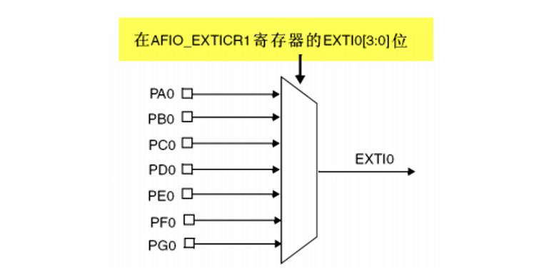
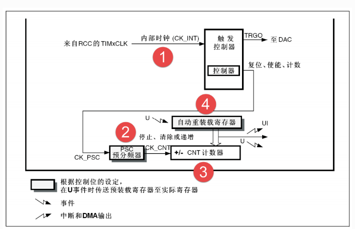
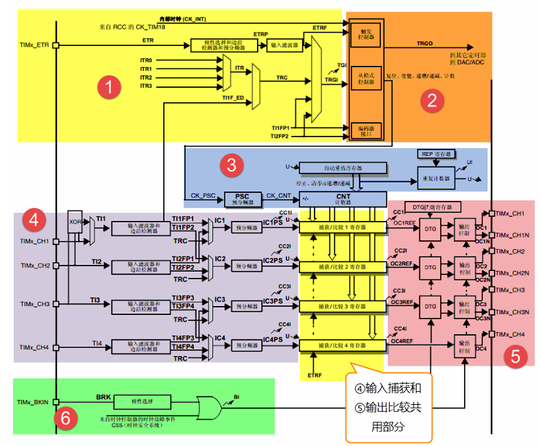
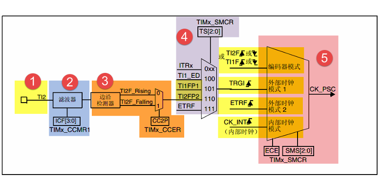
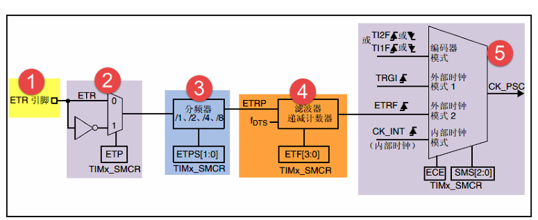

# STM32F103C8T6 中断

## 外部中断EXTI

1. 中断基本概念

   - STM32 中断非常强大，每个外设都可以产生中断，
   - 中断的分类：分为内核中断和外设中断，其中外设中断由外设（GPIO、TIM USART）触发，可配置优先级(`NVIC`)

2. EXTI外部中断流程和相关函数

   - 基本概念：STM32支持19个外部中断，0~15为IO端口输入中断，16-PVD电压监测, 17-RTC闹钟,18-USB唤醒，19-以太网端口（互联网性）； 

   - **配置GPIO与中断线映射：**0~15个IO端口分配至EXTI0~EXTI15，为了对应线和中断所以需要做映射：`void GPIO_EXTILineConfig(uint8_t GPIO_PortSource, uint8_t GPIO_PinSource)`

     

   - **映射后设置中断的初始化：**分别包含标志位（EXTI_Line）、模式选择（EXTI_Mode）、触发方式(上升沿、下降沿、双边沿)、中断有效控制，`void EXTI_Init(EXTI_InitTypeDef* EXTI_InitStruct);`

     ```C
     // EXTI完整配置
     EXTI_InitTypeDef EXTI_InitStructure = {0};
     
     // 编码器A相(PA0)配置：双边沿触发
     EXTI_InitStructure.EXTI_Trigger = EXTI_Trigger_Rising_Falling; // 触发方式--双边沿
     EXTI_InitStructure.EXTI_Mode = EXTI_Mode_Interrupt; // 模式选择
     EXTI_InitStructure.EXTI_Line = EXTI_Line0; // 标志位
     EXTI_InitStructure.EXTI_LineCmd = ENABLE; // 中断使能
     EXTI_Init(&EXTI_InitStructure); // 应用配置
     ```

     

   - **NVIC （嵌套向量中断控制器级）配置：**中断可能同时触发，所以需要设置优先级,外部中断通道选择、抢占优先级、子优先级、中断使能`NVIC_InitTypeDef NVIC_InitStructure`

     ```C
     // NVIC配置
     
     NVIC_PriorityGroupConfig(NVIC_PriorityGroup_2); // NVIC分组，意在将抢占优先级和子优先级进行分配；取值为0~4；0 表示0个抢占优先级 4个子优先级，依次类推
     NVIC_InitTypeDef NVIC_InitStructure = {0};
     // EXTI0中断(编码器A相)
     NVIC_InitStructure.NVIC_IRQChannel = EXTI0_IRQn; // 通道匹配
     NVIC_InitStructure.NVIC_IRQChannelPreemptionPriority = 0x0F; // 抢占优先级
     NVIC_InitStructure.NVIC_IRQChannelSubPriority = 0x0F; // 子优先级
     NVIC_InitStructure.NVIC_IRQChannelCmd = ENABLE; // 使能
     NVIC_Init(&NVIC_InitStructure); // 应用配置
     ```

     

   - **中断子程序：**外部中断函数只有6个，中断线0-4每个中断线对应一个中断函数`EXTIx_IRQHandler`，中断线5-9共用中断函数`EXTI9_5_IRQHandler`，中断线10-15共用中断函数`EXTI15_10_IRQHandler`

   - **中断退出(必须添加)：**清除中断标志即可，`void EXTI_ClearITPendingBit(uint32_t EXTI_Line)；`否则程序一直在中断中。

   - 其他常用函数：中断发生监控`ITStatus EXTI_GetITStatus(uint32_t EXTI_Line)； ` 

     ```C
     /*总结
     1.使能APB2时钟（GPIO和AFIO）EXTI是在APB2总线的
     2.GPIO初始化
     3.映射GPIO至AFIO
     4.中断初始化（EXTI）
     5.NVIC优先级配置
     6.编写中断子程序
     */
     ```

3. EC11编码器

   - 名称：增量式机械编码器；主要用于旋转方向，角度控制，按键

   - 引脚：

     - A相（CLK）：输出脉冲信号1。
     - B相（DT）：输出脉冲信号2，相位与A相差90°。
     - C相（SW）：按键信号（按下时接地）加RC滤波，硬件防抖。

   - 原理：使用正交编码，A/B两相输出波形相差90° 

     ```C
     // 顺时针：A上升沿 B低电平 A下降沿 B高电平
     // 逆时针：A上升沿，B高电平 A下降沿 B低电平
     // 使用双边沿检查
     // EXTI0中断（A相跳变）
     uint16_t CW_Count
     void EXTI0_IRQHandler(void) {
         if (EXTI_GetITStatus(EXTI_Line0) != RESET) {
             static uint8_t lastA = 0, lastB = 0;
             uint8_t currentA = GPIO_ReadInputDataBit(EC11_PORT, EC11_A_PIN);
             uint8_t currentB = GPIO_ReadInputDataBit(EC11_PORT, EC11_B_PIN);
             
             // 状态机判断方向（需结合A、B相变化）
             if (lastA == 0 && currentA == 1) {  // A上升沿
                 currentB == 0 ? CW_Count++: CCW_Count++;  // B=0:CW, B=1:CCW
             }
             else if (lastA == 1 && currentA == 0) {  // A下降沿
                 currentB == 1 ? CW_Count++:CCW_Count++;  // B=1:CW, B=0:CCW
             }
             
             lastA = currentA;
             lastB = currentB;
             EXTI_ClearITPendingBit(EXTI_Line0);  // 清除中断标志
         }
     }
     ```

   - 常见问题：由于机械结构原因可能多次响应

## 定时器中断

## 

​	

| 编号       | 类型       | 总线 | 功能                                                         |
| ---------- | ---------- | ---- | ------------------------------------------------------------ |
| TIM1、8    | 高级定时器 | APB2 | 16位的可 以向上/下计数，拥有通用定时器全部功能，并额外具有重复计数器、死区生成、互补输出、刹车输入等功能 |
| TIM2,3,4,5 | 通用定时器 | APB1 | 16位的可以向上/下计数，拥有基本定时器全部功能，并额外具有内外时钟源选择、输入捕获、输出比较、编码器接口、主从触发模式等功能 |
| TIM6,7     | 基本定时器 | APB1 | 16位的只能向上计数，拥有定时中断、主模式触发DAC的功能        |

### TIMxCLK(CK_INT)基本定时器



- 基本定时器时基单元工作流程

  - **分频：**时钟信号（默认72MHz）进入预分频器（`PSC`）,**主要决定计数器计数速度**，对72MHz的RCC内部时钟进行分频,APB1默认分频系数为2，实际的分频值 = 预分频值 + 1；

  - **计数：**计数器计数，分为向上计数，向下计数，中央对齐计数；

  - **计数范围的初值：**自动重装初始值(`ARR`)，配合PSC可以决定中断周期，最大为65535，**当计数器的值达到设定值后产生中断溢出**

  - 中断频率计算：`中断频率 = 输入时钟频率 / [(PSC + 1) * (ARR + 1)]`，假如需要1KHz的频率，那么`[(PSC + 1) * (ARR + 1)] = 72MHz/1KHz = 72000`, 再**有1KHz为低频信号，低功耗，所以一般PSC大，ARR小，反之亦然，**所以设置PSC=7199、ARR为9

    | **优先级考量**   | **PSC优先（大PSC，小ARR）** | **ARR优先（小PSC，大ARR）** |
    | :--------------- | :-------------------------- | :-------------------------- |
    | **计数器频率**   | 低（如10kHz）               | 高（如7.2MHz）              |
    | **中断/PWM频率** | 灵活调整                    | 需匹配高分辨率需求          |
    | **适用场景**     | 通用定时、低功耗            | 高频信号处理、高分辨率PWM   |

  - 中断周期：中断周期 = 1/中断频率；

  - 中断时间：T = 中断周期 x 中断次数;

    ```C
    #include "stm32f10x.h"
    volatile uint16_t Timer_Count_Number=0;
    
    void Timer_Init(void)
    {
        // 时钟使能
        RCC_APB1PeriphClockCmd(RCC_APB1Periph_TIM4, ENABLE);
    
        TIM_TimeBaseInitTypeDef TIM_TimeBaseStructure;
        /* 使用定时器的 输入捕获、编码器模式 或 外部时钟 这些需要对外部信号做滤波的功能，就会用到 ClockDivision; 
        TIM_CKD_DIV1为不产生滤波
        TIM_CKD_DIV2数字滤波采样时钟 = 定时器时钟 / 2
        */
        TIM_TimeBaseStructure.TIM_ClockDivision = TIM_CKD_DIV1;       // 滤波器设置
        // 要设置1Hz = 72MHz/[(PSC+1)*(ARR+1)
        TIM_TimeBaseStructure.TIM_Prescaler         = 7200 - 1;  // PSC
        TIM_TimeBaseStructure.TIM_Period            = 10000 - 1; // ARR
        TIM_TimeBaseStructure.TIM_CounterMode   = TIM_CounterMode_Up; // 向上计数模式
        TIM_TimeBaseStructure.TIM_RepetitionCounter = 0;         // 重复计数器设置
        TIM_TimeBaseInit(TIM4, &TIM_TimeBaseStructure);
    
        NVIC_PriorityGroupConfig(NVIC_PriorityGroup_2); // NVIC分组
    
        NVIC_InitTypeDef NVIC_InitStructure;
        // md.s 中没有TIM6 TIM7; 需要切换为MD_VL or HD等；此处可改为TIM4使用
        NVIC_InitStructure.NVIC_IRQChannel                   = TIM4_IRQn; 
        NVIC_InitStructure.NVIC_IRQChannelPreemptionPriority = 0; 	   // 抢占优先级
        NVIC_InitStructure.NVIC_IRQChannelSubPriority        = 0;      // 子优先级
        NVIC_InitStructure.NVIC_IRQChannelCmd                = ENABLE; // 使能
        NVIC_Init(&NVIC_InitStructure);
        
        // TIM_IT_Update: 更新中断 TIM_IT_Trigger: 触发中断；捕获中断
        TIM_ITConfig(TIM4, TIM_IT_Update, ENABLE); // 中断类型使能
        TIM_Cmd(TIM4,ENABLE); // 定时器开关
    }
    
    
    // Handler函数
    void TIM4_IRQHandler()
    {
        if (TIM_GetITStatus(TIM4, TIM_IT_Update) != RESET) {
            Timer_Count_Number++;
            TIM_ClearITPendingBit(TIM4, TIM_IT_Update); // 清除中断
        }
    }
    ```
    
  - PWM的产生
  
    - 原理：调整高低电平在一个周期的不同占比称为脉冲宽度调制技术（PWM），PWM输出是数字信号（只有开/关两种状态），但通过快速切换和适当的滤波，可以产生等效的模拟效果; 依据上面TIM中断更新（TIM_IT_Update）事件所用的寄存器，添加了比较寄存器（CCRx）,大于CCRx时输出高电平，小于输出低电平
    - STM32控制流程
        - 计数器向上计数：从0递增到自动重装载值(ARR)
        - 比较寄存器(CCRx)：设置触发翻转的值
        - 输出控制：大于CCRx时输出高电平，小于输出低电平（可配置）
        - 周期结束：计数器达到ARR值后复位，开始新周期
    - PWM选择要点：LED调光（100Hz~5KHz） Motor（5KHz~20KHz）
        ```C
        //TIM3 PWM部分初始化  
        //PWM输出初始化 
        //arr：自动重装值 
        //psc：时钟预分频数 
        void TIM3_PWM_Init(u16 arr,u16 psc) 
        {   
            // 时钟开启，非对应GPIO需要设置AFIO映射时钟
            RCC_APB1PeriphClockCmd(RCC_APB1Periph_TIM3, ENABLE);  //①使能定时器3时钟 
            RCC_APB2PeriphClockCmd(RCC_APB2Periph_GPIOB| RCC_APB2Periph_AFIO, ENABLE); //①使能GPIO和AFIO复用功能时钟 
        
            // GPIO初始化
            GPIO_InitTypeDef GPIO_InitStructure; 
            //设置该引脚为复用输出功能,输出TIM3 CH2的PWM脉冲波形 GPIOB.5 
            GPIO_InitStructure.GPIO_Pin = GPIO_Pin_5;             //TIM_CH2 
            GPIO_InitStructure.GPIO_Mode = GPIO_Mode_AF_PP;    //复用推挽输出 
            GPIO_InitStructure.GPIO_Speed = GPIO_Speed_50MHz; 
            GPIO_Init(GPIOB, &GPIO_InitStructure);                //①初始化GPIO 

​			

## 高级定时器




1. 时钟源：内部时钟CK_INT、外部时钟1 TIx、外部时钟2：外部中断触发ETR、内部触发输入 ITRx

2. 高级控制定时器 (TIM1 和 TIM8) 和通用定时器在基本定时器的基础上引入了外部引脚，可以实 现输入捕获和输出比较功能

3. 高级控制定时器比通用定时器增加了可编程死区互补输出、重复计 数器、带刹车 (断路) 功能，这些功能都是针对工业电机控制方面。

4. 外部时钟1_TIx：

   

   - 时钟信号（TI1/2/3/4）配置：1.配置TI映射，2.设置滤波 3.触发方式选择 4.触发源选择 5.外部时钟触发模式选择

5. 外部时钟2_TIMx_ETR：

   

   - TIMx_ETR配置：1.映射 2. 触发方式选择 3. 预分频（小于16MHz）4.设置滤波 5.外部时钟触发模式选择

6. 内部时钟_ITRx：

   - 内部触发：内部触发输入是使用一个定时器作为另一个定时器的预分频器

7. 更新事件：

   - **上面设置完成后进入基本定时器的技术溢出即为更新时间**

8. 输出比较（比较匹配）

   - 将定时器计数器（CNT）的值与一个寄存器（CCR）比较，当两者相等时产生“匹配”事件。
   - **常见用途**：
     - **PWM 输出**：在匹配时切换 GPIO 电平，实现占空比控制。
     - **定时脉冲**：在指定时刻生成一次或周期性脉冲（toggle、set、reset）。
     - **触发 ADC**：通过硬件触发信号（TRGO）在精确定时点启动 ADC 转换。

9. 输入捕获

   - 在外部信号的指定边沿（上升或下降）到来时，硬件将当前 CNT 值“捕获”并存入 CCR 寄存器，并置位对应 CCnIF 标志。
   - **常见用途**：
     - **测量脉冲宽度**：结合上升和下降沿捕获计算高电平持续时间。
     - **测量信号频率**：记录两次上升沿之间的计数差。
     - **编码器接口**：通过双通道捕获实现位置和速度检测。

10. 刹车

11. 死区完成

12. TRGO

13. DMA请求

14. 锁定完成

15. 中心对称完成


