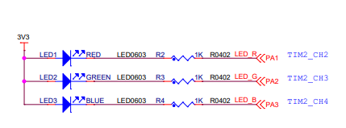
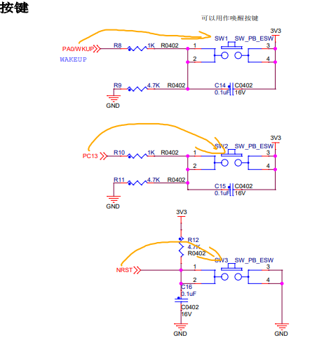

# GPIO 按键检测控制板载 LED

## 项目说明

本项目基于 STM32F103 和标准外设库，实现板载按键控制板载 LED 的基础 GPIO 实验。程序上电后初始化 LED 和两个按键，然后持续扫描按键状态：按下 SW1 时翻转 LED1，按下 SW2 时翻转 LED2；未按下按键时不改变 LED 状态。

本实验将“输入 GPIO 读取按键状态”和“输出 GPIO 控制 LED 状态”结合起来，是单片机数字输入、输出控制的基础应用。

## GPIO 模式基础

本次实验学习了 GPIO 的输入和输出配置，以及 GPIO 电平与外部电路之间的关系：

- **浮空输入（`GPIO_Mode_IN_FLOATING`）**：PA0 和 PC13 配置为浮空输入。按键电路使用外部 `4.7 kΩ` 电阻将引脚下拉到 `GND`，未按下时为低电平；按下后接通 `3V3`，读取为高电平。输入电平由外部电阻和按键电路确定，程序不启用芯片内部上拉或下拉。
- **推挽输出（`GPIO_Mode_Out_PP`）**：PA1、PA2 和 PA3 配置为推挽输出。GPIO 可以主动输出高电平或低电平，适合直接控制 LED 等数字器件。板载 LED 为低电平点亮，因此初始化为高电平表示熄灭。
- **按键消抖**：机械按键按下或释放时会产生短暂抖动。程序检测到按键后先延时约 20 ms，再次确认电平；确认有效后等待按键释放，避免一次按键被重复识别。

### GPIO 模式的应用

- **输入模式**：用于读取按键、拨码开关、限位开关、传感器数字输出和其他外部数字信号。实际使用时需要保证输入端有确定的高、低电平，通常通过外部或内部上拉/下拉电阻实现。
- **推挽输出模式**：用于控制 LED、蜂鸣器使能端、继电器驱动电路的控制端以及其他数字控制信号。输出端不能直接与另一个强驱动输出相连，避免发生电平冲突。
- **开漏输出模式**：适合 I2C 等需要多器件共享信号线的场景。开漏输出只能主动拉低，输出高电平通常需要外接上拉电阻。
- **复用功能模式**：用于将 GPIO 交给片上外设，例如 USART、SPI、I2C、定时器 PWM 等，由外设硬件产生或采样信号。

## 硬件连接

### 原理图及引脚说明

| 外设 | STM32 引脚 | GPIO 配置 | 说明 |
| --- | --- | --- | --- |
| 按键 1（SW1） | PA0/WKUP | 外部下拉输入 | 按下时接通 3V3，读取为高电平，控制 LED1 |
| 按键 2（SW2） | PC13 | 外部下拉输入 | 按下时接通 3V3，读取为高电平，控制 LED2 |
| LED1 | PA1 | 推挽输出 | 默认高电平（灭），按键 1 按下后翻转状态 |
| LED2 | PA2 | 推挽输出 | 默认高电平（灭），按键 2 按下后翻转状态 |
| LED3 | PA3 | 推挽输出 | 默认高电平（灭），已初始化但当前程序暂未使用 |

## 程序流程

1. 初始化 PA1、PA2、PA3 为 50 MHz 推挽输出，并将 LED 默认设置为熄灭。
2. 初始化 PA0 和 PC13 为浮空输入，读取板载按键的外部下拉电平。
3. 循环调用 `Key_Scan()`，检测到按键后进行约 20 ms 消抖，并等待按键释放。
4. 根据返回的按键编号调用 `Turn_LED()`，翻转对应 LED 的输出电平。

当 SW1 和 SW2 同时按下时，扫描函数优先处理 SW1；释放 SW1 后，下一次扫描才会处理 SW2。

### 目录说明

| 路径 | 作用 |
| --- | --- |
| `src/main.c` | 程序入口和主循环 |
| `src/drive/key.h` | 按键初始化、扫描和消抖逻辑 |
| `src/drive/led.h` | LED 初始化和电平翻转逻辑 |
| `src/drive/MyDelay.c`、`src/drive/MyDelay.h` | 毫秒级延时 |
| `hal/STM32F10x_StdPeriph_Driver` | STM32F1 标准外设库 |
| `src/startup_stm32f10x_md.s` | 启动文件和中断向量表 |
| `stm32f1x_64KB_flash.ld` | 适用于 64 KB Flash 的链接脚本 |

### 是否需要外接

- **LED 不需要外接**：`image.png` 显示红、绿、蓝三颗 LED 已经安装在板上，并分别通过 1 kΩ 电阻连接到 `PA1`、`PA2`、`PA3`。LED 由 3V3 供电，GPIO 输出低电平时点亮，因此属于低电平点亮。
- **按键不需要外接**：原理图中的板载 `SW1` 和 `SW2` 分别连接到 `PA0/WKUP` 和 `PC13`。两个按键均由外部 `4.7 kΩ` 电阻下拉到 `GND`，按下时接通 `3V3`，因此程序按高电平判断按键按下。
- **`image-1.png` 为板载按键原理图**：图中包含 `SW1（PA0/WKUP）`、`SW2（PC13）` 和 `NRST` 复位键。`SW1`、`SW2` 用于本程序的按键输入，`NRST` 仅用于硬件复位，不参与按键扫描。

补充说明：按键使用 GPIOA/GPIOC，LED 使用 GPIOA；按键检测包含约 20 ms 的消抖延时。

### 构建与下载

项目使用 VS Code Embedded IDE 工程配置，目标芯片为 STM32F103。连接调试器和开发板后，可以执行以下任务：

- `build`：编译并链接工程
- `rebuild`：清理后重新编译工程
- `flash`：将已生成的程序下载到开发板
- `build and flash`：编译成功后直接下载
- `clean`：清理构建产物

下载完成后，复位开发板即可观察按键和 LED 的控制效果。

