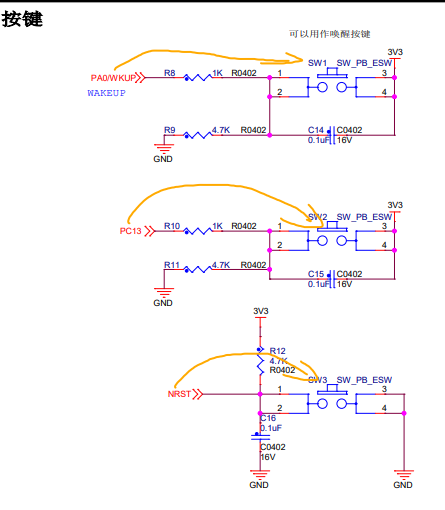

## GPIO 按键检测与有源蜂鸣器控制

### 本次学习目标

1. 掌握 STM32 GPIO 外设时钟的开启与 GPIO 初始化流程。
2. 理解浮空输入、下拉输入和推挽输出等 GPIO 工作模式的区别及使用场景。
3. 学会读取 GPIO 输入电平，并将多个按键事件组合到主循环控制逻辑中。
4. 理解机械按键抖动的成因，掌握基于延时的基础消抖方法。
5. 熟悉驱动模块的基本拆分方式，将按键检测和蜂鸣器控制封装为独立接口。
6. 通过编译、下载和实物验证，建立从 GPIO 配置到硬件现象的完整调试流程。

### 项目说明


本项目基于 STM32F103 和标准外设库，实现板载按键输入与有源蜂鸣器输出：

- 初始化 `PA0`、`PC13` 按键输入，以及 `PB10` 蜂鸣器推挽输出。
- 主循环轮询两路按键，任意一路检测到按下后，蜂鸣器响约 100 ms。
- `KEY_Scan()` 通过延时、等待按键释放和再次延时，实现基础按键消抖，并避免长按期间重复触发。
- `PB15` 复位键已完成下拉输入初始化，但当前示例未在主循环中使用。

### 按键 enum 设计

- `KEY_TriggerLevel` 用于描述按键按下时的有效电平：`KEY_LOW_TRIGGER` 表示低电平触发，`KEY_HIGH_TRIGGER` 表示高电平触发。调用 `KEY_Scan()` 时传入该参数，可以适配不同电路的按键极性。
- `KEY_Status` 用于表示按键扫描结果：`KEY_UP` 表示未按下，`KEY_DOWN` 表示检测到一次按下，`KEY_INIT` 是预留的初始化状态。
- 使用具名枚举值可以让调用代码表达清晰的业务含义，避免直接使用 `0`、`1` 等难以理解的数字，也便于后续扩展按键状态。

结合按键原理图，`PA0` 和 `PC13` 分别通过 `R9`、`R11` 下拉到 `GND`，按键闭合后连接到 `3.3V`，因此：

- 未按下时，GPIO 输入为 `0`；
- 按下时，GPIO 输入为 `1`；
- `PA0` 和 `PC13` 调用 `KEY_Scan()` 时应传入 `KEY_HIGH_TRIGGER`。

例如：

```c
KEY_Scan(GPIOA, GPIO_Pin_0, KEY_HIGH_TRIGGER);
KEY_Scan(GPIOC, GPIO_Pin_13, KEY_HIGH_TRIGGER);
```

原理图中的 `NRST` 复位按键使用 `R12` 上拉到 `3.3V`，按下后连接到 `GND`，所以它属于低电平有效，应使用 `KEY_LOW_TRIGGER`。不过 `NRST` 是 MCU 专用复位信号，通常由硬件复位电路直接处理，不应与普通 GPIO 按键混用。

### 蜂鸣器说明

- 本项目使用外接有源蜂鸣器，蜂鸣器内部自带振荡电路，GPIO 只需要输出高、低电平即可控制发声，不需要额外生成音频频率。
- 蜂鸣器的控制信号连接到 `PB10`，该引脚初始化为 50 MHz 推挽输出。
- `Buzzer_Set()` 先将 `PB10` 置高，使蜂鸣器发声；延时 100 ms 后将引脚置低，完成一次短鸣提示。
- 当前蜂鸣器为高电平有效，若实际硬件为低电平有效，只需调整 `Buzzer_Set()` 中的置位和复位逻辑。

### 引脚说明（按键使用板载按键）

| 功能 | GPIO 端口 | 引脚 | 配置模式 | 当前用途 |
| --- | --- | --- | --- | --- |
| KEY1 | GPIOA | `PA0` | 浮空输入 | 按下后触发蜂鸣器 |
| KEY2 | GPIOC | `PC13` | 浮空输入 | 按下后触发蜂鸣器 |
| 有源蜂鸣器 | GPIOB | `PB10` | 50 MHz 推挽输出 | 高电平有效，输出短鸣提示 |

### 四针脚接线说明

本项目的按键使用开发板上的板载器件，蜂鸣器使用外接器件。四个 GPIO 信号脚的对应关系如下：

1. `PA0` 接 KEY1 按键信号，用于检测 KEY1 按下状态。
2. `PC13` 接 KEY2 按键信号，用于检测 KEY2 按下状态。
3. `PB15` 接 KEY3 / Reset 按键信号，当前仅完成 GPIO 初始化，未参与蜂鸣器控制。
4. `PB10` 接外部有源蜂鸣器的控制信号端，输出高电平时蜂鸣器发声。

外部有源蜂鸣器还需要连接电源：蜂鸣器 `VCC-3.3V` 接开发板对应的电源，`GND` 接开发板 `GND`，控制信号端（`SIG`、`I/O` 或 `S`）接 `PB10`。接线前应确认模块的供电电压、触发电平和引脚定义；不能直接套用 GPIO 信号表。

