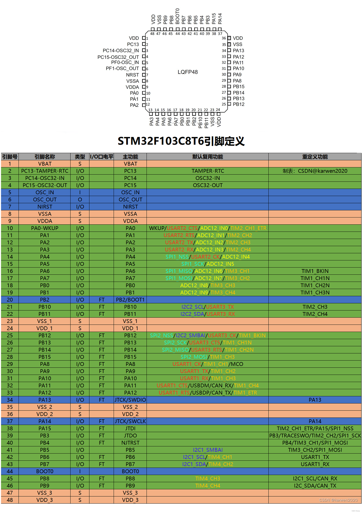
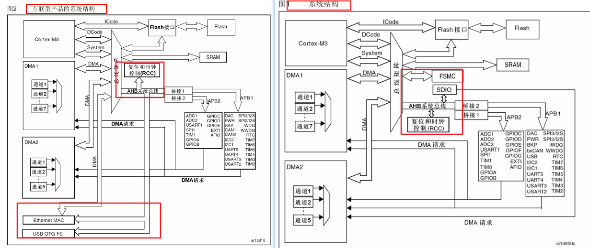

# STM32F103C8T6

## STM32引脚图





## 系统架构

STM32F1 的系统结构可以从总线和外设两个角度理解。Cortex-M3 内核通过 ICode、DCode 和 System 总线访问程序、数据与外设；DMA 也可以作为总线主设备访问存储器或外设。AHB 到 APB 的桥负责连接低速外设总线。

STM32F1 系列的不同型号外设资源并不完全相同。下图是系列级系统结构示意，STM32F103C8T6 不一定具备图中所有模块，例如 FSMC 和以太网相关模块。



## 基本使用

### 1.时钟与总线基础

  STM32 的外设不是上电后就一直工作。使用某个外设前，通常要先由 RCC 打开它所在总线的时钟门控；时钟打开后，才能访问外设寄存器并使外设运行。关闭未使用外设的时钟，可以减少功耗。

  ### AHB、APB1 和 APB2

  - **AHB**：连接内核、高速存储器、DMA 等模块。系统时钟经过分频后形成 AHB 时钟 HCLK。
  - **APB1**：连接一部分低速外设，例如 TIM2-TIM7、USART2/USART3、I2C 等。其时钟为 PCLK1。
  - **APB2**：连接另一部分外设，例如 GPIO、AFIO、ADC、USART1 和部分高级定时器。其时钟为 PCLK2。
  - **AHB 到 APB 桥**：把 AHB 侧的访问传递到 APB1 或 APB2 外设。

  这里需要区分两件事：配置系统时钟是设置 SYSCLK、HCLK、PCLK1、PCLK2 等频率；打开外设时钟是允许某个外设获得工作时钟。LED 示例主要演示后者。

### 2.GPIO输入模式和输出模式

  GPIO 是连接芯片引脚的通用输入输出外设。STM32F1 中常用 GPIO 端口通常挂载在 APB2 上。一个 GPIO 端口包含多个引脚，每个引脚都可以独立配置模式，并通过输入数据或输出数据与程序交换电平信息。

  


  输入模式用于读取外部电路施加到引脚上的电平，输出模式用于由程序控制引脚电平。下表同时列出标准外设库和 HAL 库中的常见写法，具体参数仍需结合芯片型号和驱动库版本确认。

| 模式分类 | 模式名称 | 标准库写法 | HAL库写法 | 核心特点 | 典型应用场景 |
| --- | --- | --- | --- | --- | --- |
| 输入 | 模拟输入 | `GPIO_Mode_AIN` | `GPIO_MODE_ANALOG` | 关闭数字输入路径 | ADC 等模拟功能 |
| 输入 | 浮空输入 | `GPIO_Mode_IN_FLOATING` | `GPIO_NOPULL` + `GPIO_MODE_INPUT` | 无内部上下拉，悬空时电平不确定 | 外部电路已提供确定电平的数字输入 |
| 输入 | 上拉输入 | `GPIO_Mode_IPU` | `GPIO_PULLUP` + `GPIO_MODE_INPUT` | 内部上拉，悬空时通常为高电平 | 按键、开关等默认高电平输入 |
| 输入 | 下拉输入 | `GPIO_Mode_IPD` | `GPIO_PULLDOWN` + `GPIO_MODE_INPUT` | 内部下拉，悬空时通常为低电平 | 按键、开关等默认低电平输入 |
| 输出 | 推挽输出 | `GPIO_Mode_Out_PP` | `GPIO_MODE_OUTPUT_PP` | 主动输出高、低电平 | LED、普通控制信号 |
| 输出 | 开漏输出 | `GPIO_Mode_Out_OD` | `GPIO_MODE_OUTPUT_OD` | 只能主动拉低，高电平依赖上拉 | I2C、需要线与的总线 |
| 复用输出 | 复用推挽 | `GPIO_Mode_AF_PP` | `GPIO_MODE_AF_PP` | 由片上外设驱动推挽输出 | USART、SPI、定时器输出 |
| 复用输出 | 复用开漏 | `GPIO_Mode_AF_OD` | `GPIO_MODE_AF_OD` | 由片上外设驱动开漏输出 | I2C 等需要外部上拉的接口 |

  复用模式是把引脚控制权交给 USART、SPI、定时器等片上外设；模拟输入则把引脚连接到模拟功能。GPIO 模式和具体外设功能需要结合芯片参考手册配置。

### 3.LED：第一个外设调用示例

  LED 是连接在 GPIO 引脚上的外部器件，不是芯片内部外设。LED 的亮灭由开发板电路决定：有些电路输出高电平点亮，有些电路输出低电平点亮，因此应先确认 LED 的有效电平。

  **RCC、GPIO 与 LED 的职责和调用逻辑：**

  1. **RCC**：打开 GPIO 所在总线的外设时钟，让 GPIO 模块可以工作。
  2. **GPIO**：选择 LED 引脚，将其配置为数字输出，并保存程序要求的输出电平。
  3. **LED**：根据引脚电平和外部电路的有效电平发光或熄灭。
  4. **延时模块**：提供时间间隔，使 LED 的电平变化能够被观察到；延时模块通常依赖系统时钟或定时器。

  ```text
  系统启动
    -> 确认 LED 所在端口和有效电平
    -> 打开 GPIO 所在总线的外设时钟  // RCC 允许 GPIO 模块工作
    -> 将 LED 引脚配置为输出模式    // GPIO 设置引脚工作方式
    -> 设置 LED 初始状态            // 避免上电时出现错误电平
    -> 循环改变 GPIO 输出电平       // GPIO 控制引脚
    -> 调用延时功能                 // 让状态变化可观察
    -> 返回循环
  ```

  **下面分别给出标准外设库和 HAL 库的常见写法。示例假设 LED 连接在 PA1，且高电平点亮；若开发板为低电平点亮，需要交换点亮和熄灭时的电平。**

  **标准外设库：**

  ```C
  // 1. 开启 GPIOA 所在 APB2 总线的时钟
  RCC_APB2PeriphClockCmd(RCC_APB2Periph_GPIOA, ENABLE);

  // 2. 将 PA1 配置为推挽输出
  GPIO_InitTypeDef GPIO_InitStructure = {0};
  GPIO_InitStructure.GPIO_Pin = GPIO_Pin_1;
  GPIO_InitStructure.GPIO_Mode = GPIO_Mode_Out_PP;
  GPIO_InitStructure.GPIO_Speed = GPIO_Speed_50MHz;
  GPIO_Init(GPIOA, &GPIO_InitStructure);

  while (1)
  {
     GPIO_SetBits(GPIOA, GPIO_Pin_1);   // PA1 输出高电平，LED 点亮
     Delay_ms(200);                      // 延时 200 ms
     GPIO_ResetBits(GPIOA, GPIO_Pin_1); // PA1 输出低电平，LED 熄灭
     Delay_ms(200);                      // 延时 200 ms
  }
  ```

  **HAL 库：**

  ```C
  // 1. 开启 GPIOA 时钟
  __HAL_RCC_GPIOA_CLK_ENABLE();

  // 2. 将 PA1 配置为推挽输出
  GPIO_InitTypeDef GPIO_InitStructure = {0};
  GPIO_InitStructure.Pin = GPIO_PIN_1;
  GPIO_InitStructure.Mode = GPIO_MODE_OUTPUT_PP;
  GPIO_InitStructure.Pull = GPIO_NOPULL;
  GPIO_InitStructure.Speed = GPIO_SPEED_FREQ_LOW;
  HAL_GPIO_Init(GPIOA, &GPIO_InitStructure);

  while (1)
  {
     HAL_GPIO_WritePin(GPIOA, GPIO_PIN_1, GPIO_PIN_SET);   // PA1 输出高电平
     HAL_Delay(200);                                       // 延时 200 ms
     HAL_GPIO_WritePin(GPIOA, GPIO_PIN_1, GPIO_PIN_RESET); // PA1 输出低电平
     HAL_Delay(200);                                       // 延时 200 ms
  }
  ```

  这个例子中的“打开 GPIOA 外设时钟”是外设时钟门控的基本用法，不是把系统主频配置为某个数值。若 LED 接在其它 GPIO 端口，只需按照该端口的总线归属打开对应时钟。

## 基础中断

### ETR、内部时钟与 EXTI 外部触发对比

定时器的“时钟来源”和“触发输入”是两个容易混淆的概念。APB1/APB2 提供定时器正常运行所需的内部时钟；ETR 是定时器专用的外部触发输入，可以参与计数或触发控制；EXTI 则是独立的外部中断/事件控制器，主要用于通知 CPU 处理 GPIO 边沿。

#### 三种输入来源总览

| 输入来源          | 连接位置                                        | 定时器内部路径                                               |             是否直接驱动 `CNT`              |                 是否必须进入中断                 | 典型用途                               |
| :---------------- | :---------------------------------------------- | :----------------------------------------------------------- | :-----------------------------------------: | :----------------------------------------------: | :------------------------------------- |
| **ETR 外部触发**  | 定时器的 ETR 专用引脚（具体引脚由芯片型号决定） | ETR 输入 → 极性检测 → 外部触发预分频/滤波 → 触发控制器（TRGI）或外部时钟 2 | **可以**。外部时钟 1/2 模式下可作为计数时钟 |       否。可只让硬件计数、复位、门控或启动       | 外部脉冲计数、频率测量、同步、门控计数 |
| **APB1 内部时钟** | 芯片内部 APB1 总线                              | `PCLK1` → 定时器时钟倍频规则 → 定时器预分频器 `PSC` → `CNT`  |      **是**，作为定时器的内部计数时钟       |         否。需要周期通知时才开启更新中断         | TIM2~TIM7 的普通定时、PWM、输入捕获    |
| **APB2 内部时钟** | 芯片内部 APB2 总线                              | `PCLK2` → 定时器时钟倍频规则 → 定时器预分频器 `PSC` → `CNT`  |      **是**，作为定时器的内部计数时钟       |         否。需要周期通知时才开启更新中断         | TIM1/TIM8 的高级定时、PWM、输入捕获    |
| **EXTI 外部触发** | GPIO 引脚对应的 EXTI 线路                       | GPIO 边沿 → EXTI 边沿检测 → 挂起标志 → NVIC → CPU 中断服务函数 |    **否**，不会直接给定时器提供计数脉冲     | 通常是。也可以配置为事件，不进入普通中断服务函数 | 按键、传感器边沿、编码器事件、唤醒 CPU |


#### ETR 外部触发与 EXTI 外部触发的区别

| 对比项         | ETR 外部触发                                                 | EXTI 外部触发                                                |
| :------------- | :----------------------------------------------------------- | :----------------------------------------------------------- |
| 所属外设       | `定时器内部的外部触发/从模式电路`                            | EXTI 外部中断/事件控制器                                     |
| 输入引脚       | 定时器专用 ETR 引脚，不能任意替换                            | GPIO 的 EXTI0~EXTI15 线路，可通过 AFIO 选择端口              |
| 主要处理对象   | 定时器硬件逻辑                                               | CPU/NVIC 中断或事件逻辑                                      |
| 边沿处理       | 可配置极性，并可使用 ETR 滤波和外部触发预分频                | 可配置上升沿、下降沿或双边沿；使用 EXTI 的边沿检测           |
| 能否直接计数   | **能**。配置外部时钟模式 1 或模式 2 后，ETR 有效边沿可改变 `CNT` | **不能**。EXTI 只置位挂起标志，需在中断函数中由软件读取或操作定时器 |
| 对实时性的影响 | 主要由定时器硬件完成，CPU 可以不参与每个脉冲                 | 每个有效边沿通常都需要 CPU 响应，频率过高时可能丢中断或占用 CPU |
| 是否需要 NVIC  | **不需要；是否开启定时器更新/触发中断是另一件事**            | 需要 NVIC 才能进入对应的 IRQ；EXTI 事件模式可不进入 IRQ      |
| 典型配置       | `TIM_ETRConfig()`、`TIM_ETRClockMode1Config()`、`TIM_ETRClockMode2Config()` | `GPIO_EXTILineConfig()`、`EXTI_Init()`、`NVIC_Init()`        |
| 适合场景       | 高速脉冲计数、硬件门控、同步复位、外部时钟输入               | 按键和低速传感器通知、唤醒、需要执行一段软件逻辑的边沿事件   |

**不要把 ETR 和 EXTI 当作同一条信号链：** 同一个外部信号可以根据硬件连接和功能需求接入 ETR 或 GPIO/EXTI，但 **ETR 的目标是让定时器硬件参与计数/触发，EXTI 的目标是让 CPU 得到事件通知**。若需要“外部脉冲不经过 CPU 也能连续计数”，应优先选择 ETR 外部时钟模式；若需要在边沿到来时执行软件逻辑，才选择 EXTI。

另外，ETR 与 EXTI 是否能使用同一个物理引脚取决于具体 STM32 型号的引脚复用和外部连接，不能仅根据引脚编号推断，实际使用前应查阅对应芯片的数据手册和参考手册。

### 1. EXTI 外部中断

EXTI 的完整概念、GPIO 映射、触发方式、NVIC 配置和 EC11 编码器示例，见：[9.EXTI外部中断.md](9.EXTI外部中断.md)。

### 2. Interrupt

STM32 中断的总体分类、TIM 定时器中断、USART、DMA、ADC 以及各类配置和计算，见：[8.中断.md](8.中断.md)。

### 3.Serial Communication

- **通信基础：**`Communication Protocol.md`
- **USRAT**：`USART.md`；
- **IIC**： `IIC.md`
- **SPI：**`SPI.md`
