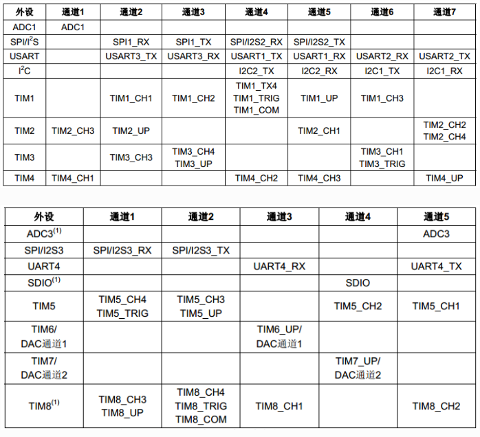

### USART 的串口分布

| 串口   | TX引脚      | RX引脚      | 备注                  |
| :----- | :---------- | :---------- | :-------------------- |
| USART1 | PA9 (默认)  | PA10 (默认) | 可重映射到PB6/PB7     |
| USART2 | PA2 (默认)  | PA3 (默认)  | 可重映射到PD5/PD6     |
| USART3 | PB10 (默认) | PB11 (默认) | 可重映射到PC10/PC11等 |
| UART4  | PC10 (默认) | PC11 (默认) | 仅中/大容量型号支持   |
| UART5  | PC12 (默认) | PD2 (默认)  | 仅中/大容量型号支持   |

```C
typedef struct
{
  uint32_t USART_BaudRate; // 波特率
  uint16_t USART_WordLength;  // 字长
  uint16_t USART_StopBits;  // 停止位
  uint16_t USART_Parity; // 校验位
  uint16_t USART_Mode;           // 收发模式配置    
  uint16_t USART_HardwareFlowControl; // 硬件数据流控制
} USART_InitTypeDef;
```


### USART 轮询模式(收发会处于等待的状态)

- 仅需配置USART 和 GPIO


   ```C
   /****************
    *@description: USART1 串口异步驱动程序
    *@author: zephyr
    *@date: 2025-06-05 11:34:16
    *@version: V1.0.0
    ****************/
   
   #include "stm32f10x.h"
   
   /**
    * @brief  初始化USART1
    * @note   此函数配置USART1的波特率、数据位、停止位和校验位，并设置GPIO引脚。
    * @param  null
    * @retval null
    * */
   void UART_Init(void)
   {
       // Enable clocks for GPIOA and USART1
       RCC_APB2PeriphClockCmd(RCC_APB2Periph_GPIOA | RCC_APB2Periph_USART1, ENABLE);
   
       // Configure PA9 (TX) as alternate function push-pull
       GPIO_InitTypeDef GPIO_InitStructure;
       GPIO_InitStructure.GPIO_Pin   = GPIO_Pin_9;
       GPIO_InitStructure.GPIO_Speed = GPIO_Speed_50MHz;
       GPIO_InitStructure.GPIO_Mode  = GPIO_Mode_AF_PP;
       GPIO_Init(GPIOA, &GPIO_InitStructure);
   
       // Configure PA10 (RX) as input floating
       GPIO_InitStructure.GPIO_Pin  = GPIO_Pin_10;
       GPIO_InitStructure.GPIO_Mode = GPIO_Mode_IN_FLOATING;
       GPIO_Init(GPIOA, &GPIO_InitStructure);
   
       // Configure USART1
       USART_InitTypeDef USART_InitStructure;
       USART_InitStructure.USART_BaudRate            = 9600;
       USART_InitStructure.USART_WordLength          = USART_WordLength_8b;
       USART_InitStructure.USART_StopBits            = USART_StopBits_1;
       USART_InitStructure.USART_Parity              = USART_Parity_No;
       USART_InitStructure.USART_HardwareFlowControl = USART_HardwareFlowControl_None;
       USART_InitStructure.USART_Mode                = USART_Mode_Rx | USART_Mode_Tx;
       USART_Init(USART1, &USART_InitStructure);
   
       // Enable USART1 receive interrupt
       USART_ITConfig(USART1, USART_IT_RXNE, ENABLE);
   
       // Enable USART1
       USART_Cmd(USART1, ENABLE);
   }
   
   // 发送和接收函数的实现
   
   /**
    * @brief  通过USART1发送单个字节
    * @note   此函数等待发送数据寄存器空，然后发送一个字节，并等待发送完成。
    * @param  data: 要发送的字节
    * @retval null
    */
   void UART_SendByte(uint8_t data)
   {
       // Wait until the transmit data register is empty
       while (USART_GetFlagStatus(USART1, USART_FLAG_TXE) == RESET);
       // Send the byte
       USART_SendData(USART1, data);
       // Wait until the transmission is complete
       while (USART_GetFlagStatus(USART1, USART_FLAG_TC) == RESET);
   }
   
   /**
    * @brief  通过USART1发送字符串
    * @note   此函数逐字节发送字符串，直到遇到字符串结束符'\0'，并等待发送完成。
    * @param  str: 要发送的字符串
    * @retval null
    */
   void UART_SendString(const char *str)
   {
       while (*str) {
           UART_SendByte((uint8_t)*str);
           str++;
       }
       // Wait until the transmission of the last byte is complete
       while (USART_GetFlagStatus(USART1, USART_FLAG_TC) == RESET);
   }
   
   /**
    * @brief  通过USART1接收单个字节
    * @note   此函数等待接收数据寄存器非空，然后读取接收到的字节。
    * @param  null
    * @retval 接收到的字节
    */
   uint8_t UART_ReceiveByte(void)
   {
       // Wait until the receive data register is not empty
       while (USART_GetFlagStatus(USART1, USART_FLAG_RXNE) == RESET);
       // Read and return the received byte
       return (uint8_t)USART_ReceiveData(USART1);
   }
   
   /**
    * @brief  通过USART1接收字符串
    * @note   此函数逐字节接收数据，直到接收到停止字符或达到缓冲区大小。
    * @param  buffer: 存储接收数据的缓冲区
    * @param  maxLength: 缓冲区的最大长度
    * @param  stopChar: 停止接收的字符
    * @retval 接收到的字符串长度
    */
   uint16_t UART_ReceiveString(char *buffer, uint16_t maxLength)
   {
       uint16_t length = 0;
       while (length < maxLength - 1) {
           while (USART_GetFlagStatus(USART1, USART_FLAG_RXNE) == RESET);
           // read the received byte & 0xff 是防止接收数据位数溢出； 此处也可以替换为UART_ReceiveByte()函数
           char received = (char)USART_ReceiveData(USART1) & 0xff; 
           if (received == '\n' || received == '\r') { // Stop on the specified stop character
               break;
           }
           buffer[length++] = received;
       }
       buffer[length] = '\0'; // Null-terminate the string
       return length;
   }
   
   ```

   

### UART 中断模式（收发不会互相影响）

- 需要在轮询模式上配置中断处理函数


   ```C
   /****************
    *@description: USART1 串口-中断收发
    *@author: zephyr
    *@date: 2025-06-05 11:34:16
    *@version: V1.0.0
   ****************/
   
   #include "stm32f10x.h"
   // #include "stm32f10x_usart.h"
   // #include "stm32f10x_gpio.h"
   // #include <stdio.h>
   // #include "stm32f10x_rcc.h"
   
   
   #define RX_BUFFER_SIZE 128 // 接收缓冲区大小
   
   volatile char rxBuffer[RX_BUFFER_SIZE]; // 接收缓冲区
   volatile uint16_t rxWriteIndex = 0;     // 写入索引
   volatile uint16_t rxReadIndex = 0;      // 读取索引
   volatile uint8_t bufferOverflow = 0;   // 缓冲区溢出标志
   
   /**
   * @brief  初始化USART1
   * @note   此函数配置USART1的波特率、数据位、停止位和校验位，并设置GPIO引脚。
   * @param  null
   * @retval null
   * */
   void UART_Init(void) {
       // Enable clocks for GPIOA and USART1
       RCC_APB2PeriphClockCmd(RCC_APB2Periph_GPIOA | RCC_APB2Periph_USART1, ENABLE);
   
       // Configure PA9 (TX) as alternate function push-pull
       GPIO_InitTypeDef GPIO_InitStructure;
       GPIO_InitStructure.GPIO_Pin = GPIO_Pin_9;
       GPIO_InitStructure.GPIO_Speed = GPIO_Speed_50MHz;
       GPIO_InitStructure.GPIO_Mode = GPIO_Mode_AF_PP;
       GPIO_Init(GPIOA, &GPIO_InitStructure);
   
       // Configure PA10 (RX) as input floating
       GPIO_InitStructure.GPIO_Pin = GPIO_Pin_10;
       GPIO_InitStructure.GPIO_Mode = GPIO_Mode_IN_FLOATING;
       GPIO_Init(GPIOA, &GPIO_InitStructure);
   
       // Configure USART1
       USART_InitTypeDef USART_InitStructure;
       USART_InitStructure.USART_BaudRate = 115200;
       USART_InitStructure.USART_WordLength = USART_WordLength_8b;
       USART_InitStructure.USART_StopBits = USART_StopBits_1;
       USART_InitStructure.USART_Parity = USART_Parity_No;
       USART_InitStructure.USART_HardwareFlowControl = USART_HardwareFlowControl_None;
       USART_InitStructure.USART_Mode = USART_Mode_Rx | USART_Mode_Tx;
       USART_Init(USART1, &USART_InitStructure);
   
       // Configure NVIC for USART1
       NVIC_InitTypeDef NVIC_InitStructure;
       NVIC_InitStructure.NVIC_IRQChannel = USART1_IRQn;
       NVIC_InitStructure.NVIC_IRQChannelPreemptionPriority = 0;
       NVIC_InitStructure.NVIC_IRQChannelSubPriority = 0;
       NVIC_InitStructure.NVIC_IRQChannelCmd = ENABLE;
       NVIC_Init(&NVIC_InitStructure);
   
       // Enable USART1 receive interrupt
       USART_ITConfig(USART1, USART_IT_RXNE, ENABLE);
   
       // Enable USART1
       USART_Cmd(USART1, ENABLE);
   }
   
   
   /**
   * @brief  USART1中断处理程序
   * @note   处理接收到的数据，包括单字节和字符串，并处理缓冲区溢出。
   * @param  null
   * @retval null
   */
   void USART1_IRQHandler(void) {
       // 检查是否为接收中断
       if (USART_GetITStatus(USART1, USART_IT_RXNE) != RESET) {
           // 读取接收到的数据
           char received = (char)USART_ReceiveData(USART1);
   
           // 检查缓冲区是否已满
           uint16_t nextIndex = (rxWriteIndex + 1) % RX_BUFFER_SIZE;
           if (nextIndex == rxReadIndex) {
               bufferOverflow = 1; // 设置缓冲区溢出标志
           } else {
               // 将数据存入缓冲区
               rxBuffer[rxWriteIndex] = received;
               rxWriteIndex = nextIndex;
           }
   
           // 清除中断标志
           USART_ClearITPendingBit(USART1, USART_IT_RXNE);
       }
   }
   
   /**
   * @brief  从接收缓冲区读取单个字节
   * @note   如果缓冲区为空，则返回0。
   * @param  null
   * @retval 接收到的字节
   */
   uint8_t UART_ReadByteFromBuffer(void) {
       if (rxReadIndex == rxWriteIndex) {
           return 0; // 缓冲区为空
       } else {
           char data = rxBuffer[rxReadIndex];
           rxReadIndex = (rxReadIndex + 1) % RX_BUFFER_SIZE;
           return (uint8_t)data;
       }
   }
   
   /**
   * @brief  检查缓冲区溢出状态
   * @note   如果发生溢出，返回1，并清除溢出标志。
   * @param  null
   * @retval 缓冲区溢出状态
   */
   uint8_t UART_CheckBufferOverflow(void) {
       if (bufferOverflow) {
           bufferOverflow = 0; // 清除溢出标志
           return 1;
       }
       return 0;
   }
   
   /**
   * @brief  从接收缓冲区读取所有内容
   * @note   将缓冲区中的所有数据读取到目标缓冲区中，直到缓冲区为空。
   * @param  destBuffer: 存储读取数据的目标缓冲区
   * @param  maxLength: 目标缓冲区的最大长度
   * @retval 实际读取的字节数
   */
   uint16_t UART_ReadAllFromBuffer(char *destBuffer, uint16_t maxLength) {
       uint16_t bytesRead = 0;
       while (rxReadIndex != rxWriteIndex && bytesRead < maxLength) {
           destBuffer[bytesRead++] = rxBuffer[rxReadIndex];
           rxReadIndex = (rxReadIndex + 1) % RX_BUFFER_SIZE;
       }
       return bytesRead;
   }
   
   
   void UART_send_str_IT(const char *str) {
       while (*str != '\0') {
           // 等待发送缓冲区空
           while (USART_GetFlagStatus(USART1, USART_FLAG_TXE) == RESET);
           // 发送数据
           USART_SendData(USART1, (uint8_t)(*str++));
       }
       // 等待发送完成
       while (USART_GetFlagStatus(USART1, USART_FLAG_TC) == RESET);
   }
   
   ```

   

### UART DMA模式



- DMA简介：DMA-直接存储器存取，是单片机外设，存储器指的是SRAM,FLASH,DMA包含DMA1和DMA2,分别有七个通道和五个通道（仅限互联网产品）

- DMA使用：使用DMA，最核心就是配置要传输的数据，包括数据从哪里来，要到哪里去，传输的数据的单位是什么，要传多少数据，是一次传输还是循环传输等。

- DMA传输数据的方向有三个：从外设到存储器，从存储器到外设，从存储器到存储器，以下是DMA的结构体

  ```C
  typedef struct
  {
      uint32_t DMA_PeripheralBaseAddr;   // 外设地址 
      uint32_t DMA_MemoryBaseAddr;       // 存储器地址
      uint32_t DMA_DIR;                  // 传输方向
      uint32_t DMA_BufferSize;           // 传输数目
      uint32_t DMA_PeripheralInc;        // 外设地址增量模式
      uint32_t DMA_MemoryInc;            // 存储器地址增量模式
      uint32_t DMA_PeripheralDataSize;   // 外设数据宽度
      uint32_t DMA_MemoryDataSize;       // 存储器数据宽度
      uint32_t DMA_Mode;                 // 模式选择
      uint32_t DMA_Priority;             // 通道优先级
      uint32_t DMA_M2M;                  // 存储器到存储器模式
  } DMA_InitTypeDef;
  ```

- 下面存储器到外设的设置：DMA-USART

  `SerialPort.h`

```C
/****************
 *@description: STM32F103 USART1 DMA驱动
 *@file: SerialPort.h
 *@author: zephyr
 *@date: 2025-06-17 16:12:08
 *@version: V1.0.0
****************/

#ifndef SeralPort_H
#define SeralPort_H

typedef enum {
    TRANSMISSION_EMPTY = 0,
    TRANSMISSION_TIMEOUT,
    TRANSMISSION_SUCCESS
} TransmissionStatus;

void USART_DMA_Init(uint32_t baudrate);
TransmissionStatus USART_DMA_Send(char *data, uint16_t length);
uint16_t USART_DMA_Read(char *buffer, uint16_t maxLength);

#endif // SeralPort_H
```


`SerialPort.c`

```C
/****************
 *@description: STM32F103 USART1 DMA驱动
 *@file: SerialPort.c
 *@author: zephyr
 *@date: 2025-06-17 16:11:47
 *@version: V1.0.0
****************/

#include "stm32f10x.h"
#include <string.h>
#include "stm32f10x_dma.h"
#include "./drive/inc/SerialPort.h"

#define TX_BUFFER_SIZE 256
#define RX_BUFFER_SIZE 256
typedef struct {
    uint8_t buffer[2][RX_BUFFER_SIZE]; // 接收用的双缓冲区
    volatile uint8_t activeBuffer;     // 当前活动缓冲区的索引
    volatile uint16_t full[2];         // 每个缓冲区中的数据长度
} SerialPortRxBuffer;

typedef struct {
    uint8_t buffer[2][TX_BUFFER_SIZE]; // 双缓冲区用于传输
    volatile uint8_t activeBuffer;     // 当前活动缓冲区的索引
    volatile uint8_t ready[2];         // 缓冲区是否准备好
    uint16_t dataLength[2];            // 每个缓冲区中的数据长度
} SerialPortTxBuffer;


// 初始化缓冲区
SerialPortRxBuffer rxBuffer;
SerialPortTxBuffer txBuffer;

/**
 * @brief  初始化GPIO引脚用于USART1
 * @note   USART1使用PA9作为TX引脚，PA10作为RX引脚
 * @param  Null
 * @retval Null
 * */
void USART_GPIO_Init(void)
{
    // Enable GPIO clock
    RCC_APB2PeriphClockCmd(RCC_APB2Periph_GPIOA, ENABLE);

    GPIO_InitTypeDef GPIO_InitStructure;

    // Configure TX pin (PA9) as alternate function push-pull
    GPIO_InitStructure.GPIO_Pin   = GPIO_Pin_9;
    GPIO_InitStructure.GPIO_Speed = GPIO_Speed_50MHz;
    GPIO_InitStructure.GPIO_Mode  = GPIO_Mode_AF_PP;
    GPIO_Init(GPIOA, &GPIO_InitStructure);

    // Configure RX pin (PA10) as input floating
    GPIO_InitStructure.GPIO_Pin  = GPIO_Pin_10;
    GPIO_InitStructure.GPIO_Mode = GPIO_Mode_IN_FLOATING;
    GPIO_Init(GPIOA, &GPIO_InitStructure);
}

// UASRT 初始化
void USART_Config(uint32_t baudrate)
{
    // Enable USART1 clock
    RCC_APB2PeriphClockCmd(RCC_APB2Periph_USART1, ENABLE);

    // Configure USART1
    USART_InitTypeDef USART_InitStructure;
    USART_InitStructure.USART_BaudRate            = baudrate;
    USART_InitStructure.USART_WordLength          = USART_WordLength_8b;
    USART_InitStructure.USART_StopBits            = USART_StopBits_1;
    USART_InitStructure.USART_Parity              = USART_Parity_No;
    USART_InitStructure.USART_HardwareFlowControl = USART_HardwareFlowControl_None;
    USART_InitStructure.USART_Mode                = USART_Mode_Rx | USART_Mode_Tx;
    USART_Init(USART1, &USART_InitStructure);
    USART_Cmd(USART1, ENABLE);
}

// DMA 通道4初始化
void USART_DMA_channel4_Init()
{
    // Enable DMA1 clock
    RCC_AHBPeriphClockCmd(RCC_AHBPeriph_DMA1, ENABLE);

    // Configure DMA1 Channel4 for USART1_TX
    DMA_InitTypeDef DMA_InitStructure;
    DMA_DeInit(DMA1_Channel4);
    DMA_InitStructure.DMA_PeripheralBaseAddr = (uint32_t)&USART1->DR; 
    DMA_InitStructure.DMA_MemoryBaseAddr     = (uint32_t)txBuffer.buffer[0];
    DMA_InitStructure.DMA_DIR                = DMA_DIR_PeripheralDST;
    DMA_InitStructure.DMA_BufferSize         = 0; // Initially set to 0, will be updated during transmission
    DMA_InitStructure.DMA_PeripheralInc      = DMA_PeripheralInc_Disable;
    DMA_InitStructure.DMA_MemoryInc          = DMA_MemoryInc_Enable;
    DMA_InitStructure.DMA_PeripheralDataSize = DMA_PeripheralDataSize_Byte;
    DMA_InitStructure.DMA_MemoryDataSize     = DMA_MemoryDataSize_Byte;
    DMA_InitStructure.DMA_Mode               = DMA_Mode_Normal;
    DMA_InitStructure.DMA_Priority           = DMA_Priority_High;
    DMA_InitStructure.DMA_M2M                = DMA_M2M_Disable;
    DMA_Init(DMA1_Channel4, &DMA_InitStructure);

    // Initialize TX buffer
    txBuffer.activeBuffer = 0;
    txBuffer.ready[0]     = 0;
    txBuffer.ready[1]     = 0;
}

// DMA 通道5的初始化
void USART_DMA_channel5_Init()
{
    // Configure DMA1 Channel5 for USART1_RX
    DMA_InitTypeDef DMA_InitStructure;
    DMA_DeInit(DMA1_Channel5);
    DMA_InitStructure.DMA_PeripheralBaseAddr = (uint32_t)&USART1->DR;
    DMA_InitStructure.DMA_MemoryBaseAddr     = (uint32_t)rxBuffer.buffer[0];
    DMA_InitStructure.DMA_DIR                = DMA_DIR_PeripheralSRC;
    DMA_InitStructure.DMA_BufferSize         = RX_BUFFER_SIZE; // Set to maximum size
    DMA_InitStructure.DMA_PeripheralInc      = DMA_PeripheralInc_Disable;
    DMA_InitStructure.DMA_MemoryInc          = DMA_MemoryInc_Enable;
    DMA_InitStructure.DMA_PeripheralDataSize = DMA_PeripheralDataSize_Byte;
    DMA_InitStructure.DMA_MemoryDataSize     = DMA_MemoryDataSize_Byte;
    DMA_InitStructure.DMA_Mode               = DMA_Mode_Circular; // Use circular mode for continuous reception
    DMA_InitStructure.DMA_Priority           = DMA_Priority_High;
    DMA_InitStructure.DMA_M2M                = DMA_M2M_Disable;

    DMA_Init(DMA1_Channel5, &DMA_InitStructure);
    DMA_Cmd(DMA1_Channel5, ENABLE);                // Enable DMA1 Channel5
    USART_DMACmd(USART1, USART_DMAReq_Rx, ENABLE); // Enable USART1 DMA receiver

    // Initialize RX buffer
    rxBuffer.activeBuffer = 0;
    rxBuffer.full[0]      = 0;
    rxBuffer.full[1]      = 0;
}

/**
 * @brief  使用DMA发送数据
 * @note   该函数将数据复制到活动缓冲区，并启动DMA传输
 * @param  data: 指向要发送的数据的指针
 * @param  length: 要发送的数据长度
 * @retval lenth: 实际发送的数据长度
 */
TransmissionStatus USART_DMA_Send(char *data, uint16_t length)
{
    if (data == NULL || length == 0) {
        return TRANSMISSION_EMPTY; // 如果数据为空或长度为0，直接返回
    } else {
        DMA_Cmd(DMA1_Channel4, DISABLE); // 禁用DMA通道4以重新配置

        // 检查当前活动缓冲区是否已准备好,并将数据复制到缓冲区
        uint8_t targetBuffer = txBuffer.activeBuffer; // 获取当前活动缓冲区
        length = (length > TX_BUFFER_SIZE) ? TX_BUFFER_SIZE : length; // 限制长度不超过缓冲区大小
        memcpy(txBuffer.buffer[targetBuffer], data, length); // 复制数据到活动缓冲区
        txBuffer.dataLength[targetBuffer] = length;          // 设置数据长度
        txBuffer.ready[targetBuffer]      = 1;               // 标记缓冲区已准备好

        // 配置DMA传输
        DMA_Cmd(DMA1_Channel4, ENABLE); // 启用DMA通道4
        DMA_SetCurrDataCounter(DMA1_Channel4, length); // 设置DMA传输的数据长度
        USART_DMACmd(USART1, USART_DMAReq_Tx, ENABLE); // 启用USART的DMA传输
        txBuffer.activeBuffer = !txBuffer.activeBuffer; // 切换到另一个缓冲区
        txBuffer.ready[!txBuffer.activeBuffer] = 0; // 将非活动缓冲区标记为未准备好

        // 超时处理
        uint32_t timeout = 1000000; // 设置超时时间
        while (DMA_GetFlagStatus(DMA1_FLAG_TC4) == RESET) {
            if (timeout-- == 0) {
                // 超时处理
                DMA_Cmd(DMA1_Channel4, DISABLE);                // 禁用DMA
                USART_DMACmd(USART1, USART_DMAReq_Tx, DISABLE); // 禁用USART的DMA传输
                return TRANSMISSION_TIMEOUT; // 退出函数
            }
        }
        DMA_ClearFlag(DMA1_FLAG_TC4); // 清除传输完成标志
        return TRANSMISSION_SUCCESS; // 返回成功状态
    }
}

/**
 * @brief  从接收缓冲区读取数据
 * @note   检查当前活动缓冲区是否有数据可读，如果有则读取数据
 * @param  buffer: 存储读取数据的目标缓冲区
 * @param  maxLength: 目标缓冲区的最大长度
 * @retval 实际读取的数据长度
 */
uint16_t USART_DMA_Read(char *buffer, uint16_t maxLength)
{
    uint8_t activeBuffer   = rxBuffer.activeBuffer; // 获取当前活动缓冲区
    uint8_t inactiveBuffer = !activeBuffer;         // 获取非活动缓冲区

    if (rxBuffer.full[inactiveBuffer]) {
        // 如果非活动缓冲区有数据，切换缓冲区
        rxBuffer.activeBuffer         = inactiveBuffer;
        rxBuffer.full[inactiveBuffer] = 0; // 标记非活动缓冲区为空
        activeBuffer                  = inactiveBuffer;
    }
	// 获取当前缓冲区的数据长度
    uint16_t length = (rxBuffer.full[activeBuffer] > maxLength) ? maxLength : rxBuffer.full[activeBuffer]; 
    memcpy(buffer, rxBuffer.buffer[activeBuffer], length);   // 复制数据到目标缓冲区                                              
    rxBuffer.full[activeBuffer] = 0;                         // 标记当前缓冲区为空

    return length; // 返回实际读取的数据长度
}

/**
* @brief  初始化USART1和DMA
* @note   该函数初始化GPIO引脚，配置USART1，并初始化DMA通道4和5
* @param  baudrate: USART1的波特率
* @retval Null
* */
void USART_DMA_Init(uint32_t baudrate)
{
    USART_GPIO_Init();     // 初始化GPIO引脚
    USART_Config(baudrate);    // 配置USART1
    USART_DMA_channel4_Init(); // 初始化DMA通道4用于发送
    USART_DMA_channel5_Init(); // 初始化DMA通道5用于接收
}
```


