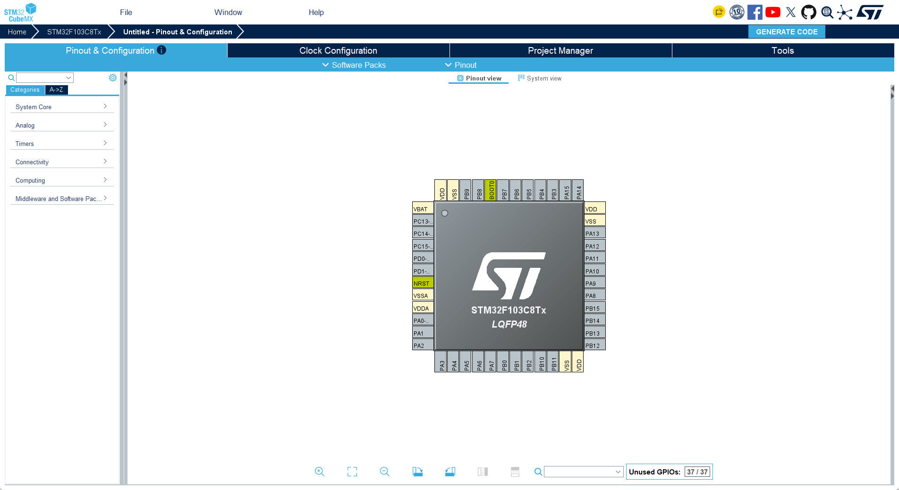
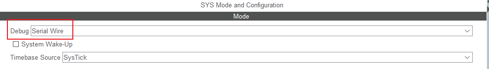
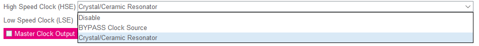
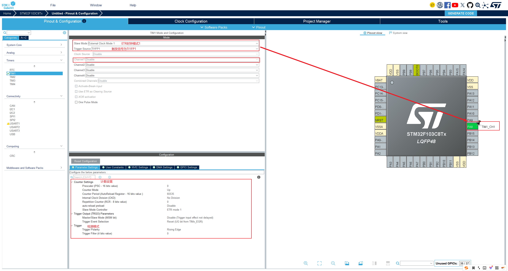
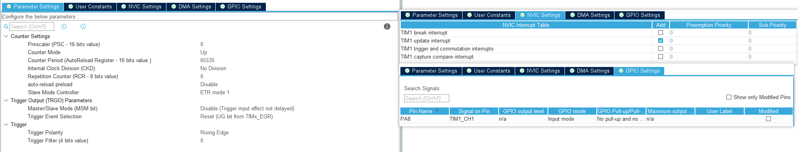
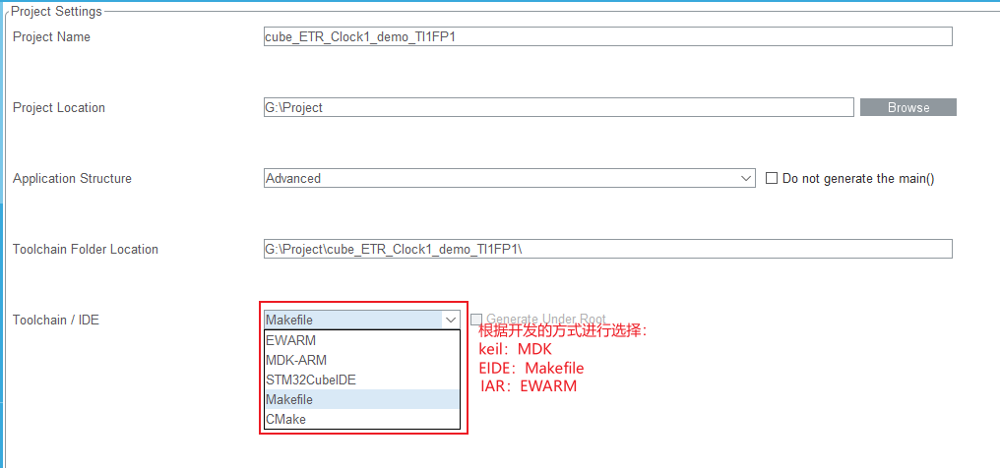
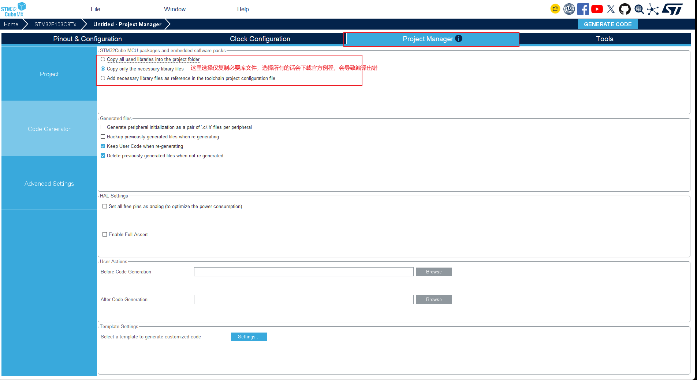
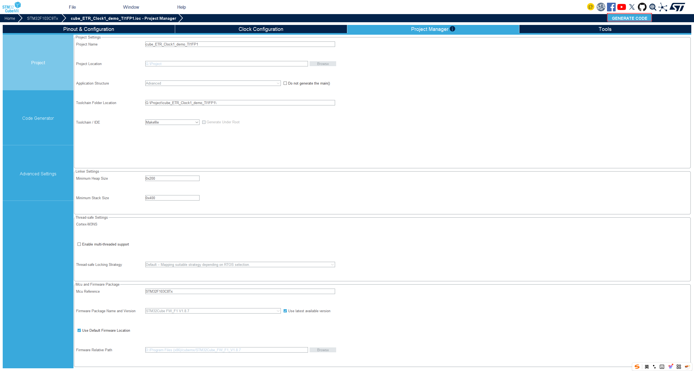
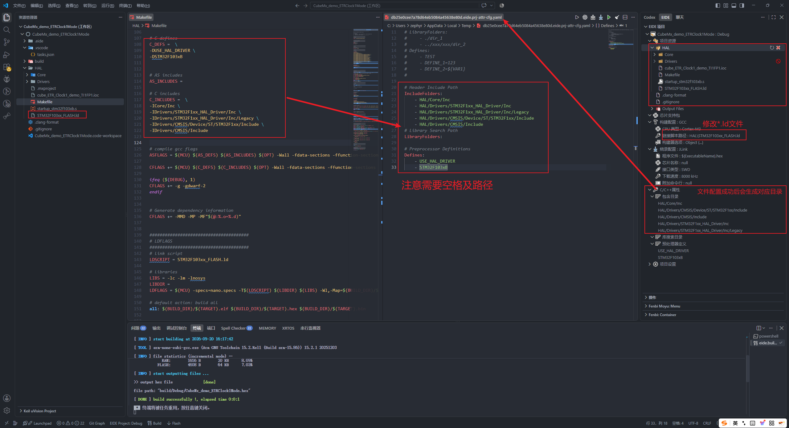
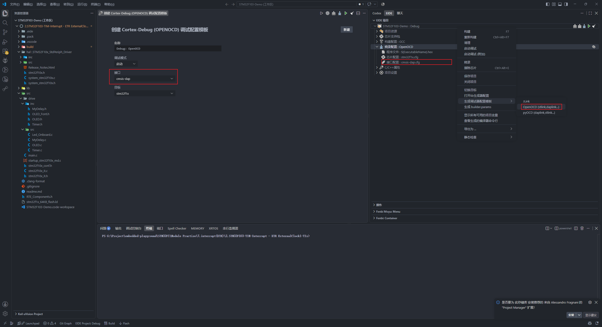

# STM32_CUBE_MX-EIDE

STM32CubeMX是ST推出的图形化配置工具，旨在简化MCU初始化与外设配置，推动HAL库标准化开发，提升工程生成效率和代码一致性。
[STM32CubeMX下载](https://www.st.com/en/development-tools/stm32cubemx.html#section-get-software-table)
[安装手册](https://docs.baud-dance.com/docs/stm32/CubeMX/install)
[登录手册](https://docs.baud-dance.com/docs/stm32/CubeMX/login)

## STM32_CUBE_MX & EIDE使用

 - 选择芯片后进入配置

   

 - 配置程序下载引脚

   

 - 配置时钟模式（选择外部晶振）

   

 - 配置STM32项目（ETR 时钟模式1 TI1FP1）

   

   

   

 - 修改创建配置

   

 - 最后点击创建

   

 - 然后导入VScode

   - EIDE创建一个Makefile项目

   - 根目录下创建一个文件夹，将cubeMX生成的代码全部复制进去

   - 配置VSCODE编译

     

   - 配置下载，依据你实际的下载方式配置（Jlink、OpenOCD等），我使用的是**OPenOCD-Cmsis**

     

   ## CubeMX-HAL使用

   ### 项目概览

   - MCU: STM32F103xB
   - Core: Cortex-M3
   - Compiler: arm-none-eabi-gcc
   - HAL: STM32F1xx HAL Driver
   - IDE/Workspace: VS Code + EIDE / STMCubeMX generated project
   - 目标用途: 学习定时器外部触发、从模式配置，以及 STM32 HAL 工程结构
   - 目录说明

     ````
     ## 目录说明
     
     ```text
     CubeMx_demo_ETRClock1Mode/
     ├── .eide/                  # EIDE 项目配置目录
     ├── .vscode/                # VS Code 工作区配置
     ├── .clang-format           # 代码格式化配置
     ├── build/                  # 编译输出目录，包含 .elf / .map / .hex 等产物
     ├── HAL/                    # HAL 工程主目录
     │   ├── Core/
     │   │   ├── Inc/             # 标准库/工程头文件
     │   │   └── Src/             # main.c, system_stm32f1xx.c 等源文件
     │   ├── Drivers/            # STM32 HAL 及 CMSIS 驱动代码
     │   ├── startup_stm32f103xb.s  # 启动文件
     │   ├── STM32F103xx_FLASH.ld   # 链接脚本
     │   ├── Makefile            # GNU Make 编译脚本
     │   └── cube_ETR_Clock1_demo_TI1FP1.ioc  # CubeMX 配置文件
     ├── CubeMx_demo_ETRClock1Mode.code-workspace  # VS Code 工作区文件
     ├── .gitignore              # Git 忽略规则
     ├── README.md               # 项目说明文档
     └── ...                     # 其他生成或辅助文件
     ```
     ````

### `main()` 中各区域的使用规范

在 STM32CubeMX / HAL 生成的工程里，`main.c` 通常会按功能分成几个固定区域，用户代码应尽量遵守这个约定，避免覆盖生成代码或破坏工程结构。

```c
int main(void)
{
  /* USER CODE BEGIN 1 */
  /* USER CODE END 1 */

  /* MCU Configuration--------------------------------------------------------*/
  HAL_Init();
  SystemClock_Config();

  /* Initialize all configured peripherals */
  MX_GPIO_Init();
  MX_TIM1_Init();

  /* USER CODE BEGIN 2 */
  /* USER CODE END 2 */

  while (1)
  {
    /* USER CODE END WHILE */

    /* USER CODE BEGIN 3 */
    /* USER CODE END 3 */
  }
}
```

- `USER CODE BEGIN 1 / END 1`
  - 一般用于放置局部变量、临时状态、用户自定义参数等
  - 适合写非常早期的初始化准备内容

- `USER CODE BEGIN Init / END Init`
  - 通常放在 `HAL_Init()` 之后、系统时钟配置之前
  - 可用于补充初始化前的准备逻辑

- `USER CODE BEGIN SysInit / END SysInit`
  - 放置系统级初始化完成后的补充逻辑
  - 通常较少使用

- `USER CODE BEGIN 2 / END 2`
  - 这是最常用的用户代码插入区，适合放：
    - 外设启动
    - 变量初始化
    - 中断使能
    - 任务状态初始化

- `while(1)` 中的 `USER CODE BEGIN 3 / END 3`
  - 放主循环任务逻辑
  - 例如：
    - 检测按键
    - 检查状态标志位
    - 更新 LED
    - 处理采样和控制

- `USER CODE BEGIN 4 / END 4`
  - 通常位于 `main.c` 的函数尾部，用于放自定义辅助函数、局部处理函数、常用工具函数

####  约定说明

- 不要直接在自动生成的代码区间外部随意修改 `MX_*_Init()` 函数体
- 生成器会根据 CubeMX 配置重写这些区域，必要时应通过 CubeMX 再生成代码
- 自定义逻辑建议写在 `USER CODE BEGIN/END` 标记之间
- 若新增外设或中断，通常应在 CubeMX 中配置，再在 `main.c` / `stm32f1xx_it.c` 中补充用户逻辑

这类标记的作用就是让生成代码和手写代码分开，便于重新生成时不覆盖用户逻辑。

   

   