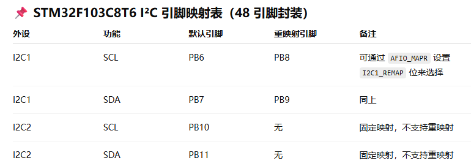
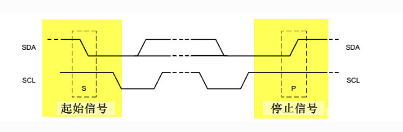
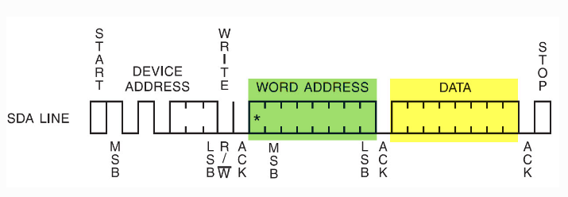

# IIC

## IIC基本概念

- 

- IIC原理：I²C（Inter-Integrated Circuit，集成电路总线）是一种 **同步、半双工、串行通信协议**，由 **Philips**（现 NXP）开发，广泛用于 **传感器、EEPROM、RTC（实时时钟）、LCD 驱动** 等低速外设的通信。STM32 等微控制器通常内置硬件 I²C 控制器，支持主从模式。

- 通信结构：I²C 采用 **主从架构**，仅需 **2 根信号线**：

  | 信号线                  | 作用                               |
  | :---------------------- | :--------------------------------- |
  | **SCL（Serial Clock）** | 主机提供的同步时钟（单向）         |
  | **SDA（Serial Data）**  | 双向数据线（开漏输出，需上拉电阻） |

  

- I²C 数据帧格式：I²C 通信由 **起始条件、地址帧、数据帧、停止条件** 组成：

  - **起始条件（Start Condition）:** SCL 为高电平时，SDA 由高→低跳变。

  - **停止条件（Stop Condition）: **SCL 为高电平时，SDA 由低→高跳变。

  - **地址帧（Address Frame）: **7 位从机地址 + 1 位读写方向（0=写，1=读）。

  - **数据帧（Data Frame）:** 每 8 位数据后跟随 1 位 **ACK（应答）**（低电平有效）。

    ```C
    typedef struct {
        uint32_t I2C_ClockSpeed; /*!< 设置SCL时钟频率，此值要低于40 0000*/
        uint16_t I2C_Mode;      /*!< 指定工作模式，可选I2C模式及SMBUS模式 */
        uint16_t I2C_DutyCycle; /*指定时钟占空比，可选low/high = 2:1及16:9模式*/
        uint16_t I2C_OwnAddress1;     /*!< 指定自身的I2C设备地址 */
        uint16_t I2C_Ack;                 /*!< 使能或关闭响应(一般都要使能) */
        uint16_t I2C_AcknowledgedAddress; /*!< 指定地址的长度，可为7位及10位 */
    } I2C_InitTypeDef;
    ```
- IIC配置注意事项

   - 严格的时序控制，每次操作均需要做超时判定，以及检查标志位

   - 重试机制

   - 完整的错误处理链，（start 信号处理，send_addr 地址发送，数据发送/接收，STOP信号生成）

   - 八位地址的处理方式（左移一位，或者要求传入七位地址）

   - 主从机的收发机制不一样，所以主从机均要编写收发函数（从机多为中断回调）
      - Master 接收数据时，需要处理最后一个字节，发送NACK: `I2C_AcknowledgeConfig(I2C1, DISABLE); `
      - Master 发送数据时，`checkEvent()`会调用硬件自动处理ACK;
      
   - 需配置为`GPIO_Mode_AF_OD` （复用开漏输出）表示由 I²C 外设硬件接管，自动驱动时序;`GPIO_Mode_Out_OD`表示普通开漏输出，需要手写SCL、SDA时序, `GPIO_Mode_IN_FLOATIONG` 仅能被动采样，无法主动发数据 

      

- IIC GPIO模拟时序写法（`GPIO_Mode_Out_OD`）

   ```C
   // IIC 初始化,按GPIO模拟时序编写，速度依赖于指令执行时长
   #include "stm32f10x.h"
   
   /*引脚配置*/
   #define OLED_W_SCL(x)		GPIO_WriteBit(GPIOB, GPIO_Pin_11, (BitAction)(x))
   #define OLED_W_SDA(x)		GPIO_WriteBit(GPIOB, GPIO_Pin_12, (BitAction)(x))
   
   /*引脚初始化*/
   void OLED_I2C_Init(void)
   {
       RCC_APB2PeriphClockCmd(RCC_APB2Periph_GPIOB, ENABLE);
   	
   	GPIO_InitTypeDef GPIO_InitStructure;
    	GPIO_InitStructure.GPIO_Mode = GPIO_Mode_Out_OD;
   	GPIO_InitStructure.GPIO_Speed = GPIO_Speed_50MHz;
   	GPIO_InitStructure.GPIO_Pin = GPIO_Pin_11;
    	GPIO_Init(GPIOB, &GPIO_InitStructure);
   	GPIO_InitStructure.GPIO_Pin = GPIO_Pin_12;
    	GPIO_Init(GPIOB, &GPIO_InitStructure);
   	
   	OLED_W_SCL(1);
   	OLED_W_SDA(1);
   }
   
   // 起始信号
   void OLED_I2C_Start(void)
   {
   	OLED_W_SDA(1);
   	OLED_W_SCL(1);
   	OLED_W_SDA(0);
   	OLED_W_SCL(0);
   }
   
   // 停止信号
   void OLED_I2C_Stop(void)
   {
   	OLED_W_SDA(0);
   	OLED_W_SCL(1);
   	OLED_W_SDA(1);
   }
   
   // 单字节数据发送
   void OLED_I2C_SendByte(uint8_t Byte)
   {
   	uint8_t i;
   	for (i = 0; i < 8; i++)
   	{
   		OLED_W_SDA(!!(Byte & (0x80 >> i)));
   		OLED_W_SCL(1);
   		OLED_W_SCL(0);
   	}
   	OLED_W_SCL(1);	//额外的一个时钟，不处理应答信号
   	OLED_W_SCL(0);
   }
   
   // 命令
   void OLED_WriteCommand(uint8_t Command)
   {
   	OLED_I2C_Start();
   	OLED_I2C_SendByte(0x78);		//从机地址
   	OLED_I2C_SendByte(0x00);		//写命令
   	OLED_I2C_SendByte(Command); 
   	OLED_I2C_Stop();
   }
   
   // 写数据
   void OLED_WriteData(uint8_t Data)
   {
   	OLED_I2C_Start();
   	OLED_I2C_SendByte(0x78);		//从机地址
   	OLED_I2C_SendByte(0x40);		//写数据
   	OLED_I2C_SendByte(Data);
   	OLED_I2C_Stop();
   }
   ```

   

## OLED 

   - 原理：有机发光二极管，本身自发光，所以能完美显示纯黑，使用PWM调光，低亮度会有频闪，成本高

   - 设计：SSD1306为0.96寸大小 分辨率为128*64, 共计8192颗LED,为显示清晰所以每个ASIIC码取模为16 x 8）；3.3~5V（内置3.3V LDO，I2C通信接口电平是3.3V的）有如下两种设计：

     - 7引脚（SPI会使用）：VSS、GND、D0(SCL-- SPI IIC 时钟引脚)、D1(SDA -- SPI IIC 数据引脚)、RES(复位引脚)、DC(数据和命令控制)、CS(片选引脚)
     - 4引脚（IIC使用）：VSS、GND、SCL、SDA

   - 具体实现

     - GPIO模拟时序写法（参考前面）
     
     - GPIO 库函数（SPL）写法（此处处理了IIC的错误情况）
     
       ```C
       #define I2C_Speed        400000 // 400kHz standard mode
       #define I2C_OWN_ADDRESS7 0x00   // 本机地址
       #define OLED_I2C_ADDR    0x78   // 八位地址
       
       // 默认导入了相关包
       void I2C_InitConfiguration()
       {
           GPIO_InitTypeDef GPIO_InitStructure;
           I2C_InitTypeDef I2C_InitStructure;
           // GPIO初始化
           GPIO_InitStructure.GPIO_Mode  = GPIO_Mode_AF_OD; // 设置GPIO模式为复用开漏输出
           GPIO_InitStructure.GPIO_Speed = GPIO_Speed_50MHz;
           GPIO_InitStructure.GPIO_Pin   = GPIO_Pin_11 | GPIO_Pin_12;
           GPIO_Init(GPIOB, &GPIO_InitStructure);
       
           // I2C 初始化
           I2C_DeInit(I2C2);                                            // Reset I2C peripheral
           I2C_InitStructure.I2C_Mode                = I2C_Mode_I2C;    // I2C模式
           I2C_InitStructure.I2C_DutyCycle           = I2C_DutyCycle_2; // 快速模式占空比2
           I2C_InitStructure.I2C_OwnAddress1         = I2C_OWN_ADDRESS7;
           I2C_InitStructure.I2C_Ack                 = I2C_Ack_Enable;               // 使能应答
           I2C_InitStructure.I2C_AcknowledgedAddress = I2C_AcknowledgedAddress_7bit; // 7位地址
           I2C_InitStructure.I2C_ClockSpeed          = I2C_Speed;                    // 100kHz standard mode
           I2C_Init(I2C2, &I2C_InitStructure);
       
           I2C_Cmd(I2C2, ENABLE);
       }
       
       /********************************************** 基础封装******************************************/
       typedef enum {
           I2C_OK = 0, // 成功
           I2C_ERR_TIMEOUT, // 超时
           I2C_ERR_ACK_FAIL, // 应答失败
           I2C_ERR_PARAM, // 参数错误
           I2C_ERR_BUSY, // 总线忙
           I2C_ERR_UNKNOWN // 未知错误
       } I2C_Status_t;
       
       // IIC的start信号
       I2C_Status_t I2C_Start(uint32_t timeout)
       {
           I2C_GenerateSTART(I2C2, ENABLE);
           return I2C_WaitEvent(I2C_EVENT_MASTER_MODE_SELECT, timeout);
       }
       
       // IIC的停止信号
       I2C_Status_t I2C_Stop()
       {
           I2C_GenerateSTOP(I2C2, ENABLE);
           return I2C_OK;
       }
       
       // 发送地址 
       I2C_Status_t I2C_SendAddr(uint8_t addr, uint32_t direction, uint32_t timeout)
       {
           if ((addr & 0xFE) != addr) addr >>= 1; // 确保地址为七位
           I2C_Send7bitAddress(I2C2, addr, direction);
           if (direction == I2C_Direction_Transmitter) {
               return I2C_WaitEvent(I2C_EVENT_MASTER_TRANSMITTER_MODE_SELECTED, 10);
           } else if (direction == I2C_Direction_Receiver) {
               return I2C_WaitEvent(I2C_EVENT_MASTER_RECEIVER_MODE_SELECTED, 10);
           } else {
               return I2C_ERR_PARAM; // 参数错误
           }
       }
       
       // Master 发送数据时 checkEvent 会调用硬件检测从机的ACK应答信号 
       I2C_Status_t I2C_SendDataByte(uint8_t data)
       {
           I2C_SendData(I2C2, data);
           return I2C_WaitEvent(I2C_EVENT_MASTER_BYTE_TRANSMITTED, 10);
       }
       
       /********************************************** OLED功能封装 ******************************************/
       // 写命令
       uint8_t OLED_WriteCommand(uint8_t cmd)
       {
           // SS1306 I2C传输协议要求传输顺序：设备地址，控制字节，命令
           I2C_Status_t temp;
           temp = I2C_Start(100); // 起始信号
           if (temp != I2C_OK) return 0;
           temp = I2C_SendAddr(OLED_I2C_ADDR, I2C_Direction_Transmitter, 100); // 设备地址
           if (temp != I2C_OK) return 0;
           temp = I2C_SendDataByte(0x00); // 0x00=控制字节，0x40=数据
           if (temp != I2C_OK) return 0;
           temp = I2C_SendDataByte(cmd); // 命令
           if (temp != I2C_OK) return 0;
           I2C_Stop(); // 停止信号
           return 1;
       }
       
       // 写数据
       uint8_t OLED_WriteData(uint8_t data)
       {
           I2C_Status_t temp;
           temp = I2C_Start(100);
           if (temp != I2C_OK) return 0;
           temp = I2C_SendAddr(OLED_I2C_ADDR, I2C_Direction_Transmitter, 100);
           if (temp != I2C_OK) return 0;
           temp = I2C_SendDataByte(0x40);
           if (temp != I2C_OK) return 0;
           temp = I2C_SendDataByte(data);
           if (temp != I2C_OK) return 0;
           I2C_Stop();
           return 1;
       }
       
       // 设置光标位置
       void OLED_SetCursor(uint8_t Y, uint8_t X)
       {
           OLED_WriteCommand(0xB0 | Y);                 // 设置Y位置
           OLED_WriteCommand(0x10 | ((X & 0xF0) >> 4)); // 设置X位置高4位
           OLED_WriteCommand(0x00 | (X & 0x0F));        // 设置X位置低4位
       }
       // 清屏命令
       void OLED_Clear(void)
       {
           uint8_t i, j;
           for (j = 0; j < 8; j++) {
               OLED_SetCursor(j, 0);
               for (i = 0; i < 128; i++) {
                   OLED_WriteData(0x00);
               }
           }
       }
       
       // code 编写OLED 初始化函数即可
       ```

## EEPROM

   - EEPROM 写入时序（起始信号>器件地址+写>内存地址>data>停止信号）

   

   ​	

   ```C
   // IIC 初始化函数和OLED一致
   
   /********************************************** 基础函数封装（无超时机制，已发生错误） **********************************************/
   void IIC_Start()
   {
       I2C_GenerateSTART(I2C2, ENABLE);                             // 产生I2C起始信号
       while (!I2C_CheckEvent(I2C2, I2C_EVENT_MASTER_MODE_SELECT)); // 等待起始信号发送完成
   }
   
   void IIC_Stop()
   {
       I2C_GenerateSTOP(I2C2, ENABLE); // 产生I2C停止信号
   }
   
   void IIC_SendADDR(uint8_t address, uint32_t direction)
   {
       if ((address & 0xFE) != address) address >>= 1;                            // 确保地址为七位
       I2C_Send7bitAddress(I2C2, address, direction);                             // 发送器件地址+信号
       while (!I2C_CheckEvent(I2C2, I2C_EVENT_MASTER_TRANSMITTER_MODE_SELECTED)); // 等待地址发送完成
   }
   
   void IIC_SendDataByte(uint8_t data)
   {
       I2C_SendData(I2C2, data);                                         // 发送数据
       while (!I2C_CheckEvent(I2C2, I2C_EVENT_MASTER_BYTE_TRANSMITTED)); // 等待数据发送完成
   }
   
   /********************************************** EEPROM函数封装 **********************************************/
   
   // 向EEPROM写入一个字节, 信号传输方式按图编写即可
   void EEPROM_WriteByte(uint8_t addr, uint16_t MemoryAddr, uint8_t *data)
   {
       IIC_Start();                                            // 发送起始信号
       IIC_SendADDR(OLED_I2C_ADDR, I2C_Direction_Transmitter); // 发送器件地址+写信号
       IIC_SendDataByte(addr);                                 // 发送数据地址
       IIC_SendDadtaByte((uint8_t)MemoryAddr >> 8);            // 发送EEPROM高地址
       IIC_SendDadtaByte((uint8_t)MemoryAddr && 0xFF);         // 发送EEPROM低地址
       IIC_SendDataByte(data);                                 // 发送数据
       IIC_Stop();                                             // 发送停止信号
       Delay_ms(5);                                            // 等待写入完成
   }
   
   // 向EEPROM写入多个字节
   void EEPROM_WriteBytes(uint8_t addr, uint16_t MemoryAddr, uint8_t *data, uint16_t len)
   {
       uint16_t i;
       uint8_t res;
       for (i = 0; i < len; i++) {
           // 等待上次写入完成, 主要检测EEPROM处是否应答，应答会将SCL拉低，超时时可以添加重试次数)
           if (EEPROM_WaitStatus())
               EEPROM_WriteByte(addr, MemoryAddr++, data++);
       }
   }
   
   ```

   ​	

   

   - EEPROM的读取顺序（起始信号>器件地址+写>内存地址>重复起始信号>器件地址+读>data>停止信号）

     

     ```C
     /**
     * @brief  从EEPROM读取一个字节
     * @param  deviceAddr: 设备地址
     * @param  memAddr: 内存地址
     * @retval data: 读取到的数据
     * */
     uint8_t EEPROM_IIC_ReadByte(uint8_t deviceAddr, uint16_t memAddr)
     {
         uint8_t data;
         // 等待I2C1空闲
         while (I2C_GetFlagStatus(I2C1, I2C_FLAG_BUSY));
         while (!I2C_GetFlagStatus(I2C1, I2C_FLAG_TXE));
     
         EEPROM_IIC_Start(I2C1);// 发送起始信号
         EEPROM_IIC_SendAddr(I2C1, deviceAddr, I2C_Direction_Transmitter);// 发送设备地址和写操作
         EEPROM_IIC_SendData(I2C1, (uint8_t)(memAddr >> 8));// 发送内存地址（高字节）   
         EEPROM_IIC_SendData(I2C1, (uint8_t)(memAddr & 0xFF));// 发送内存地址（低字节）  
         EEPROM_IIC_Start(I2C1);// 发送重复起始信号
         EEPROM_IIC_SendAddr(I2C1, deviceAddr, I2C_Direction_Receiver);// 发送设备地址和读操作
         
         // 接收数据
         data = EEPROM_IIC_ReceiveData(I2C1, 0); // NACK
         EEPROM_IIC_Stop(I2C1);// 产生停止信号
         return data; // 返回接收到的数据
     }
     
     /**
      * @brief  从EEPROM读取多个字节
      * @param  deviceAddr: 设备地址
      * @param  memAddr: 内存地址
      * @param  buffer: 数据缓冲区指针
      * @param  length: 要读取的字节数
      * @retval Null
      */
     void EEPROM_IIC_ReadBytes(uint8_t deviceAddr, uint16_t memAddr, char *buffer, uint8_t length)
     {
         // 等待I2C1空闲
         while (I2C_GetFlagStatus(I2C1, I2C_FLAG_BUSY));
         while (!I2C_GetFlagStatus(I2C1, I2C_FLAG_TXE));
     
         EEPROM_IIC_Start(I2C1); // 产生起始信号
         EEPROM_IIC_SendAddr(I2C1, deviceAddr, I2C_Direction_Transmitter); // 发送设备地址和写操作
         EEPROM_IIC_SendData(I2C1, (uint8_t)(memAddr >> 8)); // 发送内存地址（高字节）
         EEPROM_IIC_SendData(I2C1, (uint8_t)(memAddr & 0xFF)); // 发送内存地址（低字节）
         EEPROM_IIC_Start(I2C1); // 发送重复起始信号    
         EEPROM_IIC_SendAddr(I2C1, deviceAddr, I2C_Direction_Receiver); // 发送设备地址和读操作 
         // 接收数据
         for (uint8_t i = 0; i < length; i++) {  
             if (i == length - 1) {
                 buffer[i] = EEPROM_IIC_ReceiveData(I2C1, 0); // NACK
             } else {
                 buffer[i] = EEPROM_IIC_ReceiveData(I2C1, 1); // ACK
             }
         }
         EEPROM_IIC_Stop(I2C1); // 产生停止信号
     }
     ```
