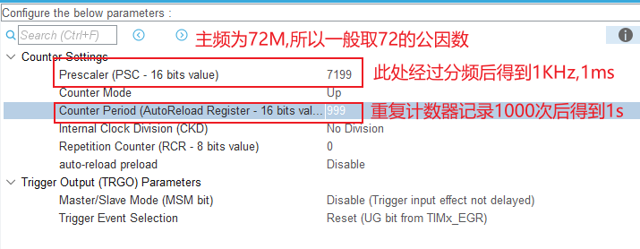
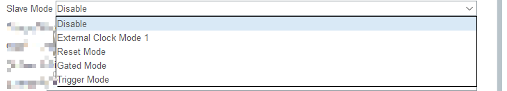
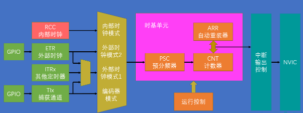
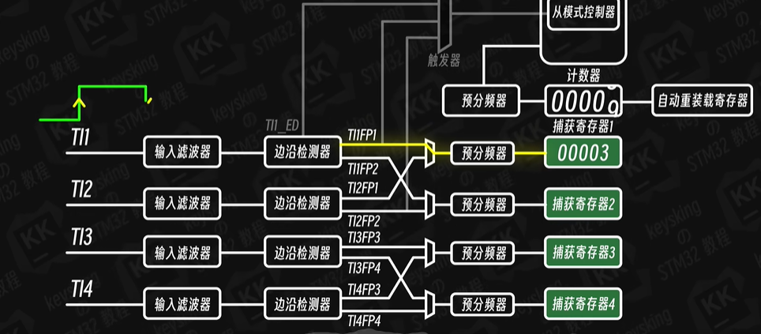

# STM32F103C8T6 定时器


## 定时器分类回顾


## 基本定时器（内部计数）

- 核心特点：不依赖外部输入信号，完全依赖内部时钟计数，适合做定时中断、时基参考、计时任务等。
- 本节重点：理解内部时钟触发路径、分频与计数器换算，以及 HAL 库定时实现思路。

### 1. 内部时钟的简要说明，以及触发路径

- 基本定时器的时钟源来自内部时钟 `CK_INT`，通常不直接使用系统时钟 `SYSCLK`，而是由 RCC 时钟树分发后进入定时器。对于 STM32F1，`SYSCLK` 一般为 `72MHz`，而 APB1 总线默认分频系数为 2，所以挂接到 TIMx 的时钟常见值为 `36MHz`（即 `72MHz / 2`）。
- 触发路径可以概括为：`RCC -> APB1 时钟 -> TIMx_CK_INT -> PSC 预分频器 -> CNT 计数器 -> ARR 自动重装 -> 更新事件/中断`。

### 2. 频率与时钟的换算，例如计时 500ms，分频器和计数器的换算

- 基本公式：
  - `计数频率 = CK_INT / ((PSC + 1) × (ARR + 1))`
  - `定时周期 = (PSC + 1) × (ARR + 1) / CK_INT`
  
- 其中
  - `PSC`：预分频器，控制计数器输入频率，区间为0~65535
  - `ARR`：自动重装值，控制计数器达到多少后溢出，区间为0~65535
  - 如计时1S:
  
  


| 场景                           | 推荐组合          | 原因                   |
| ------------------------------ | ----------------- | ---------------------- |
| **PWM 呼吸灯、LED亮度等**      | ✅ 小 PSC + 大 ARR | 提高占空比精度（平滑） |
| **马达控制**                   | ✅ 小 PSC + 大 ARR | 高精度 PWM 控制        |
| **需要很高定时精度（微秒级）** | ✅ 小 PSC + 大 ARR | 提供高时间分辨率       |
| **定时中断（只要求某个频率）** | ✅ 大 PSC + 小 ARR | 简单节省资源           |
| **粗略定时（1s, 10s等）**      | ✅ 大 PSC + 小 ARR | 可读性高，占用小       |
| **资源紧张、对精度要求低**     | ✅ 大 PSC + 小 ARR | 省资源                 |

| 控制项    | 控制作用             | 对占空比的影响         |
| --------- | -------------------- | ---------------------- |
| **ARR**   | PWM周期长度 / 档位数 | 越大，占空比越精细     |
| **PSC**   | 计数步长（计时粒度） | 影响频率和响应时间     |
| **CCR值** | 当前的占空比         | 比例 = CCR / (ARR + 1) |

### 3.HAL 库实现1s定时（大纲）

- 通过cubemx生成的项目结构（需要勾选TIM的更新中断事件，否则不会进入中断函数）

  ```txt
  project-tree
  interrupt_TIM_Count/
  ├── CMakeLists.txt                # CMake 构建入口
  ├── CMakePresets.json             # 编译预设配置
  ├── startup_stm32f103xb.s         # STM32 启动文件
  ├── STM32F103xx_FLASH.ld          # Flash/RAM 链接脚本
  ├── Core/
  │   ├── Inc/
  │   │   ├── main.h
  │   │   ├── gpio.h
  │   │   ├── tim.h
  │   │   ├── OLED.h
  │   │   ├── stm32f1xx_hal_conf.h
  │   │   └── stm32f1xx_it.h
  │   └── Src/
  │       ├── main.c               # 主程序
  │       ├── gpio.c               # GPIO 初始化
  │       ├── tim.c                # TIM1 定时计数与中断
  │       ├── OLED.c               # OLED 显示驱动
  │       ├── stm32f1xx_it.c       # 中断处理
  │       └── system_stm32f1xx.c  # 系统时钟初始化
  ├── Drivers/                     # STM32 HAL / CMSIS 驱动
  ├── cmake/                       # CMake 工具链和 CubeMX 配置
  ├── build/                       # 编译输出目录
  ├── interrupt_TIM_Count.ioc      # STM32CubeMX 配置文件
  └── README.md                   # 项目说明
  ```

- 生成之后在`tim.c`中添加：

  ```C
  /* USER CODE BEGIN 1 */
  uint32_t overValue = 0;
  // TIM溢出中断回调函数
  void HAL_TIM_PeriodElapsedCallback(TIM_HandleTypeDef *htim)
  {
      if(htim == &htim1)
      {
          overValue++; 
      }
  }
  
  /* USER CODE END 1 */
  ```

- `main.c`中的` MX_TIM1_Init();`后添加:

  ```C
    __HAL_TIM_SET_COUNTER(&htim1, 0); // 将计数器清零
    HAL_TIM_Base_Start_IT(&htim1); // 启动定时器 TIM1，并使能中断
  ```

- SPL标准库实现

  ```C
  // TIM4定时器的定时中断
  
  #include "stm32f10x.h"
  volatile uint16_t Timer_Count_Number=0;
  
  void Timer_Init(void)
  {
      // 时钟使能
      RCC_APB1PeriphClockCmd(RCC_APB1Periph_TIM4, ENABLE);
  
      TIM_TimeBaseInitTypeDef TIM_TimeBaseStructure;
      /* 使用定时器的 输入捕获、编码器模式 或 外部时钟 这些需要对外部信号做滤波的功能，就会用到 ClockDivision; 
      TIM_CKD_DIV1为不产生滤波
      TIM_CKD_DIV2数字滤波采样时钟 = 定时器时钟 / 2
      */
      TIM_TimeBaseStructure.TIM_ClockDivision = TIM_CKD_DIV1;       // 滤波器设置
      // 要设置1Hz = 72MHz/[(PSC+1)*(ARR+1)
      TIM_TimeBaseStructure.TIM_Prescaler         = 7200 - 1;  // PSC
      TIM_TimeBaseStructure.TIM_Period            = 10000 - 1; // ARR
      TIM_TimeBaseStructure.TIM_CounterMode   = TIM_CounterMode_Up; // 向上计数模式
      // TIM_TimeBaseStructure.TIM_RepetitionCounter = 0;         // 重复计数器设置,高级定时器才需要
      TIM_TimeBaseInit(TIM4, &TIM_TimeBaseStructure);
  
      NVIC_PriorityGroupConfig(NVIC_PriorityGroup_2); // NVIC分组
  
      NVIC_InitTypeDef NVIC_InitStructure;
      // md.s 中没有TIM6 TIM7; 需要切换为MD_VL or HD等；此处可改为TIM4使用
      NVIC_InitStructure.NVIC_IRQChannel                   = TIM4_IRQn; 
      NVIC_InitStructure.NVIC_IRQChannelPreemptionPriority = 0; 	   // 抢占优先级
      NVIC_InitStructure.NVIC_IRQChannelSubPriority        = 0;      // 子优先级
      NVIC_InitStructure.NVIC_IRQChannelCmd                = ENABLE; // 使能
      NVIC_Init(&NVIC_InitStructure);
      
      // TIM_IT_Update: 更新中断 TIM_IT_Trigger: 触发中断；捕获中断
      TIM_ITConfig(TIM4, TIM_IT_Update, ENABLE); // 中断类型（中断输出更新事件）使能
      TIM_Cmd(TIM4,ENABLE); // 定时器开关
  }
  
  
  // Handler函数
  void TIM4_IRQHandler()
  {
      if (TIM_GetITStatus(TIM4, TIM_IT_Update) != RESET) {
          Timer_Count_Number++;
          TIM_ClearITPendingBit(TIM4, TIM_IT_Update); // 清除中断
      }
  }
  ```

### 从模式

- 从模式（Slave Mode）是指：定时器不直接使用内部时钟自由计数，而是接收外部触发信号或其他定时器的事件来决定是否计数、启动、停止、复位或同步。这类模式的作用就是把多个定时器、外部信号和传感器进行了硬件联动，其核心思想是：**被触发器控制运行**，常用于编码器、同步采样、PWM同步、外部事件计数和联合定时。
- 在 STM32 里，常见的从模式包括：

| 从模式 | 简要说明 | 作用 |
| --- | --- | --- |
| `Reset Mode` | 外部触发事件到来时，复位计数器； | 用于重新开始计数、同步复位 |
| `Gated Mode` | 外部信号作为门控信号，只有在有效电平期间才计数； | 用于“有条件地计数”，例如使能窗口计时 |
| `Trigger Mode` | 外部触发事件启动一次计数/操作；可以多次触发，定时器计数会一直计数，常与单脉冲（one Pulse mode）使用 | 用于单次触发采样、启动任务 |
| `External Clock Mode 1` | 将外部脉冲作为真正的计数时钟，计数器按外部事件递增；这是少数“外部脉冲做计数时钟”的模式 | 常用于外部脉冲计数、编码器/传感器同步 |

- 统一理解：`非 External Clock Mode 1` 的从模式，仍然使用内部时钟 `CK_INT` 作为计数时钟；外部信号只负责控制启动、停止、复位、门控或同步动作。
- 只有 `External Clock Mode 1` 才是把外部脉冲当作计数时钟，计数器按外部事件递增。

- 如 **外部时钟模式 1 就是从模式的一种**，它的核心是：由外部事件直接提供计数时钟，而不是依赖内部时钟单独自走。

- **Trigger Mode 案例（HAL 库，外部触发启动计数）**：
  - 设定：`TIM2` 作为从定时器，外部 GPIO 上升沿触发后，`TIM2` 才开始计数。
  - 作用：等待外部事件到来，再启动计时，不需要 CPU 手动调用 `HAL_TIM_Base_Start()`。

```C
/* HAL库：TIM2 作为从定时器，外部触发信号启动计数 */
#include "main.h"

TIM_HandleTypeDef htim2;

void MX_TIM2_StartMode_Init(void)
{
    __HAL_RCC_TIM2_CLK_ENABLE();

    // 1. 基本定时器配置：内部时钟作为计数时钟
    htim2.Instance = TIM2;
    htim2.Init.Prescaler     = 71;                    // 72MHz / 72 = 1MHz
    htim2.Init.CounterMode   = TIM_COUNTERMODE_UP;
    htim2.Init.Period        = 9999;                  // 10ms 周期（可配合需求调整）
    htim2.Init.ClockDivision = TIM_CLOCKDIVISION_DIV1;
    htim2.Init.AutoReloadPreload = TIM_AUTORELOAD_PRELOAD_ENABLE;
    HAL_TIM_Base_Init(&htim2);

    // 2. 设置从模式：外部触发后启动计数
    //    使用标准 HAL API 配置触发源和从模式
    TIM_SlaveConfigTypeDef sSlaveConfig = {0};
    sSlaveConfig.SlaveMode      = TIM_SLAVEMODE_TRIGGER; // 触发模式：外部事件启动计数
    sSlaveConfig.InputTrigger    = TIM_TS_TI1FP1;        // 选 TI1 作为触发源
    sSlaveConfig.TriggerPolarity = TIM_TRIGGERPOLARITY_RISING;
    sSlaveConfig.TriggerFilter    = 0;
    HAL_TIM_SlaveConfigSynchro(&htim2, &sSlaveConfig);

    //    说明：
    //    - TIM_TS_TI1FP1：选 TI1 作为触发源
    //    - TIM_SLAVEMODE_TRIGGER：配置为从模式中的触发启动方式
    //    这样就是标准 HAL 库写法，而不是直接写寄存器

    // 3. 计数器清零并准备计数
    __HAL_TIM_SET_COUNTER(&htim2, 0);

    // 4. 硬件模式启动：等待外部触发信号到来后开始计数
    HAL_TIM_Base_Start_IT(&htim2);
}

void HAL_TIM_PeriodElapsedCallback(TIM_HandleTypeDef *htim)
{
    if (htim->Instance == TIM2) {
        // 计数器到达 ARR 后触发更新事件
    }
}
```

- 这段代码的关键点是：**定时器不是自己开始计数，而是等外部触发沿到来后再启动**。这正是 `Start Mode` 的典型应用。

- 如果只是“外部脉冲持续计数”，那是 `External Clock Mode 1`；如果只是“外部事件触发开始计数”，那就是 `Start Mode`。


- 说明：`Trigger Mode` 的本质是“等待外部事件再开始计数”，而 `External Clock Mode 1` 则是“外部脉冲持续作为计数时钟”。两者都属于从模式，但动作不同。


### 通用定时器和高级定时器


- 时钟源：内部时钟CK_INT、外部时钟1 TIx、外部时钟2：外部中断触发ETR、内部触发输入 ITRx
- 高级控制定时器 (TIM1 和 TIM8) 和通用定时器在基本定时器的基础上引入了外部引脚，可以实 现输入捕获和输出比较功能
- 高级控制定时器比通用定时器增加了可编程死区互补输出、重复计 数器、带刹车 (断路) 功能，这些功能都是针对工业电机控制方面。
- 外部时钟1_TIx：
  - 时钟信号（TI1/2/3/4）配置：1.配置TI映射，2.设置滤波 3.触发方式选择 4.触发源选择 5.外部时钟触发模式选择
- 外部时钟2_TIMx_ETR：
    - TIMx_ETR配置：1.映射 2. 触发方式选择 3. 预分频（小于16MHz）4.设置滤波 5.外部时钟触发模式选择
- 内部时钟_ITRx：
    - 内部触发：内部触发输入是使用一个定时器作为另一个定时器的预分频器


TIM1 的核心功能

| 应用         | 使用功能                                                     | 说明                 |
| ------------ | ------------------------------------------------------------ | -------------------- |
| LED 调光     | PWM 输出（PWM1 高电平有效，PWM2 低电平有效）                 | 调节亮度，占空比控制 |
| 电机调速     | PWM 输出 + 死区时间（作用：防止半桥上下 MOS 管在切换时同时导通，避免击穿） | 控制功率桥臂导通     |
| 舵机控制     | PWM 输出（50Hz）                                             | 位置角度控制         |
| 三相逆变器   | 互补PWM + 中心对齐 + 死区时间                                | 平衡三相波形         |
| 编码器测速   | 输入捕获 / 编码器模式                                        | 测速与方向           |
| 同步ADC采样  | 主从触发输出 TRGO                                            | 定时触发ADC转换      |
| 系统定时任务 | 定时中断                                                     | 周期事件触发         |


## 通用定时器 - 外部时钟1 - 输入捕获（TIM3_CH1）



- 外部时钟输入计数中断

  - 寻迹模块数字量输入检测

  - 检测时会出现抖动所以需要设置`TIM_ICPrescaler ` （取值为1,2,4,8分别表示边沿捕获的有效次数）& `TIM_ICFilter`（取值为0~15，值越小越灵敏）


  ```C
/*
在基础定时器上面添加输入捕获，并替换相关的中断类型
*/

#include "stm32f10x.h"
#include "./drive/inc/MyDelay.h"

uint64_t Count    = 65534; // 防止溢出
// uint64_t overflow = 0;
// uint16_t temp     = 0;
void TIM3_CH1_Config()
{
    RCC_APB2PeriphClockCmd(RCC_APB2Periph_GPIOA, ENABLE);
    RCC_APB1PeriphClockCmd(RCC_APB1Periph_TIM3, ENABLE);

    GPIO_InitTypeDef GPIO_InitStructure;
    GPIO_InitStructure.GPIO_Pin  = GPIO_Pin_6;
    GPIO_InitStructure.GPIO_Mode = GPIO_Mode_IN_FLOATING;
    GPIO_Init(GPIOA, &GPIO_InitStructure);

    // 定时器基础配置
    TIM_TimeBaseInitTypeDef TIM_TimeBaseStructure;
    TIM_TimeBaseStructure.TIM_Period        = 65535;
    TIM_TimeBaseStructure.TIM_Prescaler     = 72 - 1; // 1MHz
    TIM_TimeBaseStructure.TIM_ClockDivision = 0;
    TIM_TimeBaseStructure.TIM_CounterMode   = TIM_CounterMode_Up;
    TIM_TimeBaseInit(TIM3, &TIM_TimeBaseStructure);

    // 输入捕获配置
    //  TIM_ICPrescaler和 Filter 主要作用是用于输入的数字滤波，防止边沿检测的跳变
    TIM_ICInitTypeDef TIM_ICInitStructure;
    TIM_ICInitStructure.TIM_Channel     = TIM_Channel_1;
    TIM_ICInitStructure.TIM_ICPolarity  = TIM_ICPolarity_Rising; // 检测上升沿
    TIM_ICInitStructure.TIM_ICSelection = TIM_ICSelection_DirectTI;
    TIM_ICInitStructure.TIM_ICPrescaler = TIM_ICPSC_DIV1;
    TIM_ICInitStructure.TIM_ICFilter    = 12;
    TIM_ICInit(TIM3, &TIM_ICInitStructure);

    // NVIC
    NVIC_InitTypeDef NVIC_InitStructure;
    NVIC_InitStructure.NVIC_IRQChannel                   = TIM3_IRQn;
    NVIC_InitStructure.NVIC_IRQChannelPreemptionPriority = 1;
    NVIC_InitStructure.NVIC_IRQChannelSubPriority        = 1;
    NVIC_InitStructure.NVIC_IRQChannelCmd                = ENABLE;
    NVIC_Init(&NVIC_InitStructure);

    // 允许中断
    TIM_ITConfig(TIM3, TIM_IT_CC1, ENABLE);
    TIM_Cmd(TIM3, ENABLE);
}

void TIM3_IRQHandler(void)
{
    if (TIM_GetITStatus(TIM3, TIM_FLAG_CC1) != RESET) {
        // TIM_GetCapture1(TIM3);  中断进入时的当前计数器值
        TIM_ClearITPendingBit(TIM3, TIM_FLAG_CC1);
        Count++;
    }
}

// 输入数据捕获
uint64_t Read_Pulse_Width(void)
{

    return Count;
}
  ```


## 通用定时器 - 外部时钟1 - 输出比较（PWM的产生）

- 原理：调整高低电平在一个周期的不同占比称为脉冲宽度调制技术（PWM），PWM输出是数字信号（只有开/关两种状态），但通过快速切换和适当的滤波，可以产生等效的模拟效果; 依据上面TIM中断更新（TIM_IT_Update）事件所用的寄存器，添加了比较寄存器（CCRx）, 不同计数模式能够输出不同的有效电平和无效电平

- STM32控制流程
  
    - 计数器向上计数：从0递增到自动重装载值(ARR)
    
    - 比较寄存器(CCRx)：也就是比较值 `TIM_Pulse `
    
    - 输出比较：
    
      
    
    - 周期结束：计数器达到ARR值后复位，开始新周期
    
- PWM选择要点：LED调光（100Hz~5KHz） Motor（5KHz~20KHz）
    ```C
    #include "./stm32f10x.h"
    #include "./drive/inc/MyDelay.h"
    
    void TIM2_CH3_PWM_Init()
    {
        // 1.TIM4的APB1时钟使能 & GPIO的AFIO复用时钟 & GPIO时钟
        RCC_APB1PeriphClockCmd(RCC_APB1Periph_TIM2, ENABLE);
        RCC_APB2PeriphClockCmd(RCC_APB2Periph_GPIOA, ENABLE); 
    
        // 2.GPIO初始化； TIM2_CH3 默认连接PA2
        GPIO_InitTypeDef GPIO_InitStructure;
        GPIO_InitStructure.GPIO_Pin   = GPIO_Pin_2;
        GPIO_InitStructure.GPIO_Mode  = GPIO_Mode_AF_PP; // 推挽输出
        GPIO_InitStructure.GPIO_Speed = GPIO_Speed_50MHz;
        GPIO_Init(GPIOA, &GPIO_InitStructure);
    
        // 3.TIM时基单元配置
        TIM_TimeBaseInitTypeDef TIM_TimeBaseStructure;
        
        /* 首先为向上计数模式，输出的信号为平滑的PWM信号，所以要提高占空比精度，即大ARR，小PSC*/
        TIM_TimeBaseStructure.TIM_Prescaler     = 72 - 1;      // PSC
        TIM_TimeBaseStructure.TIM_Period        = 1000 - 1;         // ARR
    
        TIM_TimeBaseStructure.TIM_CounterMode   = TIM_CounterMode_Up; // 计数模式
        TIM_TimeBaseStructure.TIM_ClockDivision = 0;                  // 设置时钟分割
        // TIM_TimeBaseStructure.TIM_RepetitionCounter = ; // 重复计数器--TIM1 & TIM8才有高级定时器
        TIM_TimeBaseInit(TIM2, &TIM_TimeBaseStructure);
    
        // 4.PWM配置
        TIM_OCInitTypeDef TIM_OCInitStructure;
        TIM_OCInitStructure.TIM_OCMode      = TIM_OCMode_PWM1;        // 模式选择
        TIM_OCInitStructure.TIM_OutputState = TIM_OutputState_Enable; // 输出使能
        TIM_OCInitStructure.TIM_OCPolarity  = TIM_OCPolarity_High;    // 极性设置
        TIM_OCInitStructure.TIM_Pulse       = 0;                      // 设置CCR,初始化占空比，比较值
        TIM_OC3Init(TIM2, &TIM_OCInitStructure);                      // 选用TIM4_CH2 通道
        TIM_OC3PreloadConfig(TIM2, TIM_OCPreload_Enable); // 使能预装载寄存器，用于比较寄存器，防止产生不稳定
        
        // 5.使能中断
        TIM_ARRPreloadConfig(TIM2, ENABLE); // 使能ARR 预装载寄存器，防止分频的频率突然跳变产生毛刺
        TIM_Cmd(TIM2, ENABLE); // 使能TIM2中断
    }
    
    /**
     * @brief  占空比比值设定
     * @param  Compare2 占空比值
     * @retval NULL
     * */
    
    void TIM2_CH3_PWM_SetCompare3(uint16_t Compare)
    {
        TIM_SetCompare3(TIM2, Compare3); // 设置CH3占空比 对应Compare3
    }
    
    /**
    * @brief  呼吸灯效果
    * @param  NULL
    * @retval NULL
    * */
    void breathing_LED(void)
    {
        uint16_t i;
        for (i = 0; i < 1000; i++) {
            TIM2_CH3_PWM_SetCompare3(i);
            Delay_ms(1);
        }
    
        for (i = 0; i < 1000; i++) {
            TIM2_CH3_PWM_SetCompare3(1000 - i);
            Delay_ms(1);
        }
    }


## 编码器模式

输出比较（比较匹配）

- 将定时器计数器（CNT）的值与一个寄存器（CCR）比较，当两者相等时产生“匹配”事件。
- **常见用途**：
  
  - **PWM 输出**：在匹配时切换 GPIO 电平，实现占空比控制。
  - **定时脉冲**：在指定时刻生成一次或周期性脉冲（toggle、set、reset）。
  - **触发 ADC**：通过硬件触发信号（TRGO）在精确定时点启动 ADC 转换。
  
  

输入捕获

- 在外部信号的指定边沿（上升或下降）到来时，硬件将当前 CNT 值“捕获”并存入 CCR 寄存器，并置位对应 CCnIF 标志。
- **常见用途**：
  - **测量脉冲宽度**：结合上升和下降沿捕获计算高电平持续时间。
  - **测量信号频率**：记录两次上升沿之间的计数差。
  - **编码器接口**：通过双通道捕获实现位置和速度检测。


