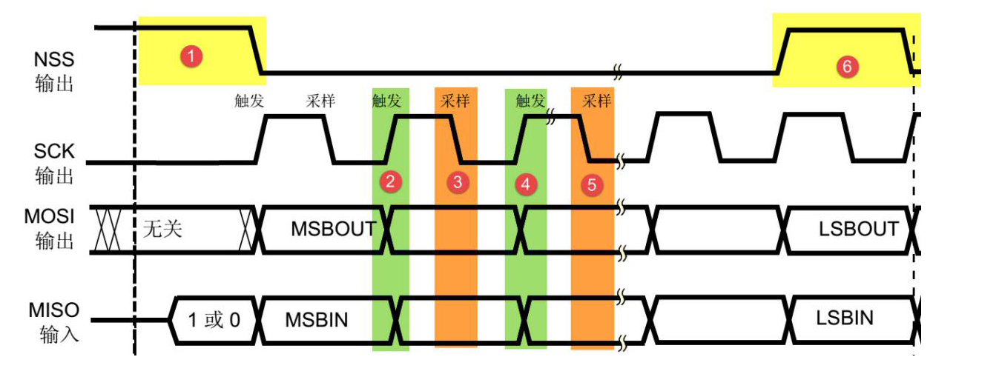
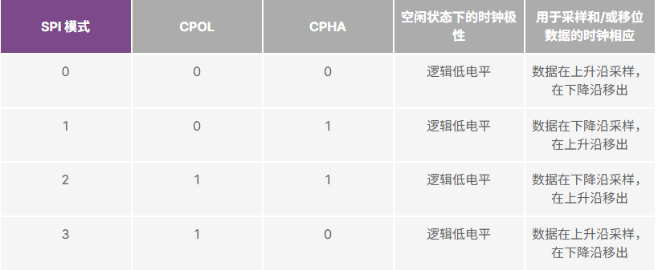

# SPI

1. SPI基本概念

   - SPI 原理：SPI（Serial Peripheral Interface，串行外设接口）是由摩托罗拉提出的一种高速、全双工、同步的串行通信协议，常用于 STM32 与 Flash、SD卡、传感器（如加速度计、陀螺仪）、显示屏等外设的通信。STM32F103 系列内置硬件 SPI 控制器，支持主从模式，通信速率可达 18 Mbps（在 72MHz 系统时钟下）

2. SPI 通信模式

   - SPI 采用 **主从架构**，通常由 **1个主机（Master）** 和 **1个或多个从机（Slave）** 组成，通过 **4 根信号线** 进行通信

     | 信号线                          | 作用                   |
     | :------------------------------ | :--------------------- |
     | **SCK (Serial Clock)**          | 主机提供的同步时钟信号 |
     | **MOSI (Master Out Slave In)**  | 主机发送，从机接收     |
     | **MISO (Master In Slave Out)**  | 从机发送，主机接收     |
     | **NSS (Slave Select, 也称 CS)** | 从机片选（低电平有效） |

3. SPI的时序控制图

   

   - 由于SPI是全双工接口，需要MOSI/MISO同时收发数据，所以用户可以灵活配置上升沿还是下降沿来进行采样或者移位

   - 时钟极性：空闲状态下的CPOL位为时钟极性（空闲状态为CS的高低电平转换期间）

   - 时钟相位：空闲状态下CPHA位为时钟相位

      

   - SPI的连接方式：常规连接(多cs端口)、菊花链（串联）、串行转并行转换器

      ```C
      typedef struct
      {
        uint16_t SPI_Direction;           // SPI通信方式
        uint16_t SPI_Mode;                // 主从模式
        uint16_t SPI_DataSize;            // 传输大小
        uint16_t SPI_CPOL;                // 时钟极性
        uint16_t SPI_CPHA;                // 时钟相位
        uint16_t SPI_NSS;                 // NSS控制端口（硬件 OR 软件）
        uint16_t SPI_BaudRatePrescaler;   // SPI波特率
        uint16_t SPI_FirstBit;            // 传输顺序（高位在前 或者 低位在前）
        uint16_t SPI_CRCPolynomial;       // CRC校验多项式
      }SPI_InitTypeDef;
      ```

      

   - SPI 波特率计算： `f(sclk)=PCLKx/分频系数, 分频系数包含：2,4,8,16,32,64,128,256；PCLK2(SPI1) = 72MHz，PCLK1(SPI2) = 36MHz`

   - 常用波特率设置：

      | 情况                          | 推荐设置                       |
      | ----------------------------- | ------------------------------ |
      | **外设支持高频**（如 W25Qxx） | 设置较高波特率，如 9~18 MHz    |
      | **长线通信/不稳定外设**       | 适当降低波特率                 |
      | **调试阶段**                  | 先设低速确保稳定性，如 1~2 MHz |
      | **参考外设手册时序要求**      | 避免超过最大支持时钟频率       |

4. SPI配置

   ```C
   // SPI初始化
   void SPI1_Init(){
          // 1. 使能 SPI1 时钟
       RCC_APB2PeriphClockCmd(RCC_APB2Periph_SPI1, ENABLE);
       
       // 2. 配置 SPI1 参数
       SPI_InitTypeDef SPI_InitStruct;
       SPI_InitStruct.SPI_Direction = SPI_Direction_2Lines_FullDuplex; // 全双工
       SPI_InitStruct.SPI_Mode = SPI_Mode_Master;                      // 主机模式
       SPI_InitStruct.SPI_DataSize = SPI_DataSize_8b;                  // 8位数据
       SPI_InitStruct.SPI_CPOL = SPI_CPOL_Low;                         // CPOL=0
       SPI_InitStruct.SPI_CPHA = SPI_CPHA_1Edge;                       // CPHA=0 (Mode 0)
       SPI_InitStruct.SPI_NSS = SPI_NSS_Soft;                          // 软件控制 NSS
       SPI_InitStruct.SPI_BaudRatePrescaler = SPI_BaudRatePrescaler_8; // 分频系数 8
       SPI_InitStruct.SPI_FirstBit = SPI_FirstBit_MSB;                 // 高位先发
       SPI_Init(SPI1, &SPI_InitStruct);
       
       // 3. 使能 SPI1
       SPI_Cmd(SPI1, ENABLE);
   }
   
   // 数据发送和接收
   uint8_t SPI1_SendByte(uint8_t data) {
       // 等待发送缓冲区空
       while (SPI_I2S_GetFlagStatus(SPI1, SPI_I2S_FLAG_TXE) == RESET);
       
       // 发送数据
       SPI_I2S_SendData(SPI1, data);
       
       // 等待接收完成
       while (SPI_I2S_GetFlagStatus(SPI1, SPI_I2S_FLAG_RXNE) == RESET);
       
       // 返回接收到的数据
       return SPI_I2S_ReceiveData(SPI1);
   }
   
   // 片选控制
   #define CS_PIN  GPIO_Pin_4
   #define CS_PORT GPIOA
   
   void CS_Enable(void) {
       GPIO_ResetBits(CS_PORT, CS_PIN); // 拉低，选中从机
   }
   
   void CS_Disable(void) {
       GPIO_SetBits(CS_PORT, CS_PIN);   // 拉高，取消选中
   }
   ```

