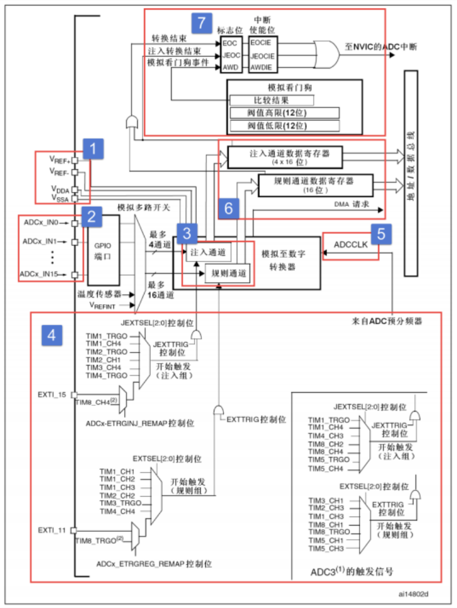
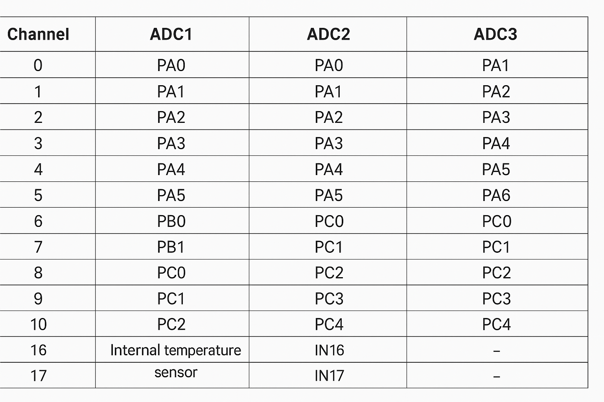

# ADC（**A**nalog-to-**D**igital **C**onverter）

## 简介

- 基本概念：将连续变化的模拟信号（声音、温度、湿度）转换为数字信号

- ADC的关键参数：分辨率（电压分级，分级越高，精度越大）、采样率（采样率越高，越能捕捉到信号的快速变化）、参考电压（判定基准）

- STM32F103: 该系列有3个ADC，精度为`12`位，每个ADC最多有`16`个外部通道。其中ADC1和ADC2都有16个外部通道， ADC3根据CPU引脚的不同通道数也不同，一般都有8个外部通道,ADC的输入时钟不得超过14MHz

- 功能框图讲解：

  

  1. 对参考电压进行限定：ADC所能测量的电压范围就是VREF- ≤ VIN ≤ VREF+; 把 VSSA 和 VREF-接地，把 VREF+和 VDDA 接 3V3，得到ADC 的输入电压范围为：0~3.3V

  2. ADC的16个采样通道（`内部温度传感器--internal temperature` `sensor 内部参考电压`）通道定义：规则通道（基本的ADC转换通道）注入通道（可以中断规则通道的执行）

     

  3. 转换顺序：规则通道由`SQRx`寄存器控制，注入通道由`JSQR`寄存器控制（类似于优先级配置）

  4. 触发源：可以通过配置寄存器`CR2`、内部定时器、外部IO进行ADC转换触发

  5. 转换时间：每次ADC的信号转换均需要时间，该时间由APB2的`PLCK2`(最大12MHz)以及寄存器`ADC_SMPR1` 和 `ADC_SMPR2`决定()，

     - 计算方式：转换时间=采样时间+12.5个周期；实际时间 = 转换时间*周期的单位时间
  
     - | 配置值 (SPL 宏)             | 采样周期数 | 总转换周期数 (采样 + 12.5) | 转换时间 (µs) | 采样率 (kSPS) |
       | --------------------------- | ---------- | -------------------------- | ------------- | ------------- |
       | `ADC_SampleTime_1Cycles5`   | 1.5        | 14.0                       | 1.17 µs       | ~ 854 kSPS    |
       | `ADC_SampleTime_7Cycles5`   | 7.5        | 20.0                       | 1.67 µs       | ~ 600 kSPS    |
       | `ADC_SampleTime_13Cycles5`  | 13.5       | 26.0                       | 2.17 µs       | ~ 462 kSPS    |
       | `ADC_SampleTime_28Cycles5`  | 28.5       | 41.0                       | 3.42 µs       | ~ 292 kSPS    |
       | `ADC_SampleTime_41Cycles5`  | 41.5       | 54.0                       | 4.50 µs       | ~ 222 kSPS    |
       | `ADC_SampleTime_55Cycles5`  | 55.5       | 68.0                       | 5.67 µs       | ~ 176 kSPS    |
       | `ADC_SampleTime_71Cycles5`  | 71.5       | 84.0                       | 7.00 µs       | ~ 143 kSPS    |
       | `ADC_SampleTime_239Cycles5` | 239.5      | 252.0                      | 21.0 µs       | ~ 47.6 kSPS   |

  6. 数据寄存器：转换完成后的数据就存放在数据寄存器，同时也分为注入通道和规则通道

  7. 中断：转换完成后可以触发中断，进行数据处理，也可以产生DMA请求将数据转至内存；看门口事件负责检测模拟量的正确性

  8. 数据转换：上面七步完成的是ADC的采样，但是采样的是电压值，需要进行数据转换，计算公式：V = (ADC_Value/ADC_Max)*3.3; 其中ADC_Max表示12位精度时的最大值；STM32只能采集3.3V的信号，5V的需要进行分压降至3.3V
  


## 实际使用

- `ADC_InitType struct`

  ```C
  typedef struct
  {
      uint32_t ADC_Mode;                      // ADC 工作模式选择
      FunctionalState ADC_ScanConvMode;       /* ADC 扫描（多通道）或者单次（单通道）模式选择 */
      FunctionalState ADC_ContinuousConvMode; // ADC 单次转换或者连续转换选择
      uint32_t ADC_ExternalTrigConv;          // ADC 转换触发信号选择
      uint32_t ADC_DataAlign;                 // ADC 数据寄存器对齐格式
      uint8_t ADC_NbrOfChannel;               // ADC 采集通道数
  } ADC_InitTypeDef;
  ```

- ADC及DMA初始化：

  ```C
  
  ```

  


