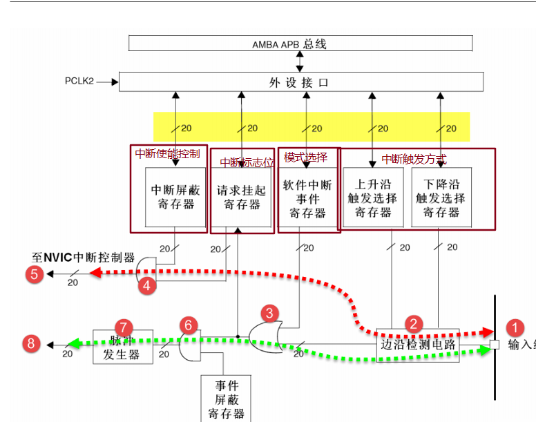

# EXTI-EC11

## 中断基本概念

- STM32 中断非常强大，每个外设都可以产生中断，
- 中断的分类：分为内核中断和外设中断，其中外设中断由外设（GPIO、TIM USART）触发，可配置优先级(`NVIC`)

- EXTI外部中断流程和相关函数

  - 基本概念：STM32支持19个外部中断，0~15为IO端口输入中断，16-PVD电压监测, 17-RTC闹钟,18-USB唤醒，19-以太网端口（互联网性）； 

  - **配置GPIO与中断线映射：**0~15个IO端口分配至EXTI0~EXTI15，为了对应线和中断所以需要做映射：`void GPIO_EXTILineConfig(uint8_t GPIO_PortSource, uint8_t GPIO_PinSource)`， **此外AFIO映射并非所有所有引脚都支持该功能，需要查阅手册**

    

  - **映射后设置中断的初始化：**分别包含标志位（EXTI_Line）、模式选择（EXTI_Mode）、触发方式(上升沿、下降沿、双边沿)、中断有效控制，`void EXTI_Init(EXTI_InitTypeDef* EXTI_InitStruct);`

    ```C
    // EXTI完整配置
    EXTI_InitTypeDef EXTI_InitStructure = {0};
    
    // 编码器A相(PA0)配置：双边沿触发
    EXTI_InitStructure.EXTI_Trigger = EXTI_Trigger_Rising_Falling; // 触发方式--双边沿
    EXTI_InitStructure.EXTI_Mode = EXTI_Mode_Interrupt; // 模式选择
    EXTI_InitStructure.EXTI_Line = EXTI_Line0; // 标志位
    EXTI_InitStructure.EXTI_LineCmd = ENABLE; // 中断使能
    EXTI_Init(&EXTI_InitStructure); // 应用配置
    ```

    

    

## NVIC

- **NVIC （嵌套向量中断控制器级）配置：**中断可能同时触发，所以需要设置优先级,外部中断通道选择、抢占优先级、子优先级、中断使能`NVIC_InitTypeDef NVIC_InitStructure`

  ```C
  // NVIC配置
  
  NVIC_PriorityGroupConfig(NVIC_PriorityGroup_2); // NVIC分组，意在将抢占优先级和子优先级进行分配；取值为0~4；0 表示0个抢占优先级 4个子优先级，依次类推
  NVIC_InitTypeDef NVIC_InitStructure = {0};
  // EXTI0中断(编码器A相)
  NVIC_InitStructure.NVIC_IRQChannel = EXTI0_IRQn; // 通道匹配
  NVIC_InitStructure.NVIC_IRQChannelPreemptionPriority = 0x0F; // 抢占优先级
  NVIC_InitStructure.NVIC_IRQChannelSubPriority = 0x0F; // 子优先级
  NVIC_InitStructure.NVIC_IRQChannelCmd = ENABLE; // 使能
  NVIC_Init(&NVIC_InitStructure); // 应用配置
  ```

  

  - **中断子程序：**外部中断函数只有6个，中断线0-4每个中断线对应一个中断函数`EXTIx_IRQHandler`，中断线5-9共用中断函数`EXTI9_5_IRQHandler`，中断线10-15共用中断函数`EXTI15_10_IRQHandler`

  - **中断退出(必须添加)：**清除中断标志即可，`void EXTI_ClearITPendingBit(uint32_t EXTI_Line)；`否则程序一直在中断中。

  - 其他常用函数：中断发生监控`ITStatus EXTI_GetITStatus(uint32_t EXTI_Line)； ` 

    ```C
    /*总结
    1.使能APB2时钟（GPIO和AFIO）EXTI是在APB2总线的
    2.GPIO初始化
    3.映射GPIO至AFIO
    4.中断初始化（EXTI）
    5.NVIC优先级配置
    6.编写中断子程序
    */
    ```

- EC11编码器

  - 名称：增量式机械编码器；主要用于旋转方向，角度控制，按键

  - 引脚：

    - A相（CLK）：输出脉冲信号1。
    - B相（DT）：输出脉冲信号2，相位与A相差90°。
    - C相（SW）：按键信号（按下时接地）加RC滤波，硬件防抖。

  - 原理：使用正交编码，A/B两相输出波形相差90° 

    ```C
    // 顺时针：A上升沿 B低电平 A下降沿 B高电平
    // 逆时针：A上升沿，B高电平 A下降沿 B低电平
    // 使用双边沿检查
    // EXTI0中断（A相跳变）
    uint16_t CW_Count
    void EXTI0_IRQHandler(void) {
        if (EXTI_GetITStatus(EXTI_Line0) != RESET) {
            static uint8_t lastA = 0, lastB = 0;
            uint8_t currentA = GPIO_ReadInputDataBit(EC11_PORT, EC11_A_PIN);
            uint8_t currentB = GPIO_ReadInputDataBit(EC11_PORT, EC11_B_PIN);
            
            // 状态机判断方向（需结合A、B相变化）
            if (lastA == 0 && currentA == 1) {  // A上升沿
                currentB == 0 ? CW_Count++: CCW_Count++;  // B=0:CW, B=1:CCW
            }
            else if (lastA == 1 && currentA == 0) {  // A下降沿
                currentB == 1 ? CW_Count++:CCW_Count++;  // B=1:CW, B=0:CCW
            }
            
            lastA = currentA;
            lastB = currentB;
            EXTI_ClearITPendingBit(EXTI_Line0);  // 清除中断标志
        }
    }
    ```

  - 常见问题：由于机械结构原因可能多次响应