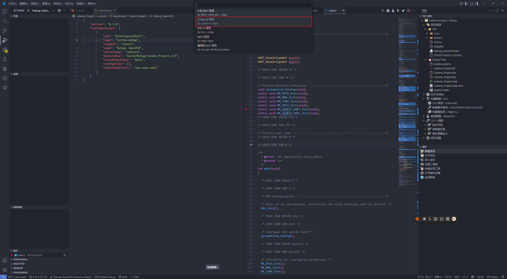
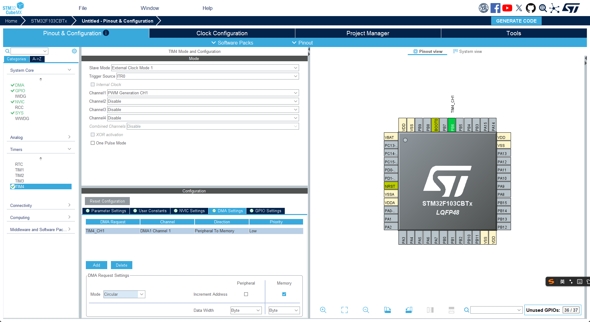
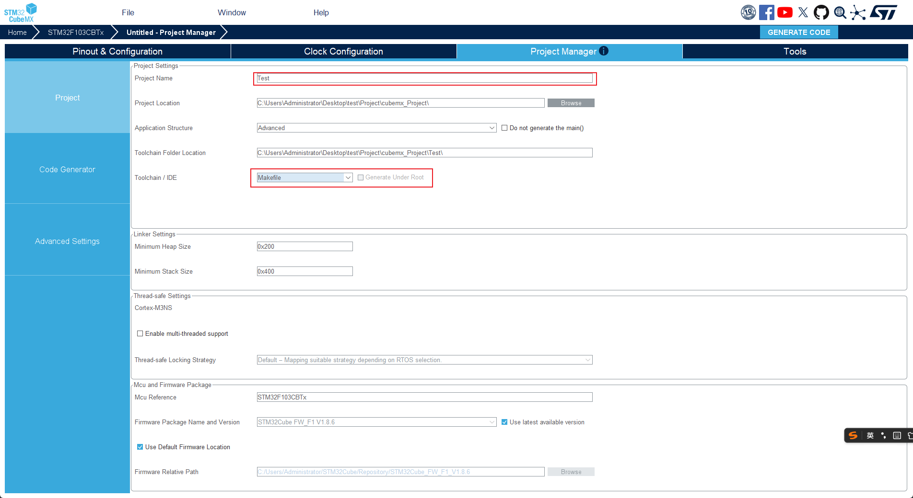
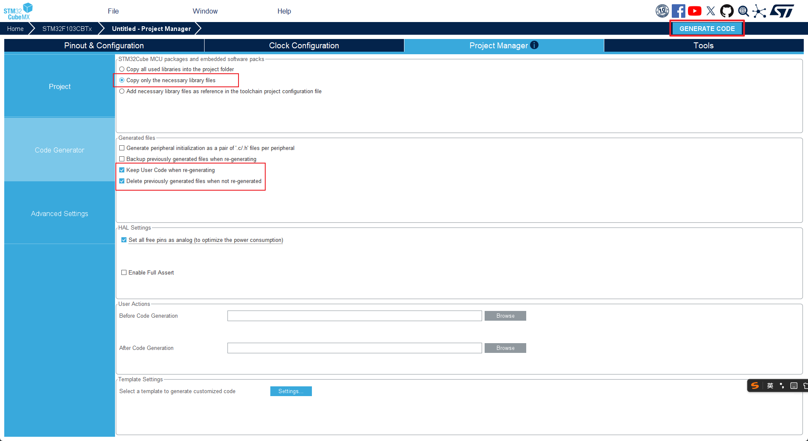
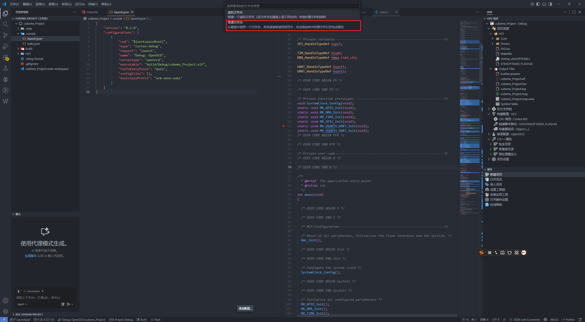
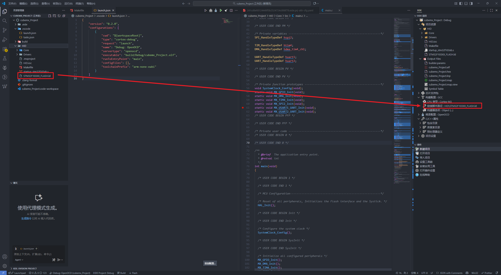
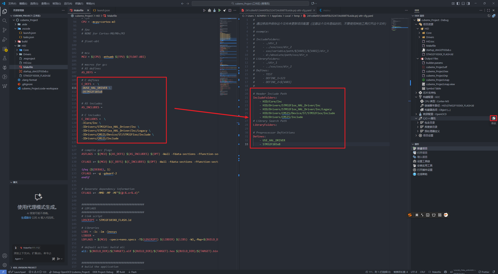
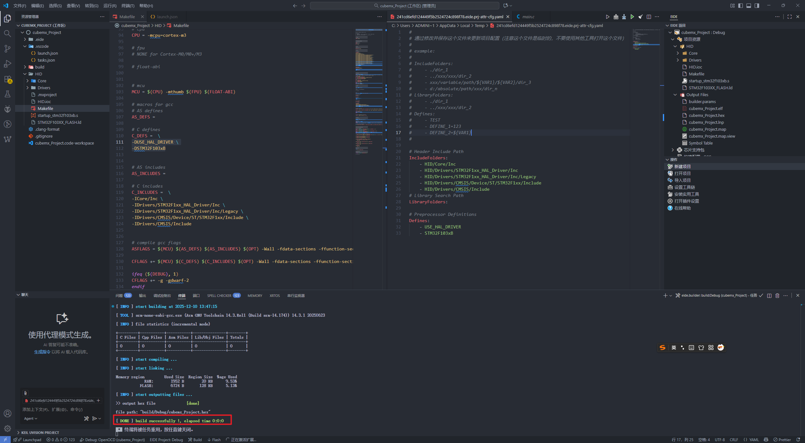
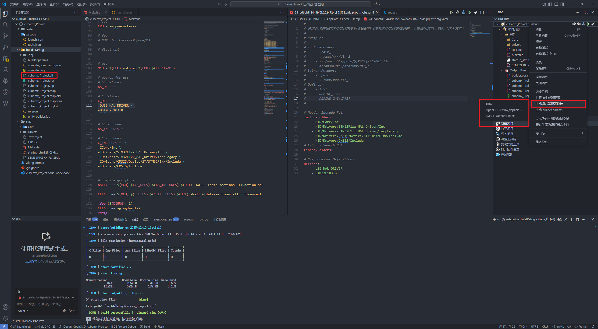
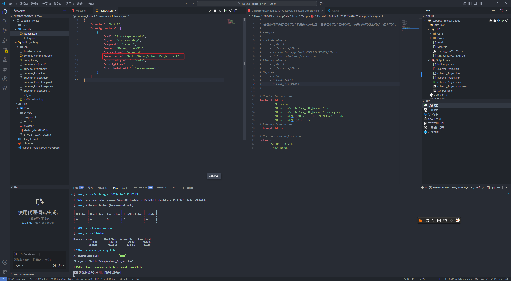

## CubeMX 项目导入Vscode+EIDE中进行编译

### 新建一个Cortex-M Project项目，然后切换EIDE工作区

### 打开Cube_MX 创建一个项目，导出时选择MakeFile：

- ​	任意配置一下项目：

  

- 设置导出选项，然后点击导出：

  

  

### 编译配置

- 将CubeMX的项目复制到EIDE创建的空项目下，是整个项目的初始目录（CubeMX处填写的Project Name）

- 打开EIDE目录，添加该文件夹

  

- 构建配置中填写链接脚本的相对路径

  

- 编写C/C++属性的yaml文件，将Makefile 的文件填写至对应位置， 需要去掉前缀 `-I -D` 

- 

- 点击编译

  

### 调试

- 打开刚刚编译好的文件目录，找到`.elf`文件，复制相对路径

- 在EIDE项目栏处右键选择生成调试配置文件

  

- 打开配置文件粘贴路径地址

  

参考地址：[EIDE 官方文档](https://em-ide.com/docs/getting-started/import_prj)